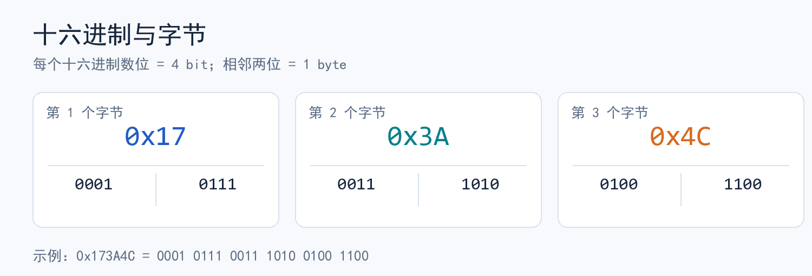
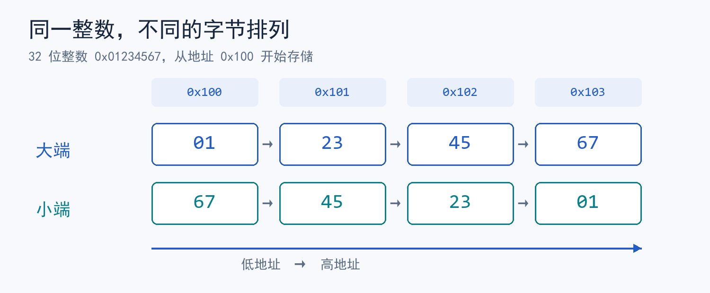

> 对应视频：[九曲阑干《CSAPP》2-1.信息的存储（上）](https://www.bilibili.com/video/BV1tV411U7N3/)（11:05）。
> 对照原书：《深入理解计算机系统》第 3 版中文译本，第 2.1.1～2.1.5 节，纸书第 24～35 页。
> 整理说明：当前环境无法取得视频画面或字幕；以下按该分集主题、以原书核对的知识点整理。上下篇分界是笔记编排，不代表视频的精确时间轴。插图为自绘示意图。

## 先建立一个模型

- **位（bit）**只有 `0`、`1` 两种状态。同一串位在不同解释规则下可以是整数、字符、浮点数或指令。
- 在本章讨论的机器中，**1 字节（byte）= 8 位**，是最小的可寻址内存单位。内存可抽象为一个按字节编址的数组：地址 `A` 指向一个字节，多字节对象通常占用连续地址。
- 对象的**地址**是它所占字节中地址最小的那个。对象的**值**与字节如何排列，是两个不同问题。

## 1. 十六进制：让位模式可读

每个十六进制数位对应 **4 位**，所以两个十六进制数位恰好表示一个字节。C 用 `0x` 前缀表示十六进制常量，`A`～`F` 对应十进制 `10`～`15`。



例如：

```text
十六进制  0x17 3A 4C
二进制    0001 0111 0011 1010 0100 1100
```

转换时从右往左每 4 位分一组；不足 4 位在左侧补 `0`。十进制转十六进制则可反复除以 16，逆序写出余数。`0x2A = 2×16 + 10 = 42`。

## 2. 字长与 C 数据类型

**字长（word size）**是机器指针数据的标称大小。若虚拟地址用 `w` 位编码，理论上可区分 `2^w` 个字节地址；实际系统可能只实现其中一部分地址。**64 位机器**与**64 位程序**也要分开：同一台机器可能运行按 32 位模式编译的程序。

| 类型 | 常见大小 | 阅读时要注意 |
| --- | ---: | --- |
| `char` | 1 字节 | 是否有符号与实现有关；`signed char` / `unsigned char` 明确 |
| `short` | 2 字节 | 不要把这些常见值当成 C 标准对所有平台的固定承诺 |
| `int`、`float` | 4 字节 | 原书示例中的典型平台如此 |
| `double` | 8 字节 | 与 `float` 的位模式不同 |
| `long` | 32 位程序常见 4；64 位 Unix 常见 8 字节 | 64 位 Windows 的 `long` 通常仍是 4 字节 |
| 指针 | 32 位程序常见 4；64 位程序常见 8 字节 | 与所指对象的大小无关 |

需要固定宽度时优先使用 `<stdint.h>` 中的 `uint32_t`、`int64_t` 等（仅在实现提供对应精确宽度类型时可用）。用 `sizeof` 查询**当前编译环境**中的大小，不凭机器名字猜。原书图 2-3 给的是典型值，不是所有 C 实现的统一规格。

## 3. 多字节对象与字节序

假设 4 字节整数 `0x01234567` 从地址 `0x100` 开始。**大端**把最高有效字节放在低地址；**小端**把最低有效字节放在低地址。地址方向始终是从左到右递增，变化的是字节摆放顺序。



| 地址 | `0x100` | `0x101` | `0x102` | `0x103` |
| --- | --- | --- | --- | --- |
| 大端 | `01` | `23` | `45` | `67` |
| 小端 | `67` | `45` | `23` | `01` |

**何时需要关心？**跨机器传输二进制数据、阅读十六进制内存转储或反汇编结果、把对象按原始字节解释时。只做普通的 `int` 加法时，字节序通常被机器和编译器隐藏了。网络协议或文件格式应明确定义字节序，不能默认发送方和接收方一致。

下面的 C 程序按地址从低到高打印对象的每个字节，可在自己的机器上验证。用 `unsigned char *` 查看对象表示是 C 允许的做法：

```c
#include <stdint.h>
#include <stdio.h>

int main(void) {
    uint32_t x = 0x01234567u;
    const unsigned char *p = (const unsigned char *)&x;
    for (size_t i = 0; i < sizeof x; ++i)
        printf("%02x%s", (unsigned)p[i], i + 1 == sizeof x ? "\n" : " ");
}
```

若输出 `67 45 23 01`，此对象采用小端排列；若是 `01 23 45 67`，则采用大端排列。

## 4. 字符串与机器代码也是字节序列

- 以常见 ASCII/UTF-8 环境为例，C 字符串 `"12345"` 的字节依次为 `31 32 33 34 35 00`。末尾 `00` 是终止符 `\0`；`strlen("12345")` 为 `5`，而该字符串字面量所形成数组的 `sizeof` 为 `6`。
- 字符串中单字节 ASCII 字符的先后顺序由文本顺序决定，通常不会像多字节整数那样因端序而倒过来。其他字符编码（例如 UTF-8）仍需按其各自规则理解。
- 机器指令也以字节保存，但**相同 C 源码不保证相同机器码**：指令集、操作系统约定、编译器和编译选项都可能改变结果。书中第 2.1.5 节用 `sum` 函数的不同编译结果说明这一点。

## 易错点与自测

1. `0x01234567` 的**数值**不随字节序改变；改变的是内存中的字节顺序。
2. “64 位程序”不意味着 `int` 或 `long` 必定是 8 字节；查 `sizeof` 和目标平台的数据模型。
3. 读内存转储时先确认：起始地址、每组有几个字节、按低地址到高地址的显示方向，以及数据类型。

**试一试：**`0xB7` 的二进制是什么？若一个 32 位整数 `0xA1B2C3D4` 在小端机器上从低地址开始存放，前两个字节是什么？

<details><summary>参考答案</summary>

`0xB7 = 1011 0111₂`；低地址起前两个字节是 `D4 C3`。

</details>
