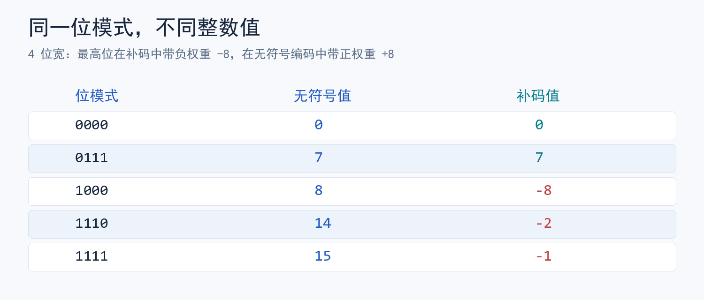

> 对应视频：[九曲阑干《CSAPP》合集：2-2.整数的表示（上）](https://www.bilibili.com/video/BV1tV411U7N3/)（07:12）。
> 对照原书：《深入理解计算机系统》第 3 版中文译本，第 2.2.1～2.2.3 节，纸书第 41～49 页。
> 编排说明：视频画面与字幕在当前环境不可取得；本篇依分集主题并用原书核对。上下篇的知识点分界是编辑安排，配图为自绘示意图。

## 核心问题：同一串位表示什么数？

整数在机器中只有固定的 `w` 位。**位模式本身没有正负号**，要由数据类型和编码规则解释。原书重点讨论两种编码：无符号编码与补码编码。



| 4 位模式 | 无符号解释 | 补码解释 |
| --- | ---: | ---: |
| `0000` | 0 | 0 |
| `0111` | 7 | 7 |
| `1000` | 8 | -8 |
| `1110` | 14 | -2 |
| `1111` | 15 | -1 |

## 1. 整型数据类型决定取值范围

同一种 C 整型可以声明为有符号或无符号。实际位宽与数据模型、编译器有关，因此下面先用统一的 `w` 位讨论范围：

| 编码 | 最小值 | 最大值 | `w=8` 时 |
| --- | ---: | ---: | --- |
| 无符号 | `0` | `2^w-1` | `0`～`255` |
| 补码 | `-2^(w-1)` | `2^(w-1)-1` | `-128`～`127` |

补码的负数比正数**多一个**：8 位的 `-128` 有编码 `1000 0000`，却没有 `+128`。这也解释了为什么最小有符号值的绝对值不能用同宽度的有符号类型表示。

## 2. 无符号编码：每一位都是正权重

从右到左，位的权重依次是 `2^0, 2^1, …, 2^(w-1)`。若位为 `x_i`，则：

```text
无符号值 = Σ(i=0 到 w-1) x_i · 2^i
```

例如 `1011₂ = 1×8 + 0×4 + 1×2 + 1×1 = 11`。所有 `w` 位模式恰好分别表示 `0` 到 `2^w-1`，没有重复。

## 3. 补码编码：最高位采用负权重

补码并非“最高位只表示符号、其余位照常表示大小”。它的最高位权重是 **`-2^(w-1)`**，其余位仍按正权重相加：

```text
补码值 = -x_(w-1) · 2^(w-1) + Σ(i=0 到 w-2) x_i · 2^i
```

4 位例子：`1011₂ = -8 + 0 + 2 + 1 = -5`；`1111₂ = -8 + 4 + 2 + 1 = -1`。最高位为 `0` 时，补码值与无符号值相同。全 `0` 是唯一的零编码。

在固定位宽下，取一个数的补码相反数常用“逐位取反，再加 1”：`0101`（5）→ `1010 + 1 = 1011`（-5）。但最小值是特殊情况：4 位 `1000`（-8）这样处理后仍是 `1000`，因为 `+8` 超出补码范围。此处说的是**固定位宽位模式**；C 有符号整数的溢出规则另见“整数的运算”。

## 阅读位模式的步骤

1. 先确定**位宽**，例如 8 位、16 位或 32 位。
2. 再确定按**无符号**还是**补码**解释。
3. 按每一位的权重求和；不要单看最高位就直接给其余位加负号。

下一篇讨论同一位模式在两种解释之间怎样转换，以及扩展、截断和 C 的混合类型规则。
