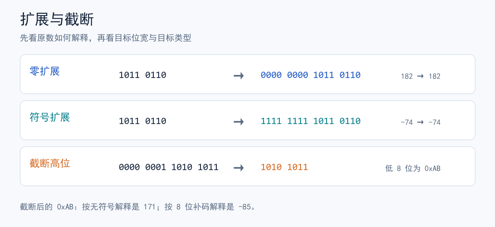

> 对应视频：[九曲阑干《CSAPP》合集：2-2.整数的表示（下）](https://www.bilibili.com/video/BV1tV411U7N3/)（08:23）。
> 对照原书：《深入理解计算机系统》第 3 版中文译本，第 2.2.4～2.2.8 节，纸书第 49～60 页。
> 编排说明：视频画面与字幕在当前环境不可取得；本篇依分集主题并用原书核对。上下篇的知识点分界是编辑安排，配图为自绘示意图。

## 1. 位宽不变时：改变解释规则

把 `w` 位补码重新解释为无符号数，**位模式不变**。若原补码值 `x` 非负，数值也不变；若 `x<0`，无符号值为 `x+2^w`。反向解释时，无符号值 `u` 若小于 `2^(w-1)`，数值不变；否则补码值为 `u-2^w`。

```text
8 位 1111 1111：无符号 = 255；补码 = -1
8 位 1000 0000：无符号 = 128；补码 = -128
```

这解释了常见的 `(unsigned)-1 == UINT_MAX`。这里讨论同宽度、以补码表示的常见机器模型；C 从无符号值转成无法表示的有符号值时，还要遵循具体实现的转换规则，不能把位重解释当作所有 C 转换的保证。

## 2. C 的有符号数与无符号数混用

在 32 位 `int` / `unsigned int` 的常见模型中，表达式 `-1 < 1u` 为假：比较前，`-1` 被转换为无符号的 `4294967295`。这是**类型转换影响比较**，不是位运算出错。

容易踩坑的写法：

```c
#include <stddef.h>

/* length 为无符号类型；length == 0 时，length - 1 回绕到最大值 */
for (size_t i = 0; i <= length - 1; ++i) { /* ... */ }

/* 更直接地表达“遍历已有元素” */
for (size_t i = 0; i < length; ++i) { /* ... */ }
```

`size_t` 是无符号整数类型。比较、减法或传参时先看参与表达式的**实际类型**，尤其是有符号与无符号混用的地方。

## 3. 扩展位宽：零扩展与符号扩展

从较窄的位模式放到较宽容器里，为保持数值不变：

- **无符号值零扩展**：高位补 `0`。
- **补码值符号扩展**：高位复制原最高位。



例如把 8 位 `1011 0110` 扩展到 16 位：按无符号数 `182` 解释，得 `0000 0000 1011 0110`；按补码数 `-74` 解释，得 `1111 1111 1011 0110`。

**先扩展再转换，可能与先转换再扩展不同。**原书中 `short sx = -12345; unsigned uy = sx;` 的例子，若 `short` 为 16 位、`unsigned` 为 32 位，先将 `sx` 扩展到 32 位，再转为 32 位无符号数；结果不是把 16 位模式先当无符号数得到的 `53191`。

## 4. 缩短位宽：截断高位

从 `w` 位变成更小的 `k` 位时，只保留低 `k` 位，相当于位模式按 `2^k` 取模；**然后再按目标类型解释**。例如 `0x01AB` 截成 8 位是 `0xAB`：无符号解释是 `171`，8 位补码解释是 `-85`。因此截断可能改变数值。

在 C 中，把一个整数转换到**不能容纳该值的有符号类型**，结果依赖实现；上面的 `-85` 是常见补码机器上的位级解释，不能直接当作所有 C 实现的承诺。

## 写代码时的检查顺序

1. 确认每个操作数和目标变量的**类型与位宽**。
2. 判断表达式里是否发生整数提升、无符号转换或隐式转换。
3. 若改变位宽，先分清**扩展还是截断**；若又改有符号性，弄清操作顺序。
4. 遍历数组时优先使用 `i < length`，避免 `length - 1` 在零长度下发生无符号回绕。

接下来“整数的运算”会使用这些位模式解释加法、乘法与溢出。
