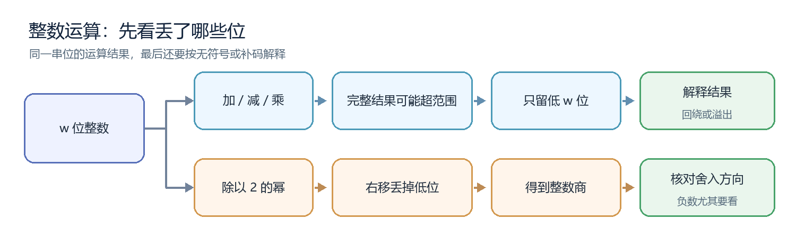
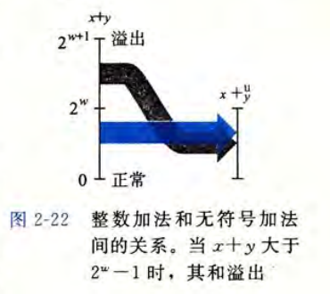
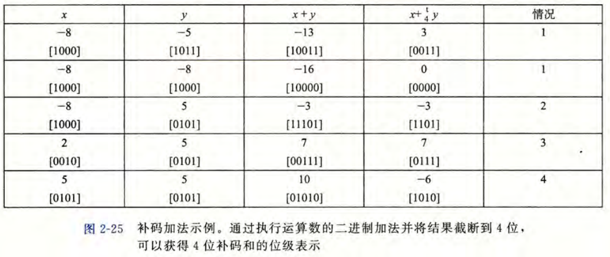
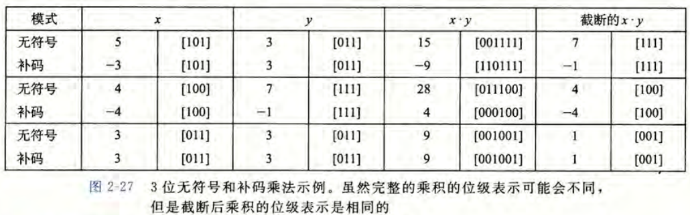
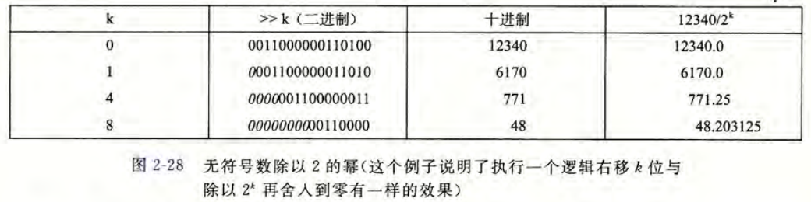
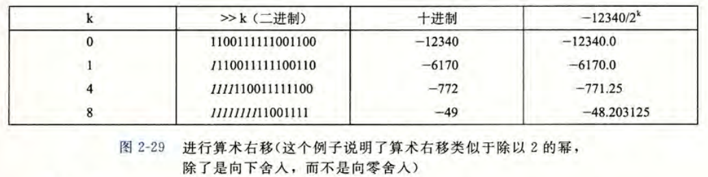
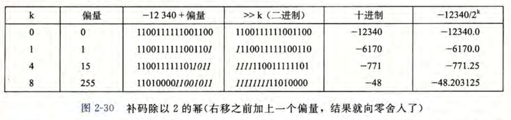

> 依据：《深入理解计算机系统》（原书第 3 版）第 2.3 节，纸书第 60～75 页。文中图 2-22、2-25、2-27～2-30 均截自原书。

学过整数的表示后，我们已经知道：计算机保存的是**位模式**，同一串位既可以按无符号数解释，也可以按补码解释。接下来要解决的是：对这些位做加、减、乘、除，为什么有时会得到与数学计算不同的答案？

本节有两条主线：**加、减、乘先看完整结果能否装下；除法先看舍去低位后朝哪个方向取整。** 下图给出阅读路线，后文会从左到右解释每一步。

两条路线都从位宽和数值解释开始。因此先弄清一串位能表示哪些数，后面的运算结果才有办法读懂。

## 一、做运算前：先分清位模式与数值

### 1. 四位整数能表示什么？

4 位共有 $2^4=16$ 种位模式。无符号数把它们读成 $0$～$15$；补码数把它们读成 $-8$～$7$。同样的位模式，数值可能不同：

| 4 位模式 | 读作无符号数 | 读作补码数 |
| :---: | :---: | :---: |
| $(0100)_2$ | $4$ | $4$ |
| $(1001)_2$ | $9$ | $-7$ |
| $(1111)_2$ | $15$ | $-1$ |

下文用 $w$ 表示位宽；在这张表中，$w=4$。最高位为 $0$ 时，两种读法的数值相同。最高位为 $1$ 时，设这串位的无符号值为 $U$、补码值为 $T$，它们的关系可以浓缩为：

$$
\boxed{T=U-2^w}
$$

例如 $(1001)_2$ 的无符号值是 $9$；在 $4$ 位补码中，它的值就是 $9-16=-7$。

这里的 $4$ 位只是教学用的小模型。实际程序可能用 $32$ 位或 $64$ 位，但同样需要先确定范围。知道一串位能表示哪些数之后，下一步就要看：运算结果超出范围时，位模式会发生什么变化？

### 2. 结果装不下时，怎么读它？

如果计算暂时产生了第 $5$ 位，却只能存回 $4$ 位，便从右往左留下末尾 $4$ 位。例如完整结果是 $(10101)_2$，盒子留下 $(0101)_2$，最左边的 $1$ 被丢掉。

以后遇到加、减、乘，可以固定按这个顺序思考：**先算数学结果 → 再看固定位宽留下的位 → 最后按无符号或补码解释。** 第一步确定完整结果，后两步确定保存后的结果。下面先用无符号加法走一遍这条路线。

## 二、加法：同样的位运算，为什么有两种结果？

### 1. 无符号加法：满一圈后从零重新开始

以 $4$ 位无符号数为例：$9$ 是 $(1001)_2$，$12$ 是 $(1100)_2$。它们的数学和是 $21$，要用 $5$ 位表示：

$$
(1001)_2+(1100)_2=(10101)_2
\quad\longrightarrow\quad
(0101)_2=5
$$

箭头表示把结果放回 $4$ 位盒子，只留下低 $4$ 位。为什么 $21$ 变成了 $5$？因为 $4$ 位只有 $16$ 种状态，好比一个走到 $15$ 就从 $0$ 继续的计数器；$21$ 走过完整的一圈 $16$，还剩 $5$。这个绕一圈的过程就是无符号加法的回绕。

**读图 2-22：**左边竖线上的 $x+y$ 是不受位数限制的数学和，右边竖线是保存后的结果。和小于 $2^w$ 时，沿蓝色箭头过去，数值不变；和达到 $2^w$ 时，沿黑色折线落回较低的位置，相当于减去 $2^w$。在刚才的 $4$ 位例子里，$2^w=16$，因此 $21$ 落到 $21-16=5$。

把保存后的无符号和记作 $s$，这条规律可写成一个短公式：

$$
\boxed{s=(x+y)\bmod 2^w}
$$

这里的取模就是数满 $2^w$ 后回到开头；$w=4$ 时，$21\bmod16=5$。

这也解释了一个容易误会的减法结果：在 $4$ 位无符号模型里，$0-1$ 不会得到负数，而是绕回 $(1111)_2$，读成 $15$。因为无符号数的范围里根本没有 $-1$。C 对无符号整数的这种回绕有明确定义，但有定义的结果未必是程序原本想要的数量。无符号数只把结果读成非负值；接下来保持位相加的步骤不变，看看改按补码解读会怎样。

### 2. 补码加法：位的处理不变，解释结果的方式变了

现在仍用 $4$ 位相加，只把输入和结果改按**补码**读。加法器处理的还是那几位；不同之处在于补码把最高位为 $1$ 的位模式解释为负数。于是，一个能保留的位模式，未必能表示原先的数学和。

**读图 2-25：**先看左边两列的输入 $x$、$y$；中间的 $x+y$ 是完整的数学和；再看右侧截成 $4$ 位后的值。先读最后一行：$5+5=10$，而 $4$ 位补码最大只能表示 $7$。保存的位是 $(1010)_2$，按补码读却是 $-6$。两个正数相加后出现负结果，这叫**正溢出**。

再读第一行：$-8+(-5)=-13$，小于 $4$ 位补码的下限 $-8$；低 $4$ 位成为 $(0011)_2$，读成 $3$。两个负数相加后出现非负结果，这叫**负溢出**。作为对照，表中的 $-8+5=-3$ 与 $2+5=7$ 都在 $-8$～$7$ 之内，所以保存后的值与数学和一致。

由此得到一条实用判断：**同号相加才可能越过补码范围的两端；异号相加不会发生这种溢出。**这里判断的是数学结果能否表示，不能只看二进制计算有没有向最高位之外进位。例如 $7+(-1)$ 的位计算是 $(0111)_2+(1111)_2=(1\,0110)_2$，虽产生了第 $5$ 位，留下的 $(0110)_2$ 仍正确表示 $6$。

因此，对 $w$ 位补码加法，完整的数学和只有落在下面的范围内才不会溢出：

$$
\boxed{-2^{w-1}\le x+y\le 2^{w-1}-1}
$$

这条范围判断来自位模式的容量。接下来还要分清一件事：位级模型能展示溢出后的位，C 语言是否允许程序依赖这个结果？

### 3. 这与 C 程序里的溢出有什么关系？

前面的 $4$ 位例子是在解释**位级模型**。写 C 程序时，还要加上一条语言规则：无符号加法回绕有定义；有符号加法超出类型范围属于**未定义行为**。因此不能先算出一个溢出的 `int` 结果，再看它是否变负来检测溢出。

正确的想法是**在相加前看剩余空间**：如果 $y>0$，先看 $x$ 是否大于 `INT_MAX - y`；如果 $y<0$，先看 $x$ 是否小于 `INT_MIN - y`。确认和仍在 `int` 范围内，才真正执行加法。这个检查仍在回答开头的问题：结果放得进盒子吗？

加法讲清了留下低位的规则，减法就不必另造一套机器：只要找出减数的相反数，就能把减法交给加法处理。

## 三、减法：为什么取反再加一能得到相反数？

### 1. 把 $5-3$ 变成一次加法

数学上，$5-3$ 就是 $5+(-3)$。在 $4$ 位补码里，$3$ 的位模式为 $(0011)_2$；逐位取反得 $(1100)_2$，再加 $1$ 得 $(1101)_2$，后者正是 $-3$。于是：

$$
(0101)_2+(1101)_2=(1\,0010)_2
\quad\longrightarrow\quad
(0010)_2=2
$$

这次加法也产生了第 $5$ 位，但留下的低 $4$ 位恰好表示正确答案。这里可以用 $x-y=x+(-y)$ 总结减法与加法的关系；在位模式中，求 $-y$ 的常用步骤是**逐位取反，再加一**。

不过，求相反数本身也可能超出补码范围。下面看最小负数，就能知道这条做法的边界在哪里。

### 2. 最小负数为什么是例外？

刚才的方法有一个边界。$4$ 位补码的最小值 $-8$ 是 $(1000)_2$；取反得 $(0111)_2$，再加 $1$ 又回到 $(1000)_2$。这不表示数学上 $-(-8)=-8$，而是因为 $+8$ 不在 $4$ 位补码的范围 $-8$～$7$ 内。

把位数换成真实的 `int`，同样要警惕最小值 `INT_MIN`。在 C 中计算 `-INT_MIN` 会发生有符号溢出。**位模式可以循环，数学上的相反数却未必能用原类型表示。**接下来乘法会把位数不够放大：两数相乘甚至可能需要原位数的两倍来保存完整结果。

## 四、乘法：完整乘积与留下的低位

### 1. 完整乘积为什么更容易丢位？

两个各占 $w$ 位的整数相乘，完整乘积最多可能需要 $2w$ 位。比如 $4$ 位无符号数 $15\times15=225$，完整二进制结果是 $(11100001)_2$；若只能留下低 $4$ 位，就只剩 $(0001)_2$，读成 $1$。这与加法回绕是同一件事，只是乘法更容易产生许多装不下的高位。

**读图 2-27：** 先只看最上面一组的两行。两行输入的位模式都为 $(101)_2$ 和 $(011)_2$。无符号行把它们读成 $5$ 和 $3$，完整乘积 $15$，留下低 $3$ 位 $(111)_2$，结果读成 $7$。补码行把同一个 $(101)_2$ 读成 $-3$，于是完整乘积是 $-9$；留下的低 $3$ 位仍为 $(111)_2$，这次却读成 $-1$。

为什么低位一样？在 $3$ 位里，$5$ 和 $-3$ 对应同一位模式，数值相差 $8$，正好是一整圈；各自乘 $3$ 后，两个乘积相差 $24$，仍是整圈的倍数。**低位相同，并不表示完整乘积相同。**与加法一样，C 的无符号乘法允许回绕；有符号乘法超出范围则是未定义行为。图里的补码截断，是帮助理解位模式的模型，不能当作 C 溢出后的保证结果。

若把完整乘积记作 $R$，低 $w$ 位按无符号读出的值记作 $p$，则乘法和加法遵循同一条回绕规律：

$$
\boxed{p=R\bmod 2^w}
$$

既然乘以 $2$ 会使二进制位向左移动，下一步自然要问：能否用移位处理乘以固定常数？

### 2. 为什么乘以常数会变成移位和加减？

二进制向左移动一位，每个 $1$ 都到了权重翻倍的位置。因此，在位数足够、运算合法时，左移 $3$ 位相当于乘 $8$。例如在足够宽的位数中，$3$ 左移 $3$ 位得到 $24$。

原书接着利用这个想法处理常数 $14$。因为 $14=16-2$，所以可以先做两次乘以 $2$ 的幂，再把结果相减：

$$
\boxed{14x=(16-2)x=16x-2x}
$$

例如 $x=3$ 时，先得到 $48$ 和 $6$，再相减得 $42$。移位负责乘以 $2$ 的幂，加减负责把这些部分合起来。这说明编译器为什么可能用移位和加减实现常数乘法。

**理解原理不等于可以随手改写 C 表达式。**负的有符号数左移、或有符号左移的中间结果无法表示，都会遇到未定义行为；移位次数也不能为负，或达到被提升后操作数的位宽。想保持原程序的意义，必须同时检查输入和中间结果。即使完全不手工改写移位，直接相乘时也要注意结果是否放得下；计算内存大小就是一个实际例子。

### 3. 实际程序为什么要在乘法前检查大小？

乘法溢出在计算内存大小时尤其危险。假设用一个只有 $8$ 位的无符号数记录字节数，最大值是 $255$。要存 $100$ 个元素，每个占 $3$ 字节，真正需要 $300$ 字节；若先在 $8$ 位中相乘，结果会绕成 $300-256=44$。程序可能只分配 $44$ 字节，却按 $100$ 个元素写入。

解决办法与加法一致：**先检查能否表示，再运算。** 这里可以先算 $255/3=85$，知道最多容纳 $85$ 个元素；$100$ 已超过上限，就不再计算那个会回绕的乘积。真实 C 程序用 `size_t` 表示大小时，可在元素大小非零的前提下，先检查 `count > SIZE_MAX / element_size`，通过后才计算 `count * element_size`。

加法和乘法关注的是高位会不会被丢掉。除法正好从另一个方向移走位：它丢掉的是低位，而低位与余数、舍入方向有关。

## 五、除法：右移之后，结果朝哪边取整？

### 1. 非负数右移：丢掉低位，就丢掉了余数

先看无符号数 $13=(1101)_2$。右移 $2$ 位得到 $(0011)_2=3$；被移走的末尾 $(01)_2$ 对应余数 $1$。所以右移得到的 $3$，正是 $13$ 除以 $4$ 的整数商。一般地，无符号数右移 $k$ 位，对应除以 $2^k$ 后向下取整。

**读图 2-28：** 第一列 $k$ 表示右移位数，第三列是位模式读出的十进制值，最后一列是真实的数学商。沿 $k=4$ 这一行看：$12340/16=771.25$，而右移后得到 $771$。少掉的 $0.25$ 来自被移走的低位。原数非负，所以向下取整恰好也就是 C 整数除法所用的向零截断。若用 $q$ 表示右移后的整数商，可以把规律写成：

$$
\boxed{q=\left\lfloor\frac{x}{2^k}\right\rfloor\qquad(x\ge0)}
$$

符号 $\lfloor a\rfloor$ 表示向下取整，例如 $\lfloor3.25\rfloor=3$。正数右移与整数除法一致，是因为向下与向零在正数一侧方向相同。换成负数，这两个方向就可能分开。

### 2. 负数右移：为什么会与 C 的除法差 $1$？

对负的补码数，常见机器使用**算术右移**：左边空出的位补符号位 $1$，保持结果为负。问题在于算术右移相当于向下取整，而 C 的有符号整数除法向零截断。只有出现负的非整数商时，两种方向才会分开。

先看 $-7/4=-1.75$：向下取整得到 $-2$，向零截断得到 $-1$。图 2-29 给出了同样的现象：

**读图 2-29：**沿 $k=4$ 这一行，数学商是 $-12340/16=-771.25$；算术右移后的十进制结果却是 $-772$，因为 $-772$ 比 $-771.25$ 更靠下。C 表达式 `-12340 / 16` 所需的是向零截断的 $-771$。现在问题很明确：若用算术右移实现除法，怎样把这个多出来的 $-1$ 修正掉？

### 3. 先加偏置：怎样把结果拉回零的方向？

原书的办法是：负数在算术右移 $k$ 位之前，先加上 $2^k-1$，也就是**除数减 $1$**。例如除以 $4$ 时先加 $3$：$-7+3=-4$，再算术右移 $2$ 位得到 $-1$，与 C 的 $-7/4$ 相同。这个小调整让有余数的负数在取整前向零靠近。

**读图 2-30：**仍看 $k=4$ 行。与上一张图直接右移得到 $-772$ 不同，这里先加偏置 $15$，把 $-12340$ 变成 $-12325$；再算术右移 $4$ 位，就得到 $-771$。表中原本能整除的行，修正后也不会多走一步。偏置的作用不是改变除数，而是抵消负数右移时可能产生的舍入差异。

对负数 $x$，在采用算术右移的机器上，把移位后的商记作 $q$，可以用下面一式概括原书的方法：

$$
\boxed{q=\left\lfloor\frac{x+(2^k-1)}{2^k}\right\rfloor\qquad(x<0)}
$$

和上一小节的式子相比，分子只多了偏置 $2^k-1$。它让右移后的结果与向零截断的整数商一致。

这一方法用于理解机器如何实现除以 $2$ 的幂。写需要可移植的 C 程序时，想要向零截断就直接写 `/`；负的有符号数右移在原书讨论的 C 语境下依赖具体实现，不能假定所有环境都按图中方式补位。普通除法还要避开除数为 $0$，以及 `INT_MIN / -1` 这种商无法表示的情况。

## 六、回到开头的运算路线图

现在可以重新看开头的两条路线：上面一条用固定位宽解释加、减、乘，下面一条用舍入方向解释除法。两条路线都要先确定数据的位宽和读法。

遇到加、减、乘，先求数学结果，再问：**目标类型能表示吗？若只看低位，剩下的位按无符号还是补码解释？** 前一个问题用于判断 C 程序能否安全运算，后一个问题用于理解固定位宽的位级结果。

遇到除以 $2$ 的幂，再多问一步：**右移会朝哪边取整，而题目要求朝哪边取整？** 非负数通常没有差异；负的非整数商要特别留意。这样，加减乘的位宽问题和除法的舍入问题便各有位置，也能沿着同一条思路读完整节。
