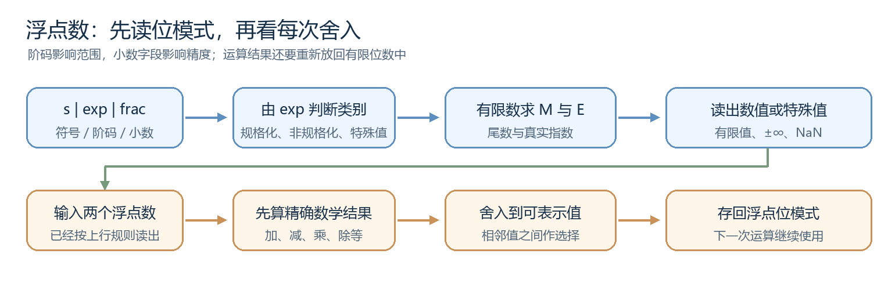
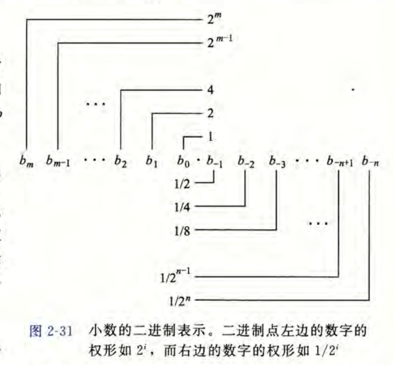
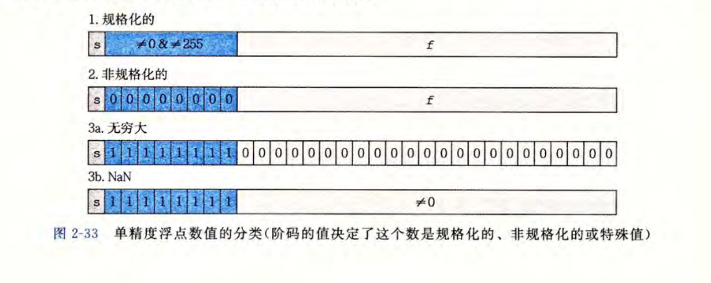
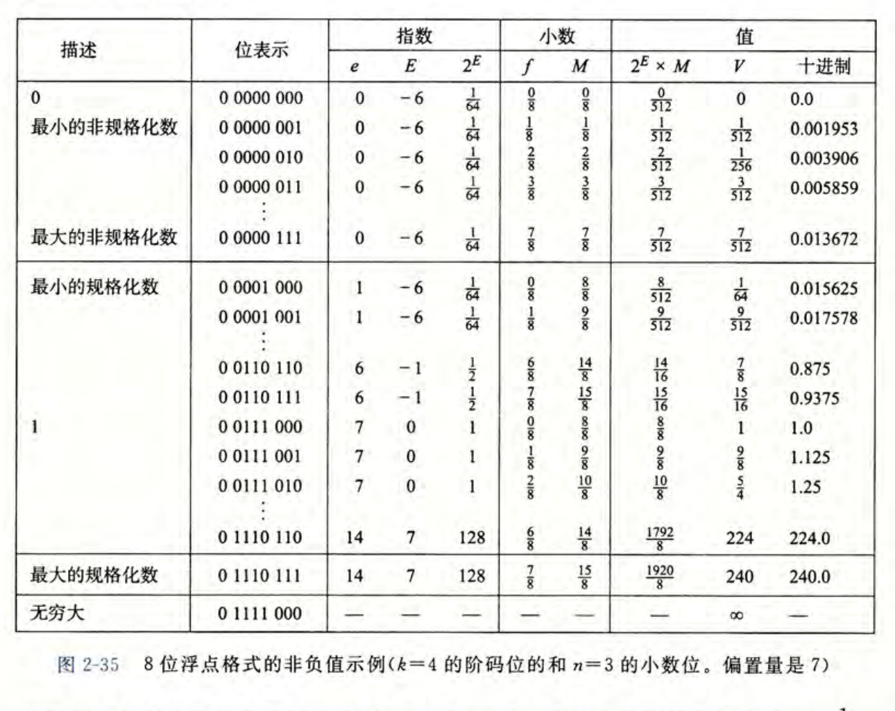
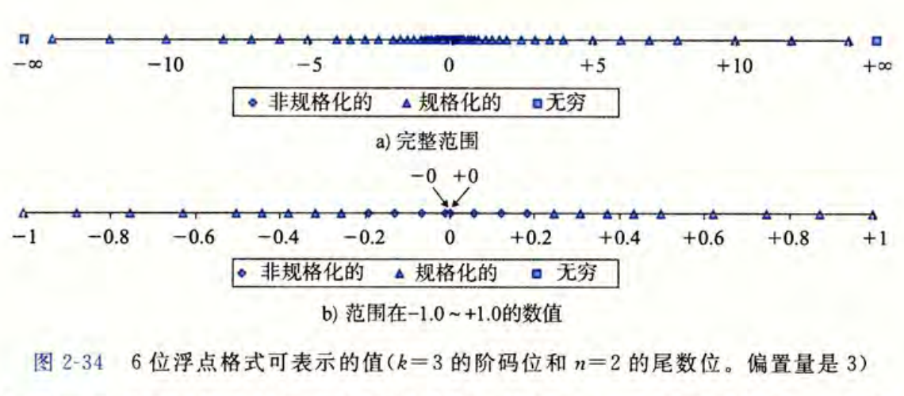
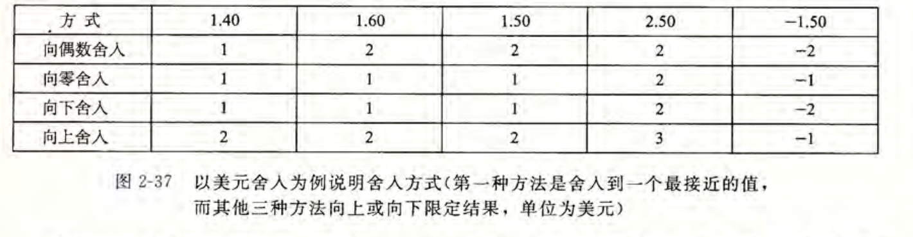

> 依据：《深入理解计算机系统》（原书第 3 版）第 2.4 节，纸书第 75～87 页。原书图 2-31～2-35、2-37 的相关插图已截取到 `images` 文件夹。

整数运算遇到的主要限制是位数不够：数学结果可能超出固定宽度。浮点数也只有有限位，但它还要表示小数，所以会出现第二个限制：**两个能表示的数之间，还有很多不能精确表示的数。** 保存这些数或运算结果时，计算机必须选择附近的一个值。

> **第一次学 IEEE 754？** 可以先读[规格化数入门补充](/notes/csapp/02-04-normalized-numbers-primer)：从二进制科学计数法出发，用 5.75 走一遍编码和解码，再回到本文学习非规格化数、舍入与运算。

下面的路线图把本节连成两步：先学会从位模式读出数值，再看运算结果怎样舍入并存回同样的格式。

## 一、从二进制小数出发：为什么小数点还不够？

### 1. 小数点右边的位代表什么？

十进制的 $12.34$ 用十的幂表示每一位的权重；二进制也一样，只是权重换成二的幂。小数点左边从右往左是 $1,2,4,\ldots$，右边从左往右是 $1/2,1/4,1/8,\ldots$。

**读图 2-31：** 先找到小数点。它左侧的 $b_0$ 权重为 $1$，再往左的 $b_1$ 权重为 $2$；右侧的第一位 $b_{-1}$ 权重为 $1/2$，第二位 $b_{-2}$ 权重为 $1/4$。某位是 $1$ 就把对应权重加进来，是 $0$ 就不加。按这个方法读 $(101.11)_2$：

$$
\boxed{(101.11)_2=4+1+\frac12+\frac14=5.75}
$$

这个例子说明，二进制小数并不神秘：它仍是按位权相加。接下来要问的是，固定数量的小数位能否像十进制小数那样表示任意常见的小数？

### 2. 为什么 $0.1$ 常常只能近似保存？

有限位的二进制小数只能把若干个 $1/2,1/4,1/8,\ldots$ 相加，因此得到的分数可以写成分母为 $2$ 的幂的形式。$0.5=1/2$ 可以精确表示为 $(0.1)_2$；十进制的 $0.1=1/10$ 则不能写成有限位的二进制小数，它的二进制展开会继续下去。

这不是浮点数特有的故障，而是进制之间的差别：十进制也无法用有限小数位精确写出 $1/3$。既然固定小数点既不能覆盖很大和很小的数，也不一定能精确写出常见小数，就需要一种能移动小数点位置的表示方法。浮点数的阶码正为此而设。

## 二、先看字段：一个浮点数存了哪三部分？

### 1. 符号、阶码、小数字段各做什么？

一个非零的有限浮点数可以看作二进制科学记数法：

$$
\boxed{V=(-1)^s\times M\times2^E}
$$

这里 $s$ 控制正负，$M$ 是尾数，$E$ 决定乘以多少个 $2$。例如 $(101.11)_2=(1.0111)_2\times2^2$，所以 $5.75$ 可以由尾数 $(1.0111)_2$ 和指数 $2$ 描述。

**读图 2-32：** 先看上方的单精度，最左边 $s$ 占 $1$ 位，中间 $\mathrm{exp}$ 占 $8$ 位，右边 $\mathrm{frac}$ 占 $23$ 位。下方双精度也有相同的三段，只是阶码为 $11$ 位、小数为 $52$ 位。
其中，**$\mathrm{exp}$ 控制科学计数法的2的指数** ，且不是直接写入公式的 $E$；**$\mathrm{frac}$ 可以理解为科学计数法的小数部分**。这两段由阶码的位模式决定。
如果无法理解，可以先看：[规格化数入门补充](/notes/csapp/02-04-normalized-numbers-primer)

| 常见 IEEE 二进制格式 | 总位数 | 阶码位数 $k$ | 小数位数 $n$ | 正常数的有效位数 |
| :--- | ---: | ---: | ---: | ---: |
| binary32，常见的 `float` | $32$ | $8$ | $23$ | $24$ |
| binary64，常见的 `double` | $64$ | $11$ | $52$ | $53$ |

表中有效位数比小数字段多 $1$，原因是大多数有限值有一个不用存储的前导 $1$。先看阶码分类，便能知道它何时存在。

### 2. 为什么要先检查阶码字段？

原书图 2-33 把单精度的阶码分成三类。与其一上来背公式，不如先按图判断数属于哪一类，再选正确的公式读它。

**读图 2-33：** 蓝色部分是阶码。第一行不是全 $0$、也不是全 $1$，对应普通的规格化数；第二行全 $0$，对应非规格化数，也包括零；最后两行全 $1$，再看小数字段是全 $0$ 还是非零，分别得到无穷大与 NaN。下面按这个顺序，把各类数的具体读法连起来。

## 三、读出数值：规格化、非规格化与特殊值

### 1. 规格化数：用隐藏的前导 $1$ 多保留一位精度

设阶码字段按**无符号数读出的值为 $e$**，它**有 $k$ 位**；**小数字段所表示的二进制小数为 $f$**。当阶码既不全 $0$ 也不全 $1$ 时：

$$
\boxed{\mathrm{Bias}=2^{k-1}-1,\qquad E=e-\mathrm{Bias},\qquad M=1+f}
$$

  **$\mathrm{Bias}$** 是阶码的偏置值，即**定值**。单精度 $k=8$，所以偏置为 $127$；可用于规格化数的阶码字段从 $1$ 到 $254$，**真实指数 $E$ 因而从 $-126$ 到 $127$**。之所以令 $M=1+f$，是因为规格化数的尾数总以二进制的 $1.$ 开头；这个 $1$ 不必存入 $\mathrm{frac}$，小数字段的 $23$ 位便能提供 $24$ 位有效精度。

现在可以完整编码前面的 $5.75$。它是 $(1.0111)_2\times2^2$，所以 $s=0$、$E=2$；单精度阶码字段要存 $e=2+127=129=(10000001)_2$。前导 $1$ 不存，小数字段只保存后面的 $0111$，再补零到 $23$ 位：

$$
\underbrace{0}_{s}\ \big|\;
\underbrace{10000001}_{\mathrm{exp}}\ \big|\
\underbrace{01110000000000000000000}_{\mathrm{frac}}
$$

这个例子把图 2-32 的三段真正用上了。它也提出一个问题：若数越来越靠近零，规格化数仍要求尾数从 $1.$ 开始，零和更小的正数该放在哪里？

### 2. 非规格化数：从最小规格化数平滑走向零
#### 怎么理解这句话？
以下图为例子。最小的规格化数，$exp=0000$，此时真实指数干到了$-6$，没办法往下干了，所以后面只能通过缩小$frac$来减小数字。所以，下面例子中的最小精度就是$0.001953$，接着就是$0$了。

阶码全 $0$ 时，不再补隐藏的前导 $1$（因为没法化成$1.xxx$了）。这时 $M=f$，而指数特意设为 $E=1-\mathrm{Bias}$，与最小规格化数使用**同一个指数**：

$$
\boxed{\mathrm{exp}=0:\quad E=1-\mathrm{Bias},\qquad M=f}
$$

为什么不直接用 $-\mathrm{Bias}$？看原书的简化例子更容易懂。图 2-35 假设总共 $8$ 位：$1$ 位符号、$4$ 位阶码、$3$ 位小数，因此偏置为 $7$。先看表中最大的非规格化数，它的小数字段是 $(111)_2$，得到 $M=7/8$、$E=-6$，数值为 $7/512$。再看紧接着的最小规格化数，阶码从全 $0$ 变为 $(0001)_2$，尾数变成 $1$、指数仍为 $-6$，数值为 $8/512$。

**读图 2-35：** 先盯住表中最大的非规格化数与最小的规格化数这相邻两行。小数字段从 $(111)_2$ 走到 $(000)_2$、阶码加 $1$，数值却只从 $7/512$ 走到 $8/512$，没有突然跳开一大段。再往表的最上方看，阶码和小数都为零时，$M=0$，就表示零；符号位还可以分别给出 $+0$ 与 $-0$。这就是非规格化数的作用：在靠近零的地方逐步变小，而不是从最小规格化数直接跳到零。真实的 binary32 也是如此：最小正规格化数是 $2^{-126}$，最小正非规格化数还能小到 $2^{-149}$。

### 3. 阶码全 $1$ 时，为什么不能继续套用数值公式？

阶码全 $1$ 被留给特殊值（ 无穷与NaN ）。小数字段全 $0$ 时，符号位决定 $+\infty$ 或 $-\infty$；小数字段非零时得到 NaN，表示一个不能按普通实数处理的运算结果。因此图 2-33 最后两行不再计算 $M$、$E$，也不套用前面的 $V$ 公式。

把三类放在一起，读一个位模式就有了固定顺序：**先拆 $s/\mathrm{exp}/\mathrm{frac}$，再看阶码属于哪一类，最后才求 $M$、$E$ 或认出特殊值。** 我们现在知道数能否表示；下一步还要看，能表示的数在数轴上排列得有多密。

## 四、范围与精度：为什么数越大，间隔通常越宽？

### 1. 可表示的数并没有均匀铺满数轴

**读图 2-34：** 上半部分看整个数轴，离零很远的三角形较稀；下半部分把 $-1$ 到 $1$ 放大，靠近零处出现更多点。三角形表示规格化数，菱形表示非规格化数，两侧方框表示无穷大。图中间的 $+0$ 和 $-0$ 有不同位模式。阶码让数能跨越很大的范围；固定数量的小数位则使大数附近的可表示点变稀。

对有 $n$ 个小数位、指数固定为 $E$ 的一段规格化数，相邻两个值的间隔可以简记为：

$$
\boxed{\Delta=2^{E-n}}
$$

这个式子只需结合位权理解：小数字段最后一位的权重是 $2^{-n}$，再乘上阶码给出的 $2^E$，便得到这一段数轴上的最小步长。指数 $E$ 越大，步长也越大。**范围由阶码扩展，精度由有限的小数位限制。**

### 2. 为什么单精度会漏掉某些大整数？

单精度有 $n=23$ 个小数位。在 $2^{24}$ 附近，$E=24$，所以上式给出相邻间隔 $\Delta=2^{24-23}=2$。因此 $2^{24}$ 可以精确表示，下一个可表示的整数却是 $2^{24}+2$；中间的 $2^{24}+1$ 无法直接存入单精度。

到这里，表示与精度已经接上：若一个真实值落在相邻两个可表示值之间，必须选其中一个。这一步叫舍入，也是浮点运算与实数运算出现差异的直接原因。

## 五、舍入：落在两个值之间时选哪一个？

### 1. 最接近值遇到正中点怎么办？

IEEE 浮点的常用默认方式是**舍入到最接近的可表示值；恰在正中点时，选最低保留位为 $0$ 的那个**。先把可表示值假设成整数，图 2-37 就给出直观例子。

**读图 2-37：** 先看第一行的 $1.40$ 与 $1.60$，它们分别更接近 $1$ 与 $2$。再看 $1.50$ 和 $2.50$：它们恰好在两个整数中间，最近偶数规则分别选 $2$ 和 $2$。表中的另外三行分别朝零、朝负无穷和朝正无穷取值；例如 $-1.50$ 向零得 $-1$，向下得 $-2$。

实际浮点舍入看的是**二进制的最低保留位**，不是十进制写出来的奇偶（类似物理实验的位数保留）。假设只保留小数点后 $2$ 个二进制位，$(10.101)_2=2.625$ 正好位于 $(10.10)_2=2.5$ 与 $(10.11)_2=2.75$ 中间。前者最低保留位为 $0$，所以选 $(10.10)_2$。这样理解，最近偶数规则就能用于任意精度，而不只用于把金额舍入到整数。

### 2. 为什么还要有向零、向上和向下？

有时任务需要一个保证不超过真实值的下界，或保证不小于真实值的上界。图中的向下舍入与向上舍入正好提供这两种方向；向零舍入则丢弃朝零方向的小数部分。它们和最近偶数一样，都是在**可表示值**中选结果，只是选择目标不同。

舍入规则解决了如何保存一个数。现在把它放回运算过程：每做完一次加减乘除，新的数学结果又可能落在两个可表示值之间，所以还要再舍入一次。

## 六、浮点运算：每一步舍入怎样改变计算？

### 1. 先算数学结果，再存回目标格式

若用 $\circ$ 代表一次加、减、乘或除，用 $\operatorname{fl}$ 代表存成目标浮点格式后的值，可把正常的有限结果概括为：

$$
\boxed{\operatorname{fl}(x\circ y)=\operatorname{round}(x\circ y)}
$$

右边先想象精确的数学结果，再按目标格式舍入；左边是机器留下的值。遇到无穷大或 NaN 时，还要按特殊值规则处理。这个式子也告诉我们：一次运算的结果会成为下一次运算的输入，误差可能沿计算顺序传下去。

### 2. 为什么改动括号会改动结果？

沿用前面单精度的 $2^{24}$ 例子，并假定每一步都存回 binary32。数学上，下面两种加法顺序都等于 $1$；浮点计算的中间值却不同：

| 运算顺序 | 第一步发生了什么 | 最终结果 |
| :--- | :--- | ---: |
| $(2^{24}+1)-2^{24}$ | $2^{24}+1$ 正好夹在相邻两个单精度值中间，舍入成 $2^{24}$ | $0$ |
| $2^{24}+(1-2^{24})$ | $1-2^{24}$ 仍能精确表示，随后相加 | $1$ |

第一行里，小小的 $1$ 在首次相加时就丢失了；第二行先把大数抵消，$1$ 被保留下来。因此浮点加法不能像精确实数加法那样随意改变结合顺序。乘法也会因中间溢出或舍入而遇到相似问题，编译器和程序员都不能只凭代数恒等式断定两种计算顺序等价。

### 3. 零、无穷大和 NaN 在运算中意味着什么？

无穷大可以表示超出有限范围的结果，NaN 则表示无法作为普通数值处理的结果，例如 IEEE 运算中的 $0/0$。NaN 与任何数比较相等都为假，连与自身比较也一样；程序应使用合适的分类函数判断它，而不是比较它是否等于另一个 NaN。

$+0$ 与 $-0$ 的位模式不同，但数值比较时相等。符号仍有用：在常见 IEEE 环境中，$1/(+0)$ 与 $1/(-0)$ 分别趋向 $+\infty$ 和 $-\infty$。这些特殊值并非另一套无关知识；它们正是图 2-33 中预留的位模式在运算中发挥作用的结果。

## 七、放回 C 程序：类型转换会保留多少信息？

前面已经看到单精度在 $2^{24}$ 附近不能逐个表示整数。类型转换会把一个值搬到另一种位数和精度的格式中，因此也要经历能否表示与是否舍入的检查。以下关系以常见的 $32$ 位 `int`、binary32 `float`、binary64 `double` 为前提；C 语言本身不要求所有机器都采用这组 IEEE 格式。

| 转换 | 通常会发生什么 | 原因 |
| :--- | :--- | :--- |
| `int` → `float` | 大整数可能舍入 | 单精度只有 $24$ 位有效精度 |
| `int` → `double` | 所有 $32$ 位整数都能精确保留 | 双精度有 $53$ 位有效精度 |
| `float` → `double` | 已有单精度值可精确保留 | 新格式精度更高，但不能恢复之前丢掉的信息 |
| `double` → `float` | 可能舍入，也可能超出有限范围 | 目标精度与范围更小 |
| 浮点数 → `int` | 小数部分向零截断；超出整数范围时 C 行为未定义 | 整数类型只接受范围内的整数值 |

例如 $2^{24}+1$ 转为 binary32 时，默认最近偶数舍入会选 $2^{24}$。再把这个 `float` 转为 `double`，数值仍是 $2^{24}$，不会凭空找回丢失的 $1$。而把 $1.9$ 转成 `int` 得 $1$，这是向零截断，与浮点运算通常使用的最近偶数舍入不是同一件事。

## 八、沿路线图复盘

读一个浮点位模式时，先拆出符号、阶码和小数字段；**阶码先决定类别**，然后才能计算有限数的 $M$、$E$。想把实数存进去时，要先看目标格式能否表示；若它落在相邻值之间，就按舍入规则选择。做浮点运算时，这一步会在每个中间结果后重复。

因此，遇到一个看似奇怪的浮点结果，可以顺着三个问题追下去：**这个数原本能否精确表示？附近可表示数的间隔有多大？这一运算或转换按什么方向舍入？** 这三个问题把表示、精度、运算顺序和 C 类型转换连成了同一条线。
