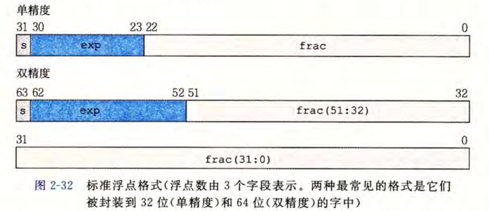

跳转回：[0204浮点数](/notes/csapp/02-04-floating-point) 继续阅读。
## 我们怎么理解一个32位的单精度的浮点数？
> 先理解“32 位在保存什么”，再记公式。本文只讲**规格化数**；零、非规格化数、无穷大和 NaN 有另外的编码规则。

## 1. 先看整体：它在保存二进制科学计数法

十进制科学计数法可以把 $575$ 写成 $5.75\times10^2$。二进制也能这样写，例如：

$$
101.11_2=1.0111_2\times2^2
$$

右边的 $1.0111_2$ 是**有效数字**，$2$ 是**指数**。乘 $2^2$ 相当于把二进制小数点向右移动两位。

IEEE 754 单精度浮点数用 32 位保存三类信息：

| 字段 | 位数 | 它回答的问题 |
| --- | ---: | --- |
| `s`（符号位） | 1 | 正数还是负数？ |
| `exp`（阶码字段） | 8 | 二进制小数点要移动多少位？ |
| `frac`（小数字段） | 23 | 有效数字的小数部分是什么？ |

>**位的排列顺序如下图：**


**注意：**`exp` 中存的值不直接等于真正的指数；`frac` 中也没有存下有效数字开头的那个 `1`。下面分别解释。

## 2. 用到的一点二进制小数知识

二进制小数点右边的每一位，依次代表 $2^{-1}$、$2^{-2}$、$2^{-3}$……例如：

$$
0.11_2=1\times2^{-1}+1\times2^{-2}=0.5+0.25=0.75
$$

所以：

$$
5.75_{10}=101.11_2
$$

因为整数部分 $101_2=4+1=5$，小数部分 $.11_2=0.75$。

把 $101.11_2$ 的小数点左移两位，就得到开头只有一个 $1$ 的形式：

$$
101.11_2=1.0111_2\times2^2
$$

这一步叫**规格化**。对非零的规格化二进制数，有效数字总能写成 $1.xxxx_2$。

## 3. 三个字段分别怎么存

继续以 $5.75=1.0111_2\times2^2$ 为例。

### 符号位 `s`

$5.75$ 是正数，所以 `s = 0`。负数则是 `s = 1`。读取时可以统一写成 $(-1)^s$。

### 阶码字段 `exp`

这个例子真正需要的指数是 $E=2$。单精度**不直接存** $E$，而是先加上偏置量 $127$：

$$
e=E+127=2+127=129=10000001_2
$$

因此 8 位 `exp` 存的是 `10000001`。读取时反过来算：$E=e-127$。

#### 为什么这么设计？
这样设计是因为 $E$ 可能为负，也可能为正，比如 $1.01_2\times2^{-5}$；**加上偏置量后，可以把阶码字段作为非负的二进制数保存**。

这里两个字母不要混淆：

| 符号 | 含义 | 本例 |
| --- | --- | ---: |
| $e$ | 从 `exp` 读出的无符号整数 | 129 |
| $E$ | 真正参与计算的指数，$E=e-127$ | 2 |

### 小数字段 `frac`

规格化后的有效数字是 $1.0111_2$。因为规格化数开头必然是 $1$。
因为对于所有非零规格化二进制数，有效数字一定可以写成：

\[
\boxed{1.xxxxx_2}
\]
所以第一位一定是$1$，因此没有必要真的把它存进去。
存储时省略它，只存小数点后面的 `0111`，再在右侧补零到 23 位：

```text
1.0111₂  →  01110000000000000000000
             └────── frac：23 位 ──────┘
```

读取时，要把省略的 `1` 补回去，得到 $1.0111_2$。这个 `1` 叫**隐藏的前导 1**。因此规格化数虽然只存 23 位 `frac`，有效数字却有 **24 位二进制精度**：前导 1 加 23 位小数。

如果把 `frac` 的各位写成 $f_1f_2\cdots f_{23}$，那么它表示的小数值是：

$$
f=f_1 2^{-1}+f_2 2^{-2}+\cdots+f_{23}2^{-23}
$$

本例中，`frac` 的前四位是 `0111`，所以 $f=0/2+1/4+1/8+1/16=0.4375$，有效数字为 $1+f=1.4375$。

## 4. 把三个字段拼起来

对于 $5.75$，刚才得到：

| 字段 | 内容 | 来自哪里 |
| --- | --- | --- |
| `s` | `0` | 正数 |
| `exp` | `10000001` | $E=2$，所以 $e=129$ |
| `frac` | `01110000000000000000000` | $1.0111_2$ 省略开头的 `1` |

于是它的单精度编码为：

```text
0 | 10000001 | 01110000000000000000000
```

检查位数：$1+8+23=32$。

## 5. 反过来读：从 32 位还原数值

拿到刚才的编码 `0 | 10000001 | 01110000000000000000000`：

1. `s = 0`，所以是正数。
2. `exp = 10000001₂ = 129`，所以真正的指数 $E=129-127=2$。
3. 给 `frac = 0111000…` 补上隐藏的前导 `1`，得到 $1.0111_2$。
4. 组合起来：$1.0111_2\times2^2=101.11_2=5.75$。

所以规格化数的总公式是：

$$
\boxed{V=(-1)^s\times(1+f)\times2^{e-127}}
$$

其中 $f$ 是 `frac` 对应的二进制小数，$e$ 是 `exp` 对应的无符号整数。也可以把 $(1+f)$ 直接看成 $1.\text{frac}_2$。

## 6. 一个边界：什么时候不能用这个公式？

上面的“补前导 1、指数减 127”规则只适用于**规格化数**，也就是 `exp` 的值在 **1 到 254** 之间时。

`exp` 全为 `0` 或全为 `1` 时有特殊含义，不能照搬本文公式。这些情况可等理解规格化数以后再学。


## 7. 整数与浮点数的二进制关系：以 12345 为例

先将整数 `12345` 转成二进制：

\[
12345_{10} = 11000000111001_2
\]

将它写成规格化的二进制科学计数法：

\[
11000000111001_2
=
1.1000000111001_2 \times 2^{13}
\]

可以看到：

```text
整数：
11000000111001

规格化后：
1.1000000111001 × 2^13
```

本质上，**有效二进制位没有发生改变，只是移动了小数点的位置。**

对于单精度浮点数：

- 符号位：

\[
s = 0
\]

- 真正的指数：

\[
E = 13
\]

- 阶码：

\[
e = E + 127 = 140 = 10001100_2
\]

- 有效数字：

\[
1.1000000111001_2
\]

规格化数最前面的 `1` 默认存在，不需要存储，所以：

\[
frac = 10000001110010000000000
\]
因此 `12345.0f` 的 IEEE 754 表示为：

\[
0 | 10001100 | 10000001110010000000000
\]

### 核心理解

整数中的有效二进制位：$11000000111001$
浮点数中的有效数字：$1.1000000111001$


本质上是**同一串二进制数字**。

浮点数只是把小数点移动到第一个 `1` 后面，然后：

- `frac` 保存有效数字
- `exp` 记录小数点移动的位置

因此可以理解为：

\[
\boxed{
\text{浮点数}
=
\text{有效二进制数字}
+
\text{小数点位置信息}
}
\]

`12345` 只有 14 位有效二进制位，而单精度浮点数有 24 位有效精度，因此 `12345` 可以被 `float` 精确表示。


跳转回：[0204浮点数](/notes/csapp/02-04-floating-point) 继续阅读。
