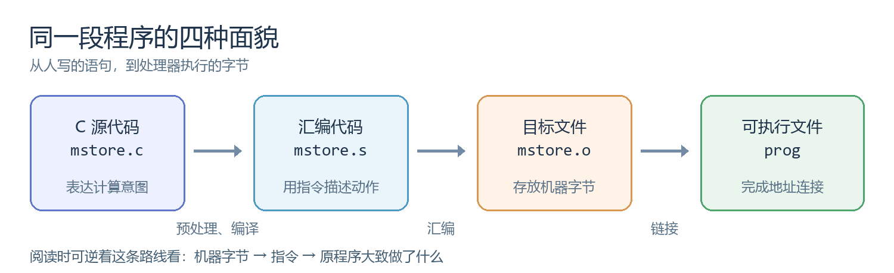
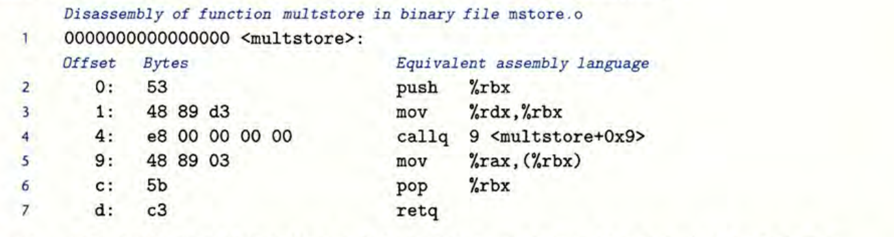
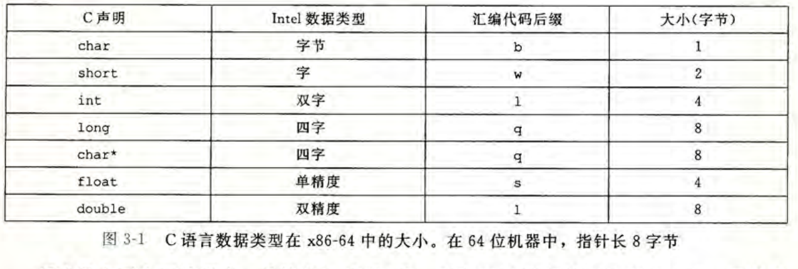

> 依据：《深入理解计算机系统》（原书第 3 版）第 3.1～3.3 节，纸书第 109～119 页。文中的反汇编截图与图 3-1 截自原书；流程图根据本节内容绘制。本篇以原书使用的 Linux、GCC 和 x86-64 为背景。

第二章回答了数据如何存成位。现在要进一步问：**程序本身怎样存储和执行？** 处理器不会直接执行 `long t = mult2(x, y);` 这样的 C 语句。编译器会把它变成一串机器指令；每条指令最终又是若干字节。学习汇编，就是在 C 语句与这些字节之间搭一座桥。

先看整条路线。下面四个方框是同一段程序在不同阶段的形式，箭头表示生成它们的步骤。我们会沿箭头认识它们，再逆着箭头练习读机器级程序。



## 一、先认清三种表示：C、汇编与机器代码

### 1. 为什么 C 程序会变成另一种样子？

C 语言让我们写出变量、表达式和函数调用，但处理器能直接执行的是**机器指令**。例如，C 中的一个函数调用，最终要由多条指令配合完成：准备参数、转去被调用函数、取得结果，必要时再把结果写入内存。编译器负责把较高层的表达转换成这些具体动作。

同一段程序常见的三种表示可以这样区分：

| 表示 | 给谁看 | 主要内容 |
| :--- | :--- | :--- |
| C 源代码 | 程序员 | 变量、类型、表达式、函数等 |
| 汇编代码 | 程序员和汇编器 | 用文字写出的机器指令，例如 `movq %rdx, %rbx` |
| 机器代码 | 处理器 | 对指令的字节编码，例如本例中上一条指令编码为 $0x48,\ 0x89,\ 0xd3$ |

**汇编代码是机器指令的可读写法，机器代码是供处理器执行的字节。** 二者描述的动作大体相同，但 C 源代码中的一个语句通常会对应多条指令；有些 C 变量甚至不会在最终代码中保留独立的存储位置。因此，读汇编需要追踪数据和动作，不能机械地寻找一条 C 语句对应的一条指令。

既然汇编贴近处理器，下一步要明确它描述的是哪一种处理器。不同处理器能识别的指令和寄存器名称并不完全相同。

### 2. 本章所说的 x86-64 是什么？

原书以 **x86-64 指令集架构**为主线。指令集架构，简称 ISA，可以理解为软件与处理器之间的一份约定：处理器有哪些可见的寄存器、能执行哪些指令、每条指令会怎样改变状态。x86 从早期较窄的处理器逐步扩展到 64 位，并保留了许多兼容规则；了解这一点，就足以理解为什么汇编中会出现看似不统一的名称，例如 `rax`、`eax` 和 `ax`。

这里的**机器状态**先记住四类即可：

| 状态 | 暂时怎样理解 | 后面主要用在哪里 |
| :--- | :--- | :--- |
| 程序计数器 `rip` | 指向接下来要执行的指令 | 分支、循环、函数调用 |
| 寄存器 | 处理器内保存少量数据的位置 | 参数、计算结果、地址 |
| 条件码 | 记录某些运算产生的状态 | 判断与条件跳转 |
| 内存 | 按地址访问的大量字节 | 变量、数组、栈 |

把执行过程想成一个反复进行的动作即可：**取出指令 → 按指令改变寄存器或内存 → 找到下一条指令。** 程序看到的内存地址是*虚拟地址*；这一篇只需要知道，地址能帮助机器定位字节，不必先掌握操作系统如何把它映射到物理内存。

有了这些对象，我们就可以拿一段具体 C 代码，看看它如何一步步变成指令。

## 二、跟着一个例子走：从 `mstore.c` 到可执行文件

### 1. 这段 C 代码原本想做什么？

原书使用下面这个函数。这里 `dest` 是一个指针，保存着某个 `long` 对象的地址；`*dest = t` 表示把 `t` 写进这个地址指向的位置。

```c
long mult2(long, long);

void multstore(long x, long y, long *dest) {
    long t = mult2(x, y);
    *dest = t;
}
```

先不看任何汇编，也能用一句话概括它：**调用 `mult2` 计算 `x` 与 `y` 的结果，然后把结果存到 `dest` 指向的内存中。** 记住这句话，后面读指令时就有了核对目标。

### 2. 编译过程中，各种文件分别是什么？

假设上面的代码保存在 `mstore.c`。原书使用 `-Og`，让 GCC 进行适合观察代码的优化。用不同选项，可以停在不同阶段：

| 命令示意 | 得到什么 | 此时能否直接运行 |
| :--- | :--- | :--- |
| `gcc -Og -S mstore.c` | 文本汇编文件 `mstore.s` | 不能 |
| `gcc -Og -c mstore.c` | 二进制目标文件 `mstore.o` | 不能 |
| `gcc -Og -o prog main.c mstore.c` | 链接后的可执行文件 `prog` | 可以 |

读图时可以把流程浓缩成：

$$
\boxed{\text{C 源代码}\ \xrightarrow{\text{预处理、编译}}\ \text{汇编代码}\ \xrightarrow{\text{汇编}}\ \text{目标文件}\ \xrightarrow{\text{链接}}\ \text{可执行文件}}
$$

目标文件里已经有机器指令的字节，但还可能缺少跨文件调用所需的最终地址。例如 `mult2` 可以定义在另一个文件里；汇编器处理 `mstore.c` 时，尚不知道链接后 `mult2` 位于哪里。链接器把所需文件合在一起，再解决这类引用。上表中的 `main.c` 提供程序入口以及示例所需的函数定义。

流程图解决了文件之间的关系，接下来要打开中间的 `mstore.s`：它究竟怎样描述刚才那句 C 代码？

## 三、读懂这段汇编：数据从哪里来，去了哪里？

### 1. 先掌握一条指令的读法

原书使用 **AT&T 汇编格式**。一条常见的双操作数指令可以先按下面的方向读：

$$
\boxed{\text{指令名}\quad\text{来源},\ \text{目的}\qquad\text{数据从来源流向目的}}
$$

例如 `movq %rdx, %rbx` 是把 `%rdx` 中的值复制到 `%rbx`。`movq` 的 `q` 表示此次操作按 $8$ 字节处理；`%rdx` 和 `%rbx` 是寄存器。需要注意：**复制不会清空来源**，执行后两个寄存器暂时可以保存相同的值。

原书给出的核心指令如下；这里省略了以 `.` 开头的汇编器指令，先只看处理器要执行的动作。

```asm
multstore:
    pushq %rbx
    movq  %rdx, %rbx
    call  mult2
    movq  %rax, (%rbx)
    popq  %rbx
    ret
```

开头的 `multstore:` 是位置标签，供汇编器等工具识别函数起点，本身不是处理器要执行的一条指令。原书生成的完整 `.s` 文件还有 `.text`、`.globl` 等以 `.` 开头的行；它们告诉汇编器或链接器如何组织代码，初学时先集中读上面的指令即可。

### 2. 按 C 函数的目标追踪一遍

这段代码遵守书中 Linux x86-64 的函数调用约定：调用 `multstore` 时，前三个参数 `x`、`y`、`dest` 分别进入 `%rdi`、`%rsi`、`%rdx`；`mult2` 的返回值放在 `%rax`。这些是约定好的位置，不是从参数名字中推出来的。

| 执行到哪里 | 此时发生什么 | 对应前面的 C 代码 |
| :--- | :--- | :--- |
| `pushq %rbx` | 暂存 `%rbx` 原来的值 | 为使用该寄存器做准备 |
| `movq %rdx, %rbx` | 把 `dest` 的地址复制到 `%rbx` | 保留稍后要写入的位置 |
| `call mult2` | 使用仍在 `%rdi`、`%rsi` 中的 `x`、`y` 调用函数 | `mult2(x, y)` |
| `movq %rax, (%rbx)` | 把返回值写入 `%rbx` 保存的地址 | `*dest = t` |
| `popq %rbx`、`ret` | 恢复寄存器并返回调用处 | 函数结束 |

最容易卡住的是 `(%rbx)`：`%rbx` 是**寄存器里的地址**，`(%rbx)` 指**该地址对应的内存位置**。所以 `movq %rax, (%rbx)` 并非把返回值复制进 `%rbx`，而是写到指针 `dest` 所指的对象中。它正好实现了 C 代码里的 `*dest = t`。

这里也看不到名为 `t` 的独立内存位置。`mult2` 的结果已经在 `%rax`，编译器可以直接使用它。至于 `pushq`、`popq` 为什么涉及栈，以及函数调用怎样返回，第 3.7 节会沿这段代码继续讲；现在抓住**保留地址 → 调用计算 → 按地址写回**这条数据路线就够了。

汇编代码已经能让我们理解程序动作。下面再往下走一层：处理器实际看到的字节长什么样？

## 四、机器字节与反汇编：为什么不能直接把字节当作 C 代码读？

### 1. 一条指令对应几个字节？

汇编器把文字指令编码成字节。原书中，`multstore` 的这段代码在目标文件里占 $14$ 字节。使用 `objdump -d mstore.o` 反汇编后，可以同时看到偏移量、字节和对应的汇编指令：



**读这张截图：** 先看第一条：偏移量 $0x0$ 处的 $0x53$ 对应 `push %rbx`，只占 $1$ 字节。下一条从 $0x1$ 开始，$0x48,\ 0x89,\ 0xd3$ 对应 `mov %rdx, %rbx`，占 $3$ 字节。再下一条从 $0x4$ 开始。只看这三条，就能发现一个规律：没有跳转时，下一条指令从上一条指令的字节结束处继续。x86-64 指令长短不一，本例中的几条指令分别占 $1$～$5$ 字节。

$$
\boxed{\text{下一条顺序指令的起点}=\text{本条起点}+\text{本条字节数}}
$$

截图中，`call` 的首字节 $0xe8$ 后面暂时跟着四个 $0x00$ 字节，因为这是**目标文件**中的代码，调用位置还要等待链接器修正。反汇编器此时显示的临时目标也不能当成真正的 `mult2` 地址。这也解释了为什么已经包含机器字节的 `.o` 文件，仍要经过链接才能成为完整程序。

### 2. 反汇编能帮我们恢复多少信息？

反汇编器依据机器字节找出指令边界，再给它们写上可读的助记符。因此，我们能从机器代码重新看到 `mov`、`call` 等动作。但机器字节并不保存每一句 C 源代码的原样：变量名 `t`、注释、原来的表达式写法都可能消失。调试信息有时能额外保留一部分源代码线索，那是另行加入的信息。

实际读一段反汇编时，可以固定走三步：**先看指令位置和字节范围，再看指令读写了哪些寄存器或内存，最后把这些动作连回原程序的大致意图。** 要把第二步做准确，还得知道每次读写多少字节，这正是原书接着介绍数据格式的原因。

## 五、数据格式：同一个寄存器名，为什么还有不同宽度？

### 1. C 类型在本书的平台上占多少字节？

原书图 3-1 汇总了本章所用平台的常见类型大小和汇编后缀：



**读图 3-1：** 先看最后一列。`char` 占 $1$ 字节、`short` 占 $2$ 字节、`int` 占 $4$ 字节；本书讨论的 Linux x86-64 环境里，`long` 和指针占 $8$ 字节。再看第三列，整数指令常用的宽度后缀是 `b`、`w`、`l`、`q`，依次对应 $1$、$2$、$4$、$8$ 字节。

把二者连起来，就得到后面读指令时最常用的换算：

$$
\boxed{\text{操作宽度（位）}=8\times\text{操作宽度（字节）}}
$$

例如 `movq` 中的 `q` 表示 $8$ 字节，也就是 $64$ 位；`movl` 中的 `l` 表示 $4$ 字节，也就是 $32$ 位。**`l` 在整数指令后缀中表示 $4$ 字节，不等于 C 的 `long` 一定占 $4$ 字节。** 这是历史命名造成的容易混淆之处：图里的 `int` 对应 `l`，Linux x86-64 的 `long` 对应 `q`。图中 `float`、`double` 的后缀属于浮点指令体系，等讲第 3.11 节时再结合浮点寄存器理解。

类型大小还依赖平台和约定，不能把上表当成所有 C 实现的统一规定。例如，常见的 64 位 Windows 环境中 `long` 仍占 $4$ 字节。读本章例子时，先按**书中的 Linux x86-64 环境**判断；读别的平台的程序时，要重新确认类型大小。

### 2. 同一条指令为什么可能写成两种样子？

前面一直使用 GCC 默认的 AT&T 格式。阅读 Intel 或 Microsoft 的资料时，常会遇到 Intel 格式。下面两行表达的是同一个复制动作：

| 格式 | 写法 | 怎样读 |
| :--- | :--- | :--- |
| AT&T | `movq %rdx, %rbx` | 来源 `%rdx` → 目的 `%rbx` |
| Intel | `mov rbx, rdx` | 目的 `rbx` ← 来源 `rdx` |

两种格式还会用不同写法表示内存位置：AT&T 的 `(%rbx)`，在 Intel 格式里常写成 `[rbx]`；Intel 格式通常也不在寄存器前加 `%`，并可能用 `QWORD PTR` 明确说明 $8$ 字节宽度。遇到资料中的 `mov` 时，**先辨认格式，再判断数据流向**，就不容易把赋值方向读反。

## 六、回到开头：读机器级程序时先问什么？

这一篇把同一段 `multstore` 代码从 C 语句一路追到了目标文件中的字节。回看开头的路线图，三个问题能帮助我们定位自己正在读哪一层：

1. **这是什么形式的代码？** `.c` 写意图，`.s` 写可读指令，`.o` 已含机器字节，链接后的文件才能形成完整可执行程序。
2. **数据怎样流动？** 先确定寄存器和内存位置，再按汇编格式辨认来源与目的；在本例中，`dest` 的地址先被保留，`mult2` 的结果随后写入该地址。
3. **一次操作有多宽？** 指令后缀告诉我们本次处理几个字节；判断宽度时还要结合当前平台的 C 类型大小。

这三个问题建立了读汇编的起点。顺着第二个问题往下，下一篇就可以具体分析**寄存器、内存地址、数据传送和算术指令**，看每条指令究竟怎样访问数据。
