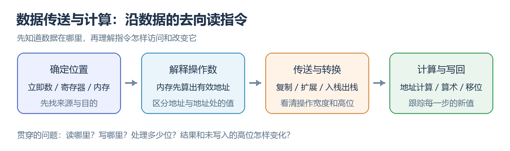
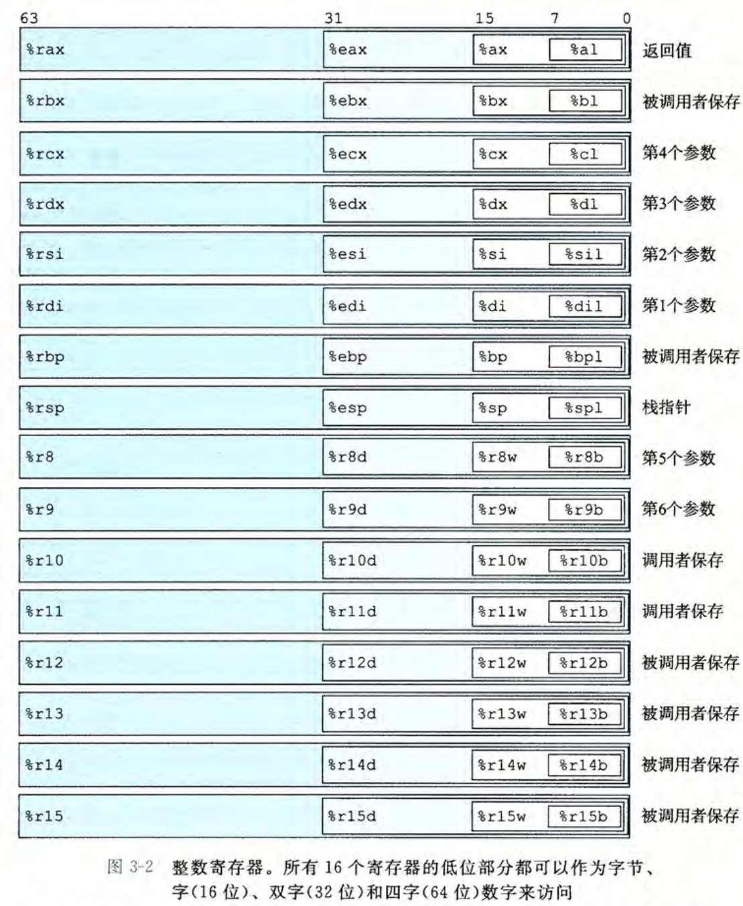
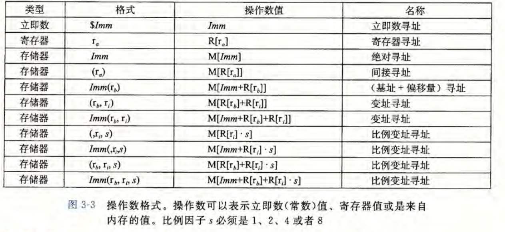
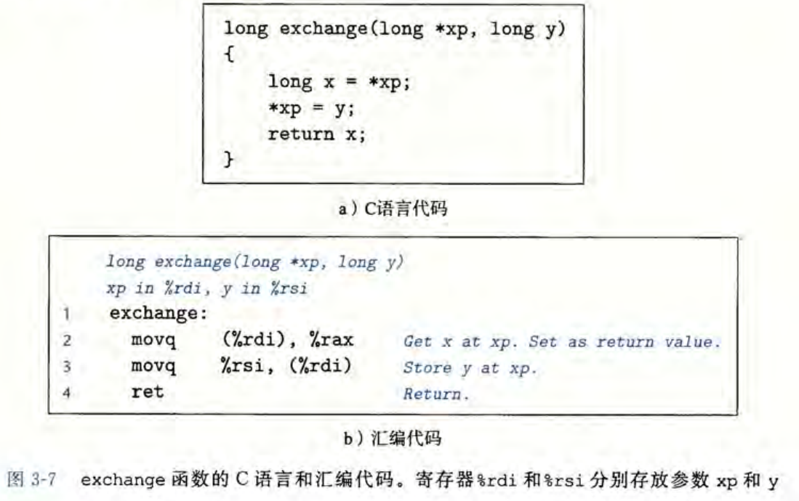
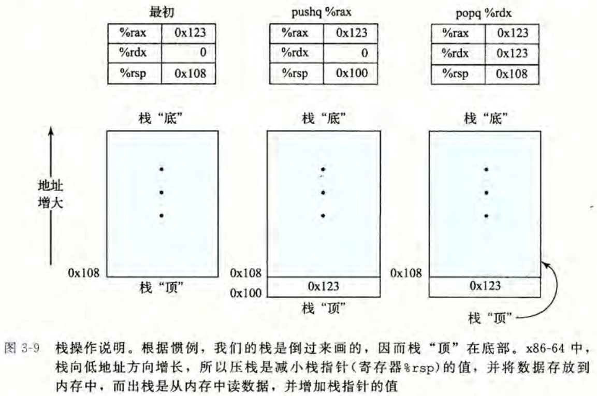
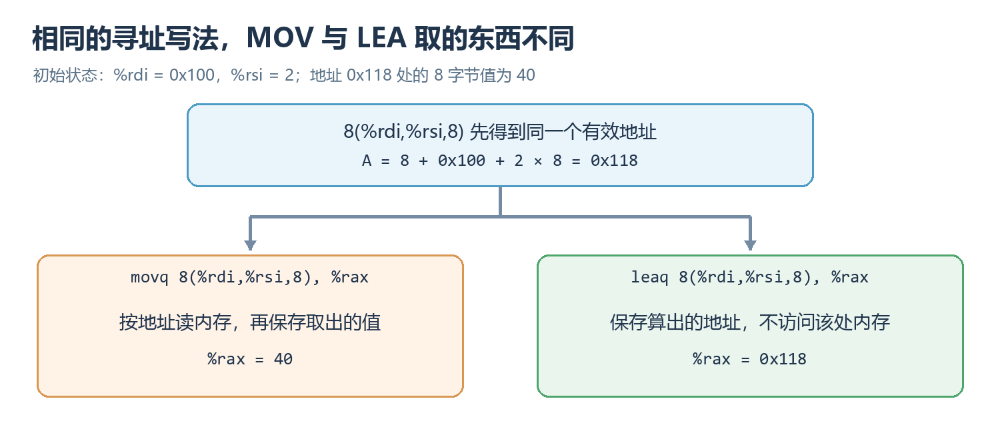
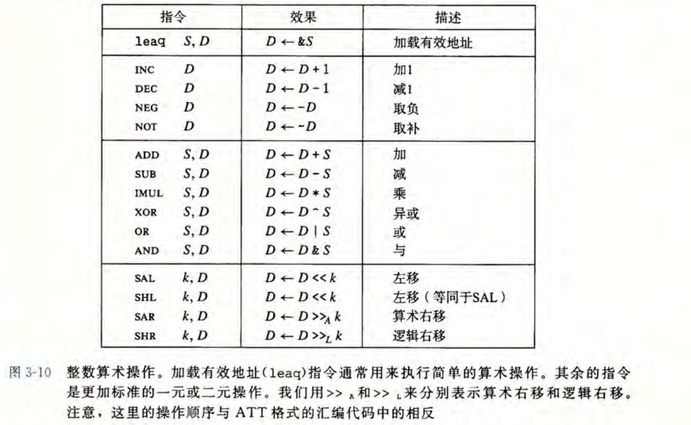
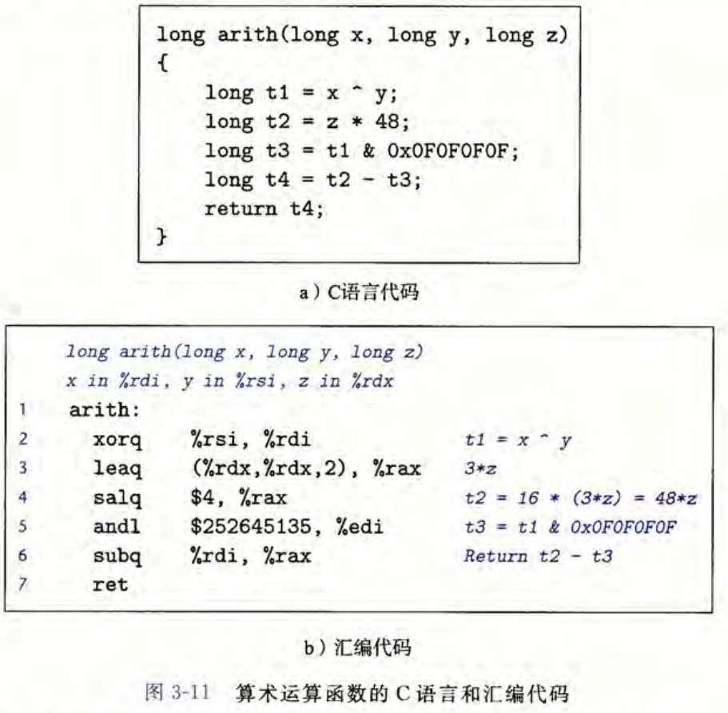
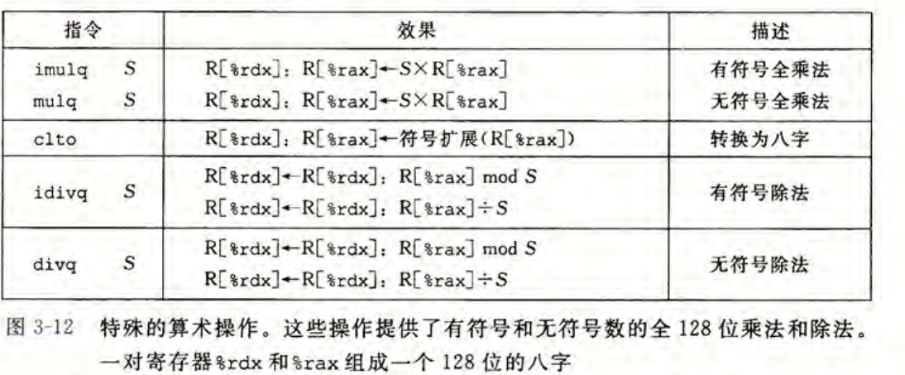

> 依据：《深入理解计算机系统》（原书第 3 版）第 3.4～3.5 节，纸书第 119～135 页。图 3-2、3-3、3-7、3-9～3-12 截自原书；两张主线与对照图根据本节内容绘制。沿用原书的 Linux、GCC、x86-64 与 AT&T 汇编格式。

上一篇已经知道：汇编用文字描述机器指令。现在要把这个认识变成具体的读代码能力：看到 `movq (%rdi), %rax`，能说出它从哪里取数据、取多少字节、写到哪里；看到后面的加减和移位，还能接着追踪结果。

本篇沿着一条数据路线展开： **认识存放位置 → 解释操作数 → 传送与转换 → 计算与写回。** 每一步都要留意操作宽度，因为同一个寄存器，写入不同数量的位时，高位的变化可能不同。



## 一、先找存放位置：寄存器与内存是什么关系？

### 1. 十六个寄存器，是处理器直接使用的数据位置

x86-64 有 $16$ 个通用整数寄存器，每个可以保存 $64$ 位的数据。这些位可以是整数，也可以是内存地址；机器不会根据寄存器名字判断它是某个 C 变量还是指针。内存则提供大量按地址访问的字节，指令可以在寄存器与内存之间搬运数据。

原书图 3-2 把寄存器名称和可访问的宽度放在一起。先看第一行，就能读懂后面大部分行：



**读图 3-2：** `%rax` 指整个 $64$ 位寄存器，`%eax` 指它的低 $32$ 位，`%ax` 指低 $16$ 位，`%al` 指低 $8$ 位。它们对应同一个寄存器的不同部分。例如，修改 `%al`，就会改变 `%rax` 的最低一个字节。第九行的 `%r8`、`%r8d`、`%r8w`、`%r8b` 也是相同的宽度关系。

图右侧的参数、返回值等标注来自 **函数调用约定。** 例如，本书的平台通常用 `%rdi`、`%rsi` 传前两个整数或指针参数，用 `%rax` 保存整数或指针返回值。读函数例子时会用到这些约定；普通计算中，寄存器仍可以保存其他临时值。`%rsp` 比较特殊，它是维护运行时栈的栈指针，后面会单独解释。

### 2. 写入低位时，剩下的高位会怎样？

认识名称还不够。假设 `%rax` 最初保存 $0x0011223344556677$，下面每一行都 **独立地从这个初始值出发，** 把相应宽度的全 $1$ 位模式写进去：

| 指令 | 写入范围 | 执行后的整个 `%rax` |
| :--- | :--- | :--- |
| `movb $-1, %al` | 低 $8$ 位 | $0x00112233445566FF$ |
| `movw $-1, %ax` | 低 $16$ 位 | $0x001122334455FFFF$ |
| `movl $-1, %eax` | 低 $32$ 位，并清零高 $32$ 位 | $0x00000000FFFFFFFF$ |
| `movq $-1, %rax` | 全部 $64$ 位 | $0xFFFFFFFFFFFFFFFF$ |

前两行只是覆盖被指定的低位；第三行却多做了清零。由此记住一条后面反复用到的规则：**写入通用寄存器的 32 位部分，会同时把高 32 位清零。** 它不只适用于 `movl`，也适用于向通用寄存器写入 $32$ 位结果的其他整数指令。这里说的是寄存器；向内存写入 $4$ 字节不会顺便清零旁边的 $4$ 字节。

寄存器的读写宽度明确后，下一个问题是：指令中的一个操作数，究竟是在指定常数、寄存器，还是内存？

## 二、解释操作数：先分清数值、地址与地址处的数据

### 1. 操作数有三种主要来源

操作数就是指令处理的数据或位置。AT&T 格式中，最常见的三类如下：

| 类别 | 写法示例 | 作为源操作数时取什么 |
| :--- | :--- | :--- |
| 立即数 | `$5`、`$0x100` | 指令中直接写出的常数 |
| 寄存器 | `%rdi` | 寄存器当前保存的值 |
| 内存 | `(%rdi)`、`8(%rdi)` | 先算地址，再读取地址处的数据 |

这里 `$` 是汇编的立即数标记。比如 `$0x100` 表示常数 $256$；没有 `$` 的 `0x100`，在这里作为普通数据操作数时表示地址 $0x100$ 处的内存。可见， **同一个数字，前面的符号会改变它的读法。**

再看 `%rdi` 与 `(%rdi)`。假设 `%rdi` 中保存 $0x100$，该地址处的 $8$ 字节整数是 $4$：读取 `%rdi` 得到地址数值 $0x100$，按 $8$ 字节读取 `(%rdi)` 得到 $4$。括号让机器多走了一步：用寄存器里的值定位内存，然后取出数据。这对应 C 中指针 `p` 与 `*p` 的区别。

### 2. 复杂的内存写法，只是在组合一个地址

原书图 3-3 列出了多种写法。**表里的 $R[r]$ 表示寄存器 $r$ 保存的值，$M[A]$ 表示地址 $A$ 处的内存数据**；实际读写多少字节，由指令的操作宽度决定。



**读图 3-3：** 先看最后一行，前面的几种内存写法都可以从它省略部分项得到。通用形式 `d(base, index, s)` 包含偏移量、基址寄存器、变址寄存器和比例因子。设两个寄存器当前的值分别为 $B$、$I$，得到的有效地址是：

$$
\boxed{A=d+B+I\times s\qquad(s\in\{1,2,4,8\})}
$$

这里 $d$ 是以字节为单位的偏移量；本篇的 $64$ 位地址示例使用 $64$ 位基址和变址寄存器。$s$ 常用于把数组下标换成字节偏移。比如本书平台的 `long` 占 $8$ 字节，元素下标为 $i$ 时，从数组起点走到该元素需要增加 $8i$ 字节。这就解释了比例因子为什么会频繁出现在数组访问里。

我们用同一组初始状态走一遍：`%rdi` 保存 $0x100$，`%rsi` 保存 $2$，地址 $0x118$ 处的 $8$ 字节值为 $40$。遇到 `8(%rdi,%rsi,8)`，先算：

$$
A=8+0x100+2\times8=0x118
$$

如果它是 `movq` 的内存源操作数，接下来才读出 $40$。因此，要把 **算出地址** 与 **按地址取值** 分成两步。`(%rdi)` 只是省略偏移量和变址部分，`8(%rdi)` 则只保留基址与偏移量。

现在已经能找到源数据和目的位置，就可以真正执行数据传送了。

## 三、MOV：把数据复制到目的位置

### 1. 来源在前，目的在后，宽度由后缀说明

`movb`、`movw`、`movl`、`movq` 都是复制数据，分别处理 $1$、$2$、$4$、$8$ 字节。若用 $S$ 表示源值、$D$ 表示目的位置，基本效果可以写成：

$$
\boxed{\text{MOV }S,D:\quad D\leftarrow S}
$$

例如 `movq (%rdi), %rax` 从内存读 $8$ 字节放入 `%rax`；`movq %rax, (%rdi)` 则把 `%rax` 的 $8$ 字节写入内存。**复制后，来源仍保留原值。** 至于目的寄存器的高位怎样处理，还要应用第一节的宽度规则。

写或读这类指令时，还要满足几个位置限制：源可以是立即数、寄存器或内存，目的可以是寄存器或内存，**一条普通 MOV 的两个操作数不能同时是内存。** 所以要把一个内存对象复制到另一个对象，通常先经过寄存器：

```asm
movq (%rdi), %rax
movq %rax, (%rsi)
```

后缀也要与寄存器名称的宽度匹配。例如 `movl %eax, %edx` 处理 $32$ 位；不能把 `movl` 的目的写成整个 `%rdx`，因为那是 $64$ 位名称。

### 2. 用 `exchange` 看清读取、覆盖与返回

原书图 3-7 给出一个很短的函数：读取指针指向的旧值，用新值覆盖它，然后返回旧值。它把上面的读取与写入连成了一个完整问题。



**读图 3-7：** 参数 `xp` 是地址，放在 `%rdi`；`y` 是新值，放在 `%rsi`。假设 `xp` 指向变量 `a`，`a` 原来为 $4$，新值 `y` 为 $3$：

| 步骤 | 指令 | 数据如何变化 |
| :--- | :--- | :--- |
| 先保留旧值 | `movq (%rdi), %rax` | 从 `a` 读出 $4$，存入 `%rax` |
| 再覆盖内存 | `movq %rsi, (%rdi)` | 把 $3$ 写进 `a`，`%rax` 中仍是 $4$ |
| 返回 | `ret` | 调用者取得 `%rax` 中的旧值 $4$ |

结果是：`a` 变成 $3$，函数返回 $4$。这里先读后写很关键；如果先覆盖内存，再去读取，就拿不到原先的 $4$ 了。

这个例子也能帮助检查括号：若第一条误读为 `movq %rdi, %rax`，复制的就会是地址，而不是 `a` 的旧值。下一步要处理的类型转换，在此基础上增加了一个问题：源和目的宽度不同时，额外的位从哪里来？

## 四、宽度转换：扩展与截断怎样变成指令？

### 1. 扩展前，先确定较窄数据应怎样解释

第二章已经讲过：**无符号数变宽时补 $0$；补码数变宽时复制符号位**。机器级代码用不同传送指令完成这两种扩展。下面都从 `%dl` 中的同一个 $8$ 位模式出发：

$$
(10101010)_2=0xAA
$$

它按无符号数读是 $170$，按 $8$ 位补码读是 $-86$。把它传到 `%rax`，三种写法会产生不同结果：

| 写法 | 做了什么 | `%rax` 的结果 |
| :--- | :--- | :--- |
| `movb %dl, %al` | 只复制低 $8$ 位 | 低字节变成 $0xAA$，其余 $7$ 字节保持原样 |
| `movzbq %dl, %rax` | 从 $1$ 字节**零扩展**到 $8$ 字节 | $0x00000000000000AA$，数值 $170$ |
| `movsbq %dl, %rax` | 从 $1$ 字节**符号扩展**到 $8$ 字节 | $0xFFFFFFFFFFFFFFAA$，数值 $-86$ |

因此，**只覆盖低位、零扩展、符号扩展，是三种不同的操作。** 后两种是在新宽度中保持相应读法下的数值，第一种则可能把原先的高位留在目的寄存器中。
>b = byte       = 8 bit
w = word       = 16 bit
l = long       = 32 bit
q = quad word  = 64 bit

### 2. 怎样从名字读出源宽度与目的宽度？

**movz** 中的 **z** 表示零(zero)扩展，**movs** 中的 **s** 表示符号扩展；末尾两个字母分别说明源和目的宽度。例如 `movzbq` 的 `b → q` 是 $1$ 字节到 $8$ 字节，`movslq` 的 `l → q` 是 $4$ 字节到 $8$ 字节。这些扩展指令可以从寄存器或内存读取较窄的源值，目的必须是寄存器。

对 $32$ 位无符号值扩展到 $64$ 位，可以直接用 `movl` 写入目的寄存器的低 $32$ 位，**因为高 $32$ 位自动清零**。对有符号值，则可以使用 **movslq**；`cltq` 是专门把 `%eax` 符号扩展到 `%rax` 的简写形式。

把规则浓缩为下面两句即可：

$$
\boxed{\text{零扩展：新高位补 0 }\qquad\text{符号扩展：新高位复制源符号位}}
$$

选择哪一种要看源值的含义。例如把负的 `int` 转成 `long`，不能靠普通 `movl` 得到正确的负数，因为它会把高位补成 $0$。

### 3. 变窄与大立即数，分别怎样处理？

变窄通常只留下低位。例如把值 $0x1234$ 转成 `unsigned char`，只保留最低字节 $0x34$。若该值已在 `%rax` 中，`movb %al, (%rdi)` 就可以把这个字节写入目标。这里同样要注意：只写一个字节，旁边的内存不会跟着改变。

另一种宽度问题来自立即数的编码。常见的 `movq` 立即数编码使用 $32$ 位立即数并符号扩展；需要任意 $64$ 位立即数写入寄存器时，可以明确使用 `movabsq`，例如：

```asm
movabsq $0x0011223344556677, %rax
```

这个 $64$ 位立即数形式的目的为寄存器；如果还要写入内存，再从寄存器传送过去。

到这里，我们已经会按位置和宽度复制数据。接下来看看一种特殊的传送：它除了读写内存，还会自动改变用于定位内存的栈指针。

## 五、入栈与出栈：带着栈指针一起移动的数据传送

### 1. 栈顶由 `%rsp` 指向，入栈向低地址增长

栈遵守后进先出：最后压入且尚未取出的值，会先被弹出。运行时栈存放在普通内存中，`%rsp` 保存栈顶地址。x86-64 的栈向 **低地址方向** 增长，所以压入一个 $8$ 字节值时，要先把栈指针减 $8$，再把数据放进腾出的位置。



**读图 3-9：** 从左到右看。起初 `%rsp` 为 $0x108$，`%rax` 为 $0x123$。执行 `pushq %rax` 后，`%rsp` 变成 $0x100$，地址 $0x100$ 处保存 $0x123$。接着执行 `popq %rdx`，这个值进入 `%rdx`，`%rsp` 加 $8$ 回到 $0x108$。

### 2. 用两步概括它们的数据变化

下面用 $M_8[A]$ 表示从地址 $A$ 开始的 $8$ 字节数据。只看图中普通寄存器与栈指针的变化，可以总结为：

$$
\boxed{\text{pushq \%rax：先 }rsp\leftarrow rsp-8\text{，再 }M_8[rsp]\leftarrow rax}
$$

$$
\boxed{\text{popq \%rdx：先 }rdx\leftarrow M_8[rsp]\text{，再 }rsp\leftarrow rsp+8}
$$

图右侧还保留了地址 $0x100$ 处的 $0x123$。这说明 **出栈主要是移动栈顶，原位置的字节没有被擦除。** 那个位置退出当前栈的有效使用范围，后面可能被新数据覆盖。

#### 为什么 **$pushq \%rax$** 这里不需要指定目标地址？
>一般来说，**$mov$** 需要一个目标地址，但 $pushq  \%rbx$ 之所以只写 $\%rbx$，是因为“往哪个栈压”已经由 $\%rsp$ 隐含指定了。

**也就是说，push 是一个很特殊的指令，它默认就知道栈在哪里**。

第一篇里的 `pushq %rbx`、`popq %rbx`，就是用这种传送暂存和恢复寄存器。等到函数调用一篇，再把它们放进完整栈帧。接下来回到寻址公式：既然算地址本身也在做加法和乘法，能不能直接把算出来的值当成运算结果？

## 六、LEA：把寻址公式当作一次计算

### 1. MOV 取地址处的数据，LEA 保存算出的值

`leaq` 的名称是加载有效地址。它的第一个操作数看起来像内存引用，但执行时只计算有效地址，**不会读取那个地址处的内存。** 目的必须是寄存器。

我们继续使用第二节的初始状态。两条指令都写 `8(%rdi,%rsi,8)`，算出的有效地址都是 $0x118$；区别发生在下一步：



**读对照图：** 上方先得到地址 $A=0x118$。沿左边的 `movq` 路线，去这个地址读出 $40$，所以 `%rax` 得到 $40$；沿右边的 `leaq` 路线，直接把 $0x118$ 保存到 `%rax`。因此不能仅凭括号就认定发生了内存访问，还要看指令名称。

$$
\boxed{\text{MOV 的内存源：}D\leftarrow M_8[A]\qquad\text{LEA：}D\leftarrow A}
$$

### 2. 为什么计算整数也会用到 LEA？

地址公式是 $d+B+I\times s$。如果寄存器里放的本来就是普通整数，这个式子仍然能做加法和有限形式的常数乘法。例如 `%rdi` 中为 $x$：

```asm
leaq (%rdi,%rdi,4), %rax
```

算出来的是 $x+4x=5x$；当 $x=3$ 时得到 $15$。这里没有任何内存读取，也不要求数值 $15$ 恰好是一个能访问的地址。所以看到 `leaq`，应先把它的操作数翻译成一个表达式，再判断这个值在后文被当作地址还是普通整数使用。

这让寻址与算术连了起来。不过，LEA 的乘法比例有限，其他计算还需要专门的算术、逻辑和移位指令。

## 七、算术与逻辑：目的位置通常也提供一个输入

### 1. 一元操作：在原位置修改一个值

原书图 3-10 把常用操作按作用放在一起。表中的 $S$ 是源值，$D$ 是目的处的原值，箭头表示更新目的位置。



**读图 3-10：** 先看 `INC`、`DEC`、`NEG`、`NOT`，它们只有一个显式操作数。这个操作数既提供旧值，也接收新值，分别对应加 $1$、减 $1$、求相反数和逐位取反。
>$INC:increment$ | $ DEC:decrement$ | $NEG:negate/negative$ |$ NOT:not$

其中 `NEG` 与 `NOT` 很容易混淆。以 $8$ 位的 $(00000101)_2=5$ 为例，逐位取反得到 $(11111010)_2$，按补码读是 $-6$；求相反数则得到 $(11111011)_2=-5$。二者恰好相差一步加 $1$，与第二章的补码取负方法相接。

### 2. 二元操作：第二个操作数既是输入，也是输出

对于常见的 `addq S, D`、`subq S, D`，计算要同时使用 $S$ 和目的处的旧值，再覆盖目的。尤其要记清减法方向：

$$
\boxed{\text{addq }S,D:\ D\leftarrow D+S\qquad\text{subq }S,D:\ D\leftarrow D-S}
$$

比如 `%rax` 原来是 $9$，`%rdx` 是 $4$，执行 `subq %rdx, %rax` 后 `%rax` 变为 $5$。按中文读成从 `%rax` 减去 `%rdx`，就能避免把结果误算成 $-5$。

逻辑指令也是相同的数据流：`and` 做逐位与，`or` 做逐位或，`xor` 做逐位异或。一个常见写法是 `xorl %eax, %eax`：每一位与自身异或都得到 $0$，低 $32$ 位因此清零；再根据第一节的规则，整个 `%rax` 也会变成 $0$。

常见加减和位运算可以把内存作为目的。例如 `addq $1, (%rdi)`，会先读出该地址处的 $8$ 字节整数，加 $1$，然后写回。这些常见二元指令也不能同时使用两个显式内存操作数；如果两项都在内存中，先把其中一项读进寄存器。两操作数 `imulq S, D` 则要求目的 $D$ 为寄存器。不能仅凭效果表中的统一写法，认定所有指令都允许完全相同的位置组合。

### 3. 位级结果与 C 语言规则要分开判断

固定输入的位模式后，同一种加法、减法或低位乘法，无符号与补码读法得到的结果位模式相同。区别主要发生在如何解读结果，以及是否超出该读法对应的范围。若机器只留下 $w$ 位，可以把低位保存规律简记为：

$$
\boxed{\text{低 }w\text{ 位的无符号值}=\text{完整结果}\bmod 2^w}
$$

但这仍是机器的位级效果。C 的无符号整数运算按范围回绕，有符号整数溢出则不能据此当成语言保证。读编译后的指令与判断原 C 程序是否合法，是两个都需要完成的问题。

普通加减和位运算清楚后，下面的移位就可以看成：按照指定数量移动这些位，同时决定空出来的位置补什么。

## 八、移位：方向之外，还要看补位与移位数量

### 1. 左移的两个名字相同，右移的两个名字不同

|名称|方向|作用|
|--|--|--|
|sal|Left|向左移动，低位补零|
|shl|Left|$sal$ 与 $shl$ 的位级效果相同|
|sar|Right|Shift Algorithm Right，算数右移，高位补原符号位|
|shr|Right|逻辑右移，高位补 $0$|

但不管往哪个方向，移出操作宽度范围的位都会被丢弃。


例如，独立从同一个 $8$ 位模式 $(10010000)_2$ 出发，右移 $2$ 位：

| 指令 | 高位补什么 | 得到的 $8$ 位 | 对应的读法 |
| :--- | :--- | :--- | :--- |
| `sarb $2, %al` | 原符号位 $1$ | $(11100100)_2$ | 补码 $-28$，对应原值 $-112$ 的算术右移 |
| `shrb $2, %al` | $0$ | $(00100100)_2$ | 无符号 $36$，对应原值 $144$ 的逻辑右移 |

这与第二章已经学过的规律一致：算术右移负数会向下取整。例如 $-7$ 算术右移 $1$ 位得到 $-4$，而 C 表达式 `-7 / 2` 向零截断得到 $-3$。所以要用移位理解除法，仍须核对舍入方向。

### 2. 可变移位数量为什么写成 `%cl`？

常见写法 `salq $4, %rax` 直接把数量写在指令里。**x86 有一个很奇怪的历史规定：如果移位次数来自寄存器,必须放在 `%cl`**：

```asm
sarq %cl, %rax
```

这里 `%cl` 是 `%rcx` 的低 $8$ 位。对本篇常见的 $32$ 位和 $64$ 位移位，机器实际分别取移位数量的低 $5$ 位和低 $6$ 位。因此，$64$ 位移位指令面对数量 $64$ 时，有效数量会变为 $0$。

这不表示 C 中可以对 $64$ 位整数随便写 `x >> 64`。C 要求移位数量小于被提升后左操作数的位宽；负数量或达到位宽的数量都会出现未定义行为。 **机器如何处理编码出的数量，与 C 允许哪些表达式，是两层规则。**

现在可以把 MOV、LEA、逻辑和移位串起来，读一个包含多步计算的真实例子。

## 九、把多条指令连起来：一个寄存器可以先后保存不同变量

原书图 3-11 的函数先做异或，再计算 $48z$，接着用掩码保留部分位，最后相减。它适合练习按时间追踪寄存器，而不是把寄存器与某个 C 变量永久绑定。



**读图 3-11：** 初始的 `x`、`y`、`z` 分别在 `%rdi`、`%rsi`、`%rdx` 中。我们取一组不会溢出的具体输入：$x=0x35=53$，$y=0x12=18$，$z=2$。

| 指令 | 当前完成的计算 | 本例中的结果 |
| :--- | :--- | :--- |
| `xorq %rsi, %rdi` | `%rdi` 变成 `x ^ y` | $0x27=39$ |
| `leaq (%rdx,%rdx,2), %rax` | `%rax=%rdx+2*%rdx`,`%rax` 变成 $3z$ | $6$ |
| `salq $4, %rax` | 左移 $4$ 位，得到 $16\times3z=48z$ | $96$ |
| `andl $252645135, %edi` | 用 $0x0F0F0F0F$ 作逐位与掩码 | `%rdi` 得到 $0x07=7$ |
| `subq %rdi, %rax` | 用 $48z$ 减去掩码后的值 | $96-7=89$ |
| `ret` | 返回 `%rax` | $89$ |

这里的 `andl` 也值得停一下。十进制 $252645135$ 就是 $0x0F0F0F0F$，这个 $64$ 位掩码的高 $32$ 位本来全为 $0$。用 `andl` 计算低 $32$ 位并写入 `%edi`，高 $32$ 位随后自动清零，恰好得到所需的整个 `%rdi` 结果。本例低字节的掩码把 $0x27$ 变成 $0x07$。

读完整段以后，能看到 `%rax` 先后保存 $3z$、$48z$ 和最终返回值。**寄存器的含义会随指令变化，必须追踪当前值。** 普通的低位计算已经能这样读了；完整乘积或除法还会额外使用固定寄存器，下一节把这个例外接进来。

## 十、完整乘除法：为什么会一起使用 `%rdx` 和 `%rax`？

### 1. 为什么乘法突然出现 %rdx:%rax

**两个 $64$ 位整数相乘，完整乘积可能需要 $128$ 位。** 若只保留低 $64$ 位，可以使用前面见过的两操作数 `imulq S, D`；若要保存完整结果，则使用单操作数形式，一个寄存器不够。
所以 CPU 干脆规定：让**两个寄存器共同承接结果**。



**读图 3-12：** 先看乘法两行。一个输入隐含在 `%rax`，另一个由指令中的 $S$ 给出。结果的高 $64$ 位进入 `%rdx`，低 $64$ 位进入 `%rax`。记号 `%rdx:%rax` 表示把两段位拼在一起，高段在左、低段在右。

| 写法 | 怎样使用输入 | 保留多少结果 |
| :--- | :--- | :--- |
| `imulq %rsi, %rax` | 原 `%rax` 与 `%rsi` 相乘 | 低 $64$ 位回到 `%rax` |
| `imulq %rsi` | `%rax` 与 `%rsi` 按有符号数相乘 | 完整 $128$ 位进入 `%rdx:%rax` |
| `mulq %rsi` | `%rax` 与 `%rsi` 按无符号数相乘 | 完整 $128$ 位进入 `%rdx:%rax` |

因此，看到 `imulq` 还要数一下操作数。只看低位时，有符号与无符号乘法的位结果相同；要解释完整高位时，就必须区分二者。

对无符号完整乘积，设高段为 $H$、低段为 $L$，可以用一个简单公式连接两段：

$$
\boxed{P=H\times2^{64}+L}
$$

例如 $2^{63}\times2=2^{64}$，低 $64$ 位全为 $0$，高段为 $1$。这就能理解：低段虽然为零，完整乘积并不为零。

原书把完整乘积存入内存时使用了下面的核心指令。这里 `dest` 在 `%rdi`，`x` 在 `%rsi`，`y` 在 `%rdx`：

```asm
movq %rsi, %rax
mulq %rdx
movq %rax, (%rdi)
movq %rdx, 8(%rdi)
```

先把 `x` 放进隐含输入 `%rax`，再与原 `%rdx` 中的 `y` 相乘；随后，`%rdx` 已变成乘积高段。两次 `movq` 共保存 $16$ 字节。由于平台采用小端序，低段放在 `dest`，高段放在 `dest + 8`。原书 C 代码使用 GCC 的 `unsigned __int128` 扩展，并在相乘前把一个操作数转成宽类型，确保计算完整乘积。

### 2. 除法为什么要先准备两个寄存器？

`idivq S` 做有符号除法，`divq S` 做无符号除法。
>x86 的 idivq 只是硬件规定了一套固定位置：
被除数：%rdx:%rax
除数：  指令里写的那个寄存器
商：    %rax
余数：  %rdx

它们都把 `%rdx:%rax` 作为 $128$ 位被除数，把 $S$ 作为除数；除数由寄存器或内存给出，不能直接写成立即数。完成以后， **商进入 `%rax`，余数进入 `%rdx`。**

>比如
idivq %rsi
等价于：
%rdx:%rax ÷ %rsi
商   → %rax
余数 → %rdx

多数 C 的 $64$ 位除法，输入被除数也只有 $64$ 位。这时必须把它放到 `%rax`，再正确准备高段 `%rdx`：

| 原输入如何解释 | 准备高段的方法 | 原因 |
| :--- | :--- | :--- |
| 有符号 $64$ 位值 | `cqto` | 扩展符号位|
| 无符号 $64$ 位值 | `xorl %edx, %edx` | 高位补0 |


### 3. 从商和余数，读回一个 C 函数

原书的 `remdiv` 把商写入 `*qp`，余数写入 `*rp`。四个参数 `x`、`y`、`qp`、`rp` 起初依次在 `%rdi`、`%rsi`、`%rdx`、`%rcx` 中，核心代码如下：

```asm
remdiv:
    movq %rdx, %r8
    movq %rdi, %rax
    cqto
    idivq %rsi
    movq %rax, (%r8)
    movq %rdx, (%rcx)
    ret
```

首先，把 `qp` 的地址从 `%rdx` 移到 `%r8`，因为准备被除数和执行除法都会改写 `%rdx`。其次，把 `x` 放进 `%rax` 并符号扩展，再除以 `%rsi` 中的 `y`。最后，按已经熟悉的指针写入方式，把商和余数存到两个地址处。

例如取 $x=-17$、$y=5$，商向零截断得到 $-3$，余数为 $-2$。用下面这个关系核对结果即可，不需要推导长公式：

$$
\boxed{x=q\times y+r\qquad-17=(-3)\times5+(-2)}
$$

有符号除法的非零余数与被除数同号。除数为零或商无法装进目的宽度时，硬件会产生除法异常；例如最小 $64$ 位有符号数除以 $-1$。这些也与第二章对整数除法范围的讨论相接。

## 十一、沿数据路线复盘，并接到下一篇

现在可以用开头的四步路线读一段新代码：先找寄存器或内存位置，再解释操作数，随后检查传送与扩展，最后按顺序跟踪计算结果。

| 阅读中出现的问题 | 用本篇哪条规律判断 |
| :--- | :--- |
| `%rdi` 与 `(%rdi)` 为何结果不同？ | 一个取寄存器值，一个按该值定位内存 |
| `movq` 与 `leaq` 写着相同括号，为何结果不同？ | 一个取内存数据，一个只保留地址表达式的结果 |
| 写了 `%eax`，为什么整个 `%rax` 都变了？ | $32$ 位寄存器写入会清零高 $32$ 位 |
| 减法方向怎么判断？ | 第二个操作数减第一个，并覆盖第二个 |
| 乘除法怎么改写了没写在指令里的寄存器？ | 单操作数乘除法隐含使用 `%rax`、`%rdx` |
| 同一个寄存器为何对应多个 C 变量？ | 它可以随时间保存不同的临时结果 |

目前分析的是顺着指令次序执行的计算。程序若要根据结果选择不同路线，还得判断结果是否为零、是否为负、是否溢出等。许多算术与逻辑指令会把运算状态记录在 **条件码** 中，而 `mov`、`lea` 不修改条件码。下一篇就从这些记录出发，解释比较、条件跳转和 `if` 怎样改变执行路线。
