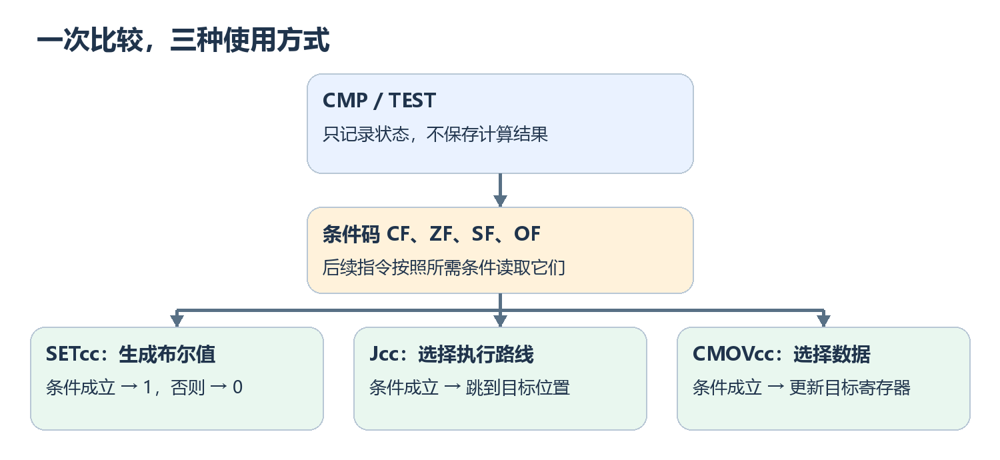
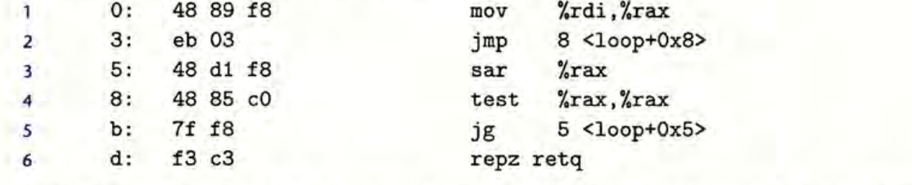

> 对应《深入理解计算机系统》第三版第 3.6.1～3.6.6 节，原书第 135～148 页。汇编采用原书的 x86-64 AT&T 写法。

## 先看结论：比较不会直接产生 `true` 或 `false`

假设 C 代码写着 `if (x < y)`。机器需要做两件事：**先记录比较的结果，再决定是否跳到另一段代码** 。这两件事分别由条件码和条件跳转完成。



图里最重要的是中间那一步：`cmp`、`test` 等指令先更新条件码；后面的指令再读取条件码。读取方式有三种：

| 后续指令 | 得到什么 | 常见用途 |
| --- | --- | --- |
| `SETcc` | 一个 $0$ 或 $1$ | 计算 `x < y` 这样的布尔表达式 |
| `Jcc` | 要不要跳到另一个位置 | 实现 `if`、短路判断 |
| `CMOVcc` | 要不要替换寄存器中的值 | 从两个已经准备好的值中选一个 |

`cc` 是条件后缀。例如 `e` 表示相等，`l` 表示有符号小于，于是有 `je`、`setl`、`cmovl`。先弄清条件码，再看这三种用法。

---

## 1. 条件码是什么：运算额外留下的四个信号

**结论：条件码不是某个变量的属性，而是处理器保存的一组状态。** 加减等指令算出结果后，还会更新这些状态；下一条判断指令可以直接使用它们。

| 条件码 | 它告诉我们什么 | 一个直观判断 |
| --- | --- | --- |
| `ZF` | 本次运算的结果是否为零 | 为零时 `ZF = 1` |
| `SF` | 结果的最高位是否为 $1$ | 按补码看，通常意味着结果为负 |
| `CF` | 无符号运算是否产生进位或借位 | 常用于无符号大小比较 |
| `OF` | 有符号运算的真实结果是否超出当前位宽 | 常用于修正溢出后的符号判断 |

这里的结果都是 **按指令位宽截断后的结果** 。比如用 $8$ 位做运算，最多只能保留 $8$ 位。因此 `SF` 只看保留下来的最高位；一旦发生有符号溢出，它就可能与真实数学结果的正负相反。

`CF` 和 `OF` 尤其容易混淆。它们分别服务于 **无符号** 和 **有符号** 的解释，并不要求相同：

| $8$ 位加法 | 保存的结果 | `CF` | `OF` | 为什么 |
| --- | --- | --- | --- | --- |
| $127+1$ | `0x80` | $0$ | $1$ | 没有第 $9$ 位进位；有符号结果 $128$ 放不进 $8$ 位 |
| $255+1$ | `0x00` | $1$ | $0$ | 无符号结果产生第 $9$ 位进位；同样的位模式按有符号数看是 $-1+1=0$ |

所以不要把 `CF` 理解为所有溢出的统一标志。同一串位按有符号数和无符号数解释，判断标准会变。

条件码还是共享的：后续算术或逻辑指令可能改写它。读汇编时，要找到判断指令之前 **最近一次更新相关标志位** 的指令。`mov`、`lea` 不改条件码；`add`、`sub`、`and`、`xor` 等通常会改。`inc`、`dec` 不改 `CF`，`not` 不改这些条件码，这是常见例外。

如果只想比较两个值，又不想真的把它们相减并保存差值，就轮到 `cmp` 出场。

---

## 2. `cmp` 与 `test`：只做判断，不改原数据

### `cmp`：把减法结果留在条件码里

**结论：** AT&T 语法中的 `cmp 源, 目的`，按 `目的 − 源` 设置条件码，但不保存差值。

```asm
cmpq %rsi, %rdi       # 假设 rdi 是 x、rsi 是 y：比较依据是 x - y ，注意是后减前
```

执行后，`%rdi` 仍是 `x`，`%rsi` 仍是 `y`。如果二者相等，差值为零，`ZF = 1`。如果把两个操作数交换，依据就会变成 `y - x`，后面的小于、大于也要反过来读。

可以暂时记成一句话：先看 `cmp` 的第二个操作数，再减去第一个。

### `test`：把按位与的结果留在条件码里

`test 源, 目的` 类似做一次按位与，也只更新条件码，不保存与运算的结果。最常见的写法是：

```asm
testq %rax, %rax      # 检查 rax 是否为 0；rax 本身不变
```

一个数与自身按位与，结果还是它自己。因此 `%rax` 为零时 `ZF = 1`，非零时 `ZF = 0`。如果写 `testq $8, %rax`，检查的是第 $3$ 位有没有置 $1$，并不是比较 `%rax` 是否等于 $8$。

到这里，`cmp` 和 `test` 只是留下了状态。下一步才是解释状态：同样的位模式，为什么有符号小于和无符号小于会得出不同答案？

---

## 3. 怎么从条件码读出大小关系

下面都假设刚执行的是 `cmp y, x`，所以条件码来自 **`x - y`** 。最常用的结论只有三条：

$$
\boxed{\begin{aligned}
x=y &:\quad ZF=1\\
x<y\quad\text{按无符号解释} &:\quad CF=1\\
x<y\quad\text{按有符号解释} &:\quad SF\ne OF
\end{aligned}}
$$

**无符号小于为什么看 `CF`？** 如果 $x<y$，做 $x-y$ 就需要借位。例如用 $8$ 位算 $0-1$，保存的位模式虽是 `0xFF`，但发生了借位，所以 `CF = 1`。

**有符号小于为什么看 `SF`与`OF`异或？** 看一个 $8$ 位例子：$x=-128$，$y=1$。真实差值是 $-129$，说明 $x<y$；可 $8$ 位保存不下 $-129$，截断后得到 `0x7F`，最高位是 $0$，即 `SF = 0`。这次发生了有符号溢出，`OF = 1`，于是 `SF ≠ OF`，仍然正确判断出小于。

可以这样理解 `OF`：**如果减法溢出，就不能直接相信截断后结果的符号。** `SF ≠ OF` 把发生溢出和没有溢出的情况一起处理了。

汇编指令不会写出 `SF ≠ OF` 这个公式，而是用后缀表示条件。对刚才的 `cmp y, x`，常见后缀如下：

| 后缀 | 含义 | 典型跳转 |
| --- | --- | --- |
| `e` / `ne` | 相等 / 不相等 | `je` / `jne` |
| `l` / `ge` | 有符号小于 / 大于等于 | `jl` / `jge` |
| `le` / `g` | 有符号小于等于 / 大于 | `jle` / `jg` |
| `b` / `ae` | 无符号小于 / 大于等于 | `jb` / `jae` |
| `be` / `a` | 无符号小于等于 / 大于 | `jbe` / `ja` |

**记后缀时，`l/g` 来自 less/greater，适用于有符号比较；`b/a` 来自 below/above**，适用于无符号比较。`jl` 与 `jb` **不是同一种小于** 。`js` 则只看 `SF`，发生溢出时不能拿它替代 `jl`。

同一套后缀能接在 `set`、`j`、`cmov` 后面。先看最简单的情况：把比较结果变成一个整数。

---

## 4. `SETcc`：把条件变成 $0$ 或 $1$
>$cc = condition$ $code$  实际上放$l/e$等 如上表

**结论：** `SETcc` 只写入一个字节；条件成立写 $1$，否则写 $0$。它不会跳转。

```c
int less(long x, long y) {
    return x < y;
}
```

按原书的参数约定，`x` 在 `%rdi`，`y` 在 `%rsi`。一种对应写法是：

```asm
cmpq   %rsi, %rdi     # 根据 x - y 设置条件码
setl   %al            # 有符号 x < y 时 al = 1，否则 al = 0
movzbl %al, %eax      # 扩成完整的 32 位 int 返回值
ret
```

为什么还要 `movzbl`？`setl` 只改 `%rax` 的最低 $8$ 位，也就是 `%al`；其他位原来是什么，它不管。`movzbl` 把这个字节 **零扩展** 为 $32$ 位，确保返回值真的是 $0$ 或 $1$。

注意这两条指令之间不能随便插入会改条件码的运算。例如 `xorl %eax, %eax` 虽然常用来清零，却也会把比较留下的标志位覆盖掉。需要清零时，可以放到 `cmp` 之前。

`SETcc` 适合把条件当数据用。若条件决定执行哪几条指令，就要使用跳转。

---

## 5. `Jcc`：条件成立，就改走另一条路

**结论：条件跳转只决定下一条指令在哪里，不会自动产生 $0$ 或 $1$。** 看这个函数：

```c
long max(long x, long y) {
    if (x < y) return y;
    return x;
}
```

可以把它写成下面的汇编。先默认返回 `x`，只有 `x < y` 时才换成 `y`：

```asm
movq %rdi, %rax       # 默认结果：x
cmpq %rsi, %rdi       # 比较 x - y
jge  .Ldone          # x >= y 时直接返回 x
movq %rsi, %rax       # 否则改为返回 y
.Ldone:
ret
```

这里 C 写的是 `x < y`，汇编却用 `jge`。原因很简单：汇编选择 **条件不成立时跳过修改** 。读跳转时，不要只盯着 `jge` 这个词；还要看它跳到哪里，以及没跳时会执行什么。

`.Ldone` 是**标记位置的标签**，本身不是一条机器指令。`jge` 成立就去这个位置；不成立就顺着往下执行 `movq %rsi, %rax`。

### 短路判断为什么必须保留执行顺序

```c
if (p && x > *p)
    *p = x;
```

如果 `p` 为空，C 的 `&&` 不会计算右边的 `*p`。实现时必须 **先检查 `p`，再决定能不能读 `*p`** ：

```asm
testq %rsi, %rsi      # 假设 rsi 是 p
je    .Ldone          # p 为空：直接结束
cmpq  %rdi, (%rsi)    # p 非空时，才读取 *p 并比较 *p - x
jge   .Ldone          # *p >= x，不需要写入
movq  %rdi, (%rsi)    # x > *p，更新 *p
.Ldone:
ret
```

第一条跳转保护了内存访问；第二条跳转决定是否赋值。这比先算完所有值再挑一个结果更重要，因为 **没被选中的表达式也不能随意提前执行** 。这里仍假设非空的 `p` 指向有效对象。

### 标签在机器码里通常怎么表示

>机器代码和汇编代码跳转的区别：
汇编里你看到的是 jmp .L1，但 CPU 根本不知道 .L1 是什么。
.L1 只是汇编器给某个地址起的名字。真正变成机器码以后，直接跳转通常存的是：
“从下一条指令开始，还要往前/往后走多少字节”。

直接跳转常把目标记成相对位移，而不是存一整段绝对地址：

$$
\boxed{\text{目标地址}=\text{跳转指令结束后的地址}+\text{有符号位移}}
$$

记住 **从指令结束处开始算** 即可。看原书图中地址 `3` 处的 `jmp`：它占 $2$ 字节，结束后的位置是 `5`；位移为 $+3$，所以跳到地址 `8`。图中地址和机器字节采用十六进制。



`jmp` 是无条件跳转；`jge`、`jl` 等才根据条件码跳转。原书还展示了 `jmp *%rax` 这种间接跳转：目标地址在寄存器里，后面的 `switch` 篇会用到。

如果分支里只是从两个已经算好的数中选一个，有时可以不跳转，直接选择数据。

---

## 6. `CMOVcc`：继续往下执行，只换结果
一般来讲，基于条件传送的代码效率会比基于跳转指令的代码效率高，也就是说，CMOV较前面的jcc等较优。

`CMOVcc` 根据条件决定是否把源值复制到目标寄存器，程序仍顺序执行下一条指令。** 上面的 `max` 可以写成：

```asm
movq  %rdi, %rax      # 先把 x 当结果
cmpq  %rsi, %rdi      # 比较 x - y
cmovl %rsi, %rax      # 若 x < y，改选 y
ret
```

此时 `x` 和 `y` 都已经在寄存器里，提前准备候选值没有额外的危险。它也不要求处理器预测 `jge` 会不会跳转。

---

## 最后串起来：读一段分支汇编看什么

遇到 `setl`、`jge`、`cmovb` 这类指令，按三步走就够了：

1. **找来源** ：前面哪条 `cmp`、`test` 或运算指令设置了条件码？中间有没有被覆盖？
2. **还原条件** ：`cmp 源, 目的` 看的是 `目的 − 源`；接着区分有符号和无符号。
3. **看用途** ：`SETcc` 生成 $0/1$，`Jcc` 改执行路线，`CMOVcc` 选择寄存器中的值。若涉及内存访问，再检查未选中的路线有没有被错误执行。

一句话概括本篇：

$$
\boxed{\text{比较或运算}\ \longrightarrow\ \text{条件码}\ \longrightarrow\ \text{布尔值、跳转或选值}}
$$

下一篇的循环继续使用同样的比较与跳转，只是跳转目标会指回前面的代码，让一段指令重复执行。
