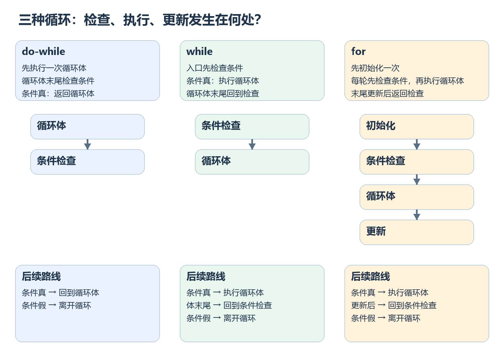
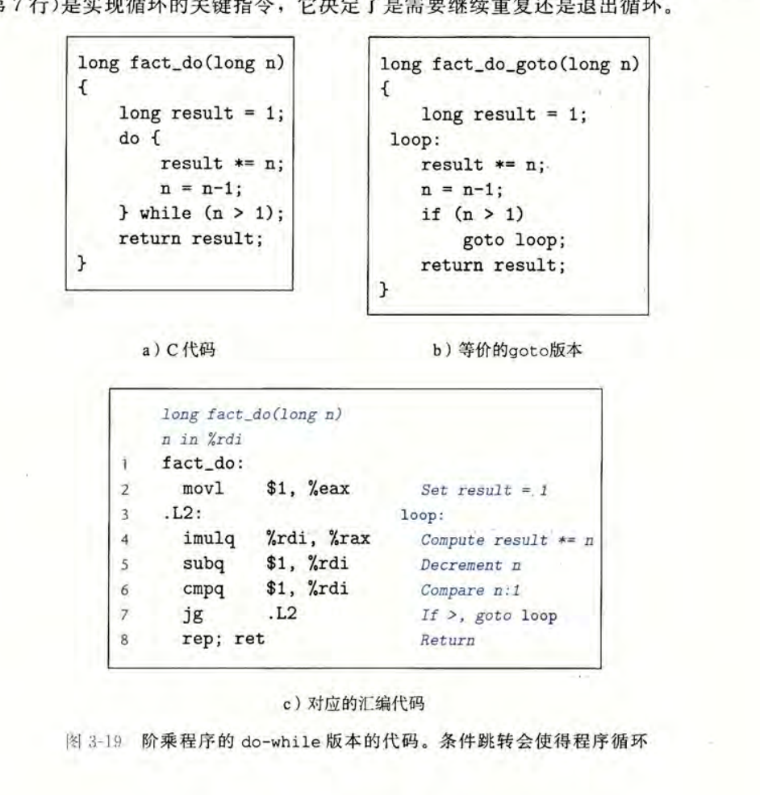
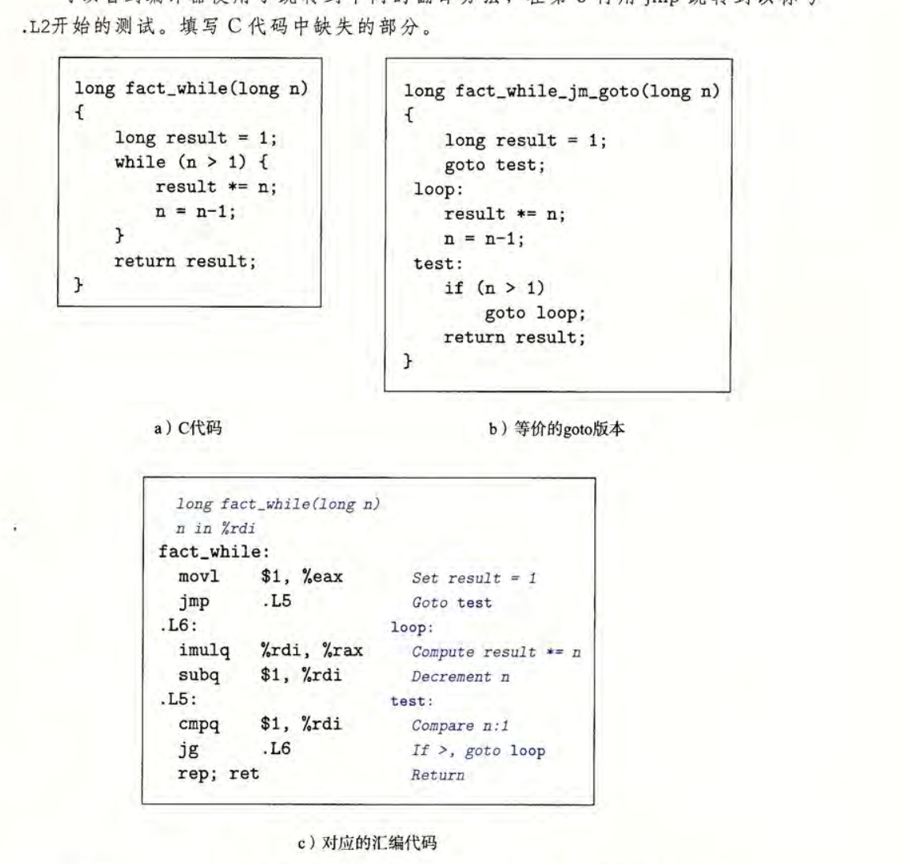
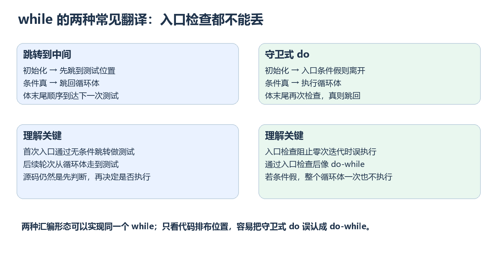
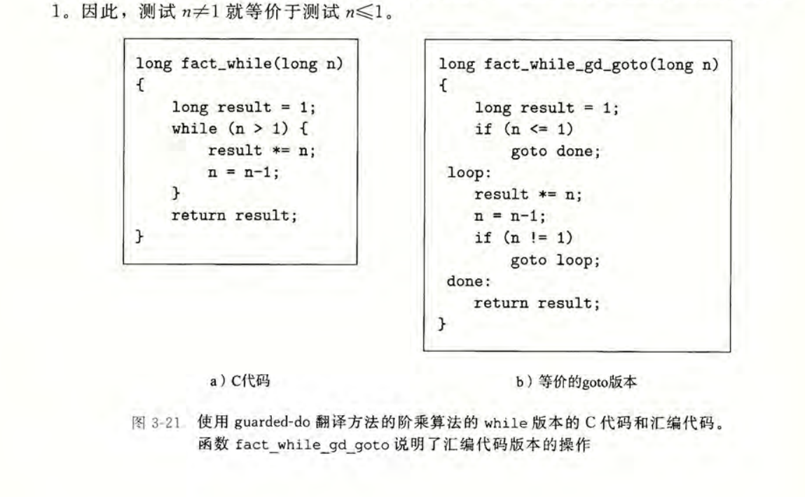
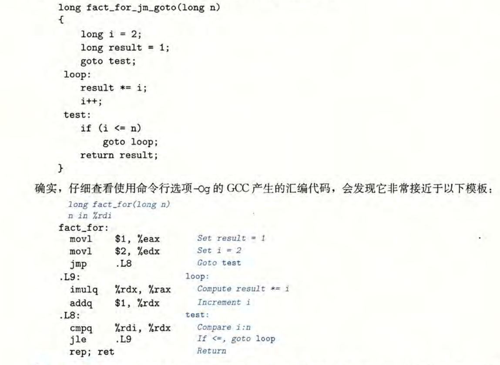

> 对应《深入理解计算机系统》第三版第 3.6.7 节，原书第 149～159 页。本篇沿用前文的 x86-64 AT&T 汇编语法。原书截图中的机器代码是教材给出的编译结果，具体编译器与优化选项可能产生不同的指令排列。

## 阅读路线：从一次分支，走向重复执行

上一篇的 `if` 通过比较和条件跳转，在两条路线中选一条。循环并不需要一套全新的机器指令：只要在条件成立时，**跳回前面的一段代码** ，就能再次执行它。

但仅仅找到一条向后的跳转还不够。读懂循环，必须回答三个问题：

1. 第一次执行循环体之前，条件检查过了吗？这决定循环体能否执行零次。
2. 一轮循环做完后，哪些变量被更新？这决定下一次判断会不会改变。
3. 条件为真、为假时分别去哪里？这决定重复与退出的位置。



图中 `do-while` 把检查放在循环体后，所以至少执行一次；`while` 把检查放在循环体前，条件一开始为假就执行零次；`for` 则在 `while` 的基础上，明确写出了初始化和每轮末尾的更新。上半部分展示顺序，下方标出条件为真或为假时的下一步。

这篇先从最容易看清回跳位置的 `do-while` 入手，再看 `while` 为什么会出现两种汇编排布，最后把 `for` 与 `continue` 接进同一条路线。

---

## 1. 先建立一个读循环的模型

### 1.1 循环在机器层面有哪些部分

可以把一段循环拆成四个部分：**初始化、条件检查、循环体、更新** 。初始化通常只做一次；条件检查决定是否继续；循环体完成本轮工作；更新改变下一轮要看的值。

它们的排列顺序并不完全相同：

| C 写法 | 一次执行的顺序 | 条件起初为假时 |
| --- | --- | --- |
| `do { body; } while (test);` | 循环体 → 检查 → 若为真则返回循环体 | 循环体仍执行一次 |
| `while (test) { body; }` | 检查 → 若为真则执行循环体 → 返回检查 | 循环体执行零次 |
| `for (init; test; update) { body; }` | 初始化一次 → 检查 → 循环体 → 更新 → 返回检查 | 只做初始化，不执行循环体与更新 |

这里的 `body`、`test`、`init`、`update` 只是描述程序各部分的占位名称。C 中任何非零条件值都当作真，零当作假。**条件检查发生在什么位置，比汇编中的标签叫什么更重要** 。

### 1.2 循环并不是永远要把四部分都写成四段指令

编译器可能把某个更新放进循环体中，也可能让一次算术运算同时留下条件码，接着直接使用 `jg`、`jne` 等跳转。寄存器重命名、代码重排和优化还会让机器代码与源码长得不一样。

因此，上面的四部分是帮助我们 **还原执行顺序** 的思维模型，并不是要求每段汇编必须有四个显眼的区块。接下来用原书的例子把这四部分落实到实际指令上。

---

## 2. do-while：先执行，再决定是否重复

### 2.1 为什么它至少执行一次

```c
do {
    body;
} while (test);
```

第一次执行会直接进入 `body`。直到循环体末尾，程序才计算 `test`。只要条件为真，就跳回循环体起点；条件为假，则继续执行循环后面的代码。

可以把这个顺序概括为：

$$
\boxed{\text{循环体}\ \longrightarrow\ \text{检查条件}\ \xrightarrow{\text{真}}\ \text{返回循环体}}
$$

这里有一个容易漏掉的事实：哪怕第一次检查结果是假，循环体也已经执行过一次了。

### 2.2 原书例子：用 do-while 计算阶乘



图中左侧的 C 代码大意如下：

```c
long fact_do(long n) {
    long result = 1;
    do {
        result *= n;
        n = n - 1;
    } while (n > 1);
    return result;
}
```

对 $n=4$，执行顺序不是先问 $4>1$，而是先乘 $4$。每轮末尾检查的是 **已经减一之后的 n** ：

| 进入本轮时的 `n` | 本轮结束时的 `result` | 减一后的 `n` | `n > 1`？ |
| --- | --- | --- | --- |
| $4$ | $1\times4=4$ | $3$ | 真，继续 |
| $3$ | $4\times3=12$ | $2$ | 真，继续 |
| $2$ | $12\times2=24$ | $1$ | 假，退出 |

图中的汇编正好按这一顺序排列。在该例的调用约定下，参数 `n` 位于 `%rdi`，返回值 `result` 位于 `%rax`：

```asm
movl  $1, %eax          # result = 1
.L2:
imulq %rdi, %rax        # result *= n
subq  $1, %rdi          # n -= 1
cmpq  $1, %rdi          # 用 n - 1 设置条件码
jg    .L2              # 若有符号 n > 1，跳回循环体
ret
```

读这段代码时，可以从 `.L2` 沿着指令向下走：乘法、减一、比较、条件跳转。`jg` 跳回前面的 `.L2`，形成重复执行的路线。`cmpq $1, %rdi` 根据 `%rdi - 1` 设置条件码，因此后面的 `jg` 判断的是更新后的 `n > 1`。

`movl $1, %eax` 写入低 $32$ 位并清零高 $32$ 位，所以这里 `%rax` 得到完整的 $1$，与上一课的寄存器写入规则一致。

### 2.3 不能因为函数叫 fact，就忘了输入范围

如果 $n=0$，这个 `do-while` 仍会先算 $1\times0$，返回 $0$；通常定义的 $0!=1$。而如果 $n$ 足够大，`long` 的乘积还会超出可表示范围。

所以这个例子主要用于观察 **循环体先执行、检查后发生** 的控制流。把它当作完整、适用于任意输入的阶乘函数，会得到错误结论。理解了这一点，就能看出 `while` 与它的关键差别。

---

## 3. while：先检查，可能一次也不执行

### 3.1 源码中的顺序必须保持

把上一节的函数改为 `while`：

```c
long fact_while(long n) {
    long result = 1;
    while (n > 1) {
        result *= n;
        n = n - 1;
    }
    return result;
}
```

第一次检查必须发生在第一次乘法之前。因此 $n=1$ 或 $n=0$ 时，循环体执行零次，直接返回初始值 $1$。对 $n=4$，仍会依次乘 $4$、$3$、$2$，返回 $24$。

用箭头总结，与上一节只差检查位置：

$$
\boxed{\text{检查条件}\ \xrightarrow{\text{真}}\ \text{循环体}\ \longrightarrow\ \text{再次检查}}
$$

按源码顺序写，检查自然位于循环体之前。不过汇编可以重新排布代码，只要实际执行仍然先检查。原书展示了两种常见的排布方式。

### 3.2 第一种排布：先跳到循环体下面的测试位置



原书图中的 `goto` 版本把测试代码放在循环体下方，先用一条无条件跳转到测试位置：

```text
初始化 result
跳到 test
loop：执行循环体并更新 n
test：如果 n > 1，就跳回 loop
否则返回
```

对应的关键汇编可以写成：

```asm
movl  $1, %eax
jmp   .Ltest            # 第一次不经过循环体，先检查
.Lbody:
imulq %rdi, %rax
subq  $1, %rdi
.Ltest:
cmpq  $1, %rdi
jg    .Lbody            # 真：跳回循环体
ret                     # 假：退出
```

以 $n=1$ 试一次：初始化后，`jmp .Ltest` 跳过乘法和减一；测试不满足 `n > 1`，于是直接返回 $1$。对 $n=4$，第一次测试通过后才跳回 `.Lbody`，执行第一轮。以后每轮自然从循环体末尾走到 `.Ltest` 再检查。

**虽然测试指令写在循环体下方，第一次执行仍然先到测试位置** 。所以只凭代码的上下排列，不能判断它是 `while` 还是 `do-while`。

### 3.3 第二种排布：入口守卫，再使用体尾回跳

另一种写法先在入口放一个保护判断；如果第一次条件就为假，直接离开。只有通过入口检查，才进入看起来像 `do-while` 的体尾回跳结构。这通常叫守卫式 `do`。注意先把结果初始化为 $1$，这样入口直接退出时也有正确的返回值：

```asm
movl  $1, %eax          # result = 1，所有路线都要执行
cmpq  $1, %rdi
jle   .Ldone            # 入口条件假：返回 1
.Lbody:
imulq %rdi, %rax
subq  $1, %rdi
cmpq  $1, %rdi
jg    .Lbody            # 体尾条件真：再做一轮
.Ldone:
ret
```

这样 $n=1$ 时在入口离开，循环体执行零次；$n=4$ 时通过入口检查，然后乘 $4$、$3$、$2$。中间的循环体与回跳可以看成 `do-while` 形态，但最前面的入口守卫保留了 `while` 的零次迭代语义。



原书图 3-21 展示了同类转换。它还把体尾的 `n > 1` 简化成 `n != 1`，依据是：**只有入口满足 `n > 1` 才会进入循环，之后每轮把 n 减一，正常沿这条路线到达体尾时，n 不会低于 1** 。这是依赖已知入口条件的局部优化，不是任意地方都能把 `>` 改成 `!=`。



如果只是想理解语义，上面未做简化的 `cmp` 加 `jg` 版本更容易读；若分析原书的优化结果，则要同时追踪入口条件给后续代码提供的约束。

### 3.4 两种排布的共同点

| 排布方式 | 第一次检查在哪里完成 | 后续如何重复 |
| --- | --- | --- |
| 跳转到中间 | 先无条件跳到循环体下方的测试位置 | 体尾顺序到达测试，条件真则跳回循环体 |
| 守卫式 `do` | 入口直接做一次条件检查 | 通过入口后，在体尾检查并跳回循环体 |

无论采用哪一种，第一次条件为假时都不能执行循环体。编译器采用哪种排布会随代码与优化变化，阅读时应追踪 **实际执行路线** ，不要套固定形状。

既然 `while` 已经包含了入口检查和重复执行，`for` 就可以从它继续构造：给循环前加初始化，给循环体后加更新。

---

## 4. for：把初始化、条件和更新写在同一处

### 4.1 四个位置如何对应

一般的 `for` 写作：

```c
for (init; test; update) {
    body;
}
```

如果暂时不考虑 `continue`、变量作用域等细节，它的执行顺序可用下面的 `while` 表示：

```c
init;
while (test) {
    body;
    update;
}
```

其中初始化只执行一次；每轮先检查；条件为真才执行循环体；本轮循环体结束后执行更新，然后回到检查。若 `test` 一开始为假，既不执行 `body`，也不执行 `update`。

$$
\boxed{\text{初始化一次}\ \longrightarrow\ \bigl(\text{检查}\to\text{循环体}\to\text{更新}\bigr)\text{ 重复}}
$$

这里的 `for` 三个表达式都可以在 C 语法中省略；省略条件表达式时，它被视为真。如果循环体里有 `break`、`return`、`continue`，还要按这些语句的实际控制流分析，后面会专门处理。

### 4.2 原书例子：从 2 乘到 n

```c
long fact_for(long n) {
    long result = 1;
    for (long i = 2; i <= n; ++i)
        result *= i;
    return result;
}
```

这个写法的四部分分别是：

| 部分 | 本例内容 | 发生时间 |
| --- | --- | --- |
| 初始化 | `result = 1`、`i = 2` | 进入循环之前，各执行一次 |
| 检查 | `i <= n` | 每轮开始前 |
| 循环体 | `result *= i` | 条件为真时 |
| 更新 | `++i` | 本轮循环体执行完后 |

对 $n=4$，`i` 依次为 $2,3,4$，乘积依次为 $2,6,24$。乘完 $4$ 才把 `i` 更新为 $5$；下一次检查 $5\le4$ 为假，于是退出。对 $n=1$，初始化后直接发现 $2\le1$ 为假，结果保持 $1$。

原书给出的汇编例子将 `i` 放在 `%rdx`，`n` 放在 `%rdi`，结果放在 `%rax`。我们把关键指令与四部分对上：

```asm
movl  $1, %eax          # result = 1
movl  $2, %edx          # i = 2
jmp   .Ltest           # 第一次先检查
.Lbody:
imulq %rdx, %rax        # result *= i
addq  $1, %rdx          # ++i
.Ltest:
cmpq  %rdi, %rdx        # 用 i - n 设置条件码
jle   .Lbody           # 有符号 i <= n 时继续
ret
```

`cmpq %rdi, %rdx` 看的是 `i - n`，后面的 `jle` 于是对应 `i <= n`。这里同时复用了上一节的跳转到中间排布：首次通过 `jmp .Ltest` 保证先检查；后续从 `++i` 顺序走到 `.Ltest`。



对合理的小范围非负输入，这个例子展示了阶乘的循环结构；若 $n$ 很大，`long` 乘积会溢出，不能把这个教学例子看作任意输入下的可靠阶乘实现。

到这里，`for` 看起来只是 `while` 加初始化和更新。但有一个关键例外：当循环体中途执行 `continue`，更新步骤必须仍按 `for` 的规则发生。

---

## 5. continue 与 break：跳到哪里才符合源码语义

### 5.1 continue 不是一律跳到条件检查

`continue` 表示跳过本轮剩余的循环体，开始下一轮。不过下一轮从哪里开始，取决于循环种类：

| 所在循环 | `continue` 后的下一步 |
| --- | --- |
| `while` | 去检查条件 |
| `do-while` | 去检查循环体末尾的条件 |
| `for` | **先执行更新表达式，再去检查条件**  |

这个区别可以用一个具体例子看出来：

```c
int sum = 0;
for (int i = 0; i < 5; ++i) {
    if (i % 2 == 0)
        continue;
    sum += i;
}
```

当 $i=0$ 时，`continue` 跳过 `sum += i`，但 `++i` 仍然执行。下一轮检查的是 $i=1$。后续只加 $1$ 和 $3$，最终 `sum = 4`。

如果机械地改写为下面的 `while`，行为就错了：

```c
int i = 0, sum = 0;
while (i < 5) {
    if (i % 2 == 0)
        continue;       // 错误：跳过了本应执行的 ++i
    sum += i;
    ++i;
}
```

第一次 `i = 0` 时就会反复 `continue`，始终到不了 `++i`，程序不再结束。准确转换时，`continue` 路线也必须先到更新位置：

```c
int i = 0, sum = 0;
goto test;
body:
    if (i % 2 == 0)
        goto update;
    sum += i;
update:
    ++i;
test:
    if (i < 5)
        goto body;
```

这段 `goto` 代码是为了展示控制流，不是说日常 C 代码应该这样写。它把 `for` 的关键路线标清了：正常执行完循环体要到 `update`，遇到 `continue` 也要到 `update`，然后才做下一次 `test`。

### 5.2 break 去循环之后，不再进行本轮更新

在本节这种没有嵌套 `switch` 的循环体里，`break` 直接退出当前循环。例如，在上面的 `for` 循环体里执行 `break`，程序会跳到整个 `for` 后面的代码，**不会再做这轮的 `++i`** 。机器代码通常通过跳到循环出口标签实现这一点。

这与 `continue` 构成一个清楚的对比：

$$
\begin{aligned}
\texttt{for + continue}&:\quad\text{跳到更新，再检查}\\
\texttt{for + break}&:\quad\text{跳到循环出口}
\end{aligned}
$$

若有多层嵌套循环，它们作用于最近的循环。还有一个需要留到下一篇细看的区别：若 `break` 写在循环内部的 `switch` 中，它会退出最近的 `switch`；同一位置的 `continue` 仍会作用于最近的循环。本篇只需先掌握例子中的目标位置；分析嵌套结构时，再逐个画出出口与更新位置即可。

---

## 6. 为什么同一个循环会长成不同的汇编

### 6.1 源码变量不一定在内存里

前面的例子中，`result` 和 `n` 在 C 里是变量，但汇编用 `%rax`、`%rdi` 保存和更新它们，根本不需要每轮把值写回内存。寄存器只是承载这些值的位置：`subq $1, %rdi` 更新后，下一轮使用的 `n` 就是 `%rdi` 中的新值。

阅读循环时，可以在旁边记一张小映射：

| C 中的量 | 某个示例中的位置 |
| --- | --- |
| `result` | `%rax` |
| `n` | `%rdi` |
| `i`，仅 `for` 例子 | `%rdx` |

这个映射只对当前代码片段有效，不是说所有程序都必须把这些变量放在相同寄存器。优化后的汇编还可能重用寄存器、删除某些中间变量，或把多步操作合并。

### 6.2 算术指令也可能直接提供循环条件

上一篇已经说明，`sub` 等算术指令会修改条件码。所以循环末尾不一定每次都另写一条 `cmp`。例如，当循环逻辑只关心某个计数器递减后是否为零，编译器可能利用递减指令设置的 `ZF`，随后用 `jne` 跳回。

但这不意味着任何算术后的跳转都在判断同一个变量。分析时仍要按顺序找 **最近一次更新了所需条件码的指令** ，再结合寄存器含义解释条件。尤其要注意，`inc`、`dec` 不更新 `CF`，而 `mov`、`lea` 不改条件码；不能凭指令名字猜测跳转的依据。

### 6.3 如何检查一种改写是否真的等价

无论是从 `for` 改写到 `while`，还是把 `while` 的测试移到循环体后，都用同一组问题检验：

1. 条件第一次为假时，循环体和更新各执行几次？
2. 一轮正常结束、遇到 `continue`、遇到 `break` 时，分别去哪里？
3. 条件表达式是否在相同的时机、以相同的次数求值？
4. 循环体中的写入、访问、调用和返回，是否仍按原来的路线发生？

这里不仅要比较最终结果。条件表达式可能读取会变化的数据，循环体也可能有副作用；若执行顺序不同，程序行为就可能不同。

---

## 7. 全篇串联：从标签还原循环

读到一段陌生的汇编，可以按下面的顺序还原：

1. **找入口与出口** ：函数从哪里进入？哪些 `ret` 或跳转会离开循环？
2. **找回跳边** ：哪条跳转指向前面的指令？它围住的代码通常是重复部分。
3. **找第一次条件检查** ：进入循环体前是否先经过条件判断？这决定零次迭代是否可能。
4. **找每轮更新** ：哪个寄存器或内存值发生变化？变化后用什么条件继续？
5. **用边界值沿路线走一遍** ：让条件起初为假、只执行一轮、执行多轮，检查自己还原的结构。

整篇的核心关系是：

$$
\boxed{\text{循环}=\text{条件判断}+\text{重复执行的路线}+\text{让下一轮发生变化的更新}}
$$

`do-while`、`while`、`for` 的区别首先是这些步骤的执行顺序；汇编中的标签和跳转只是实现这种顺序的手段。下一篇的 `switch` 会继续使用跳转，但它要解决的是从多个目标中选择一条路线，因此会引入跳转表与间接跳转。
