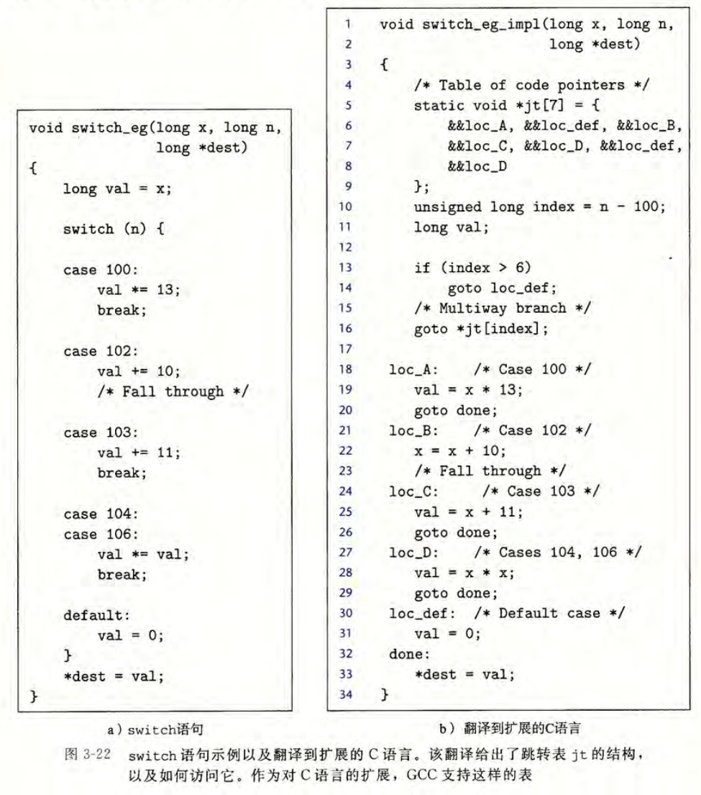
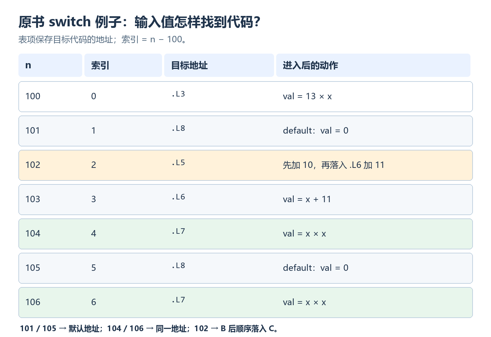
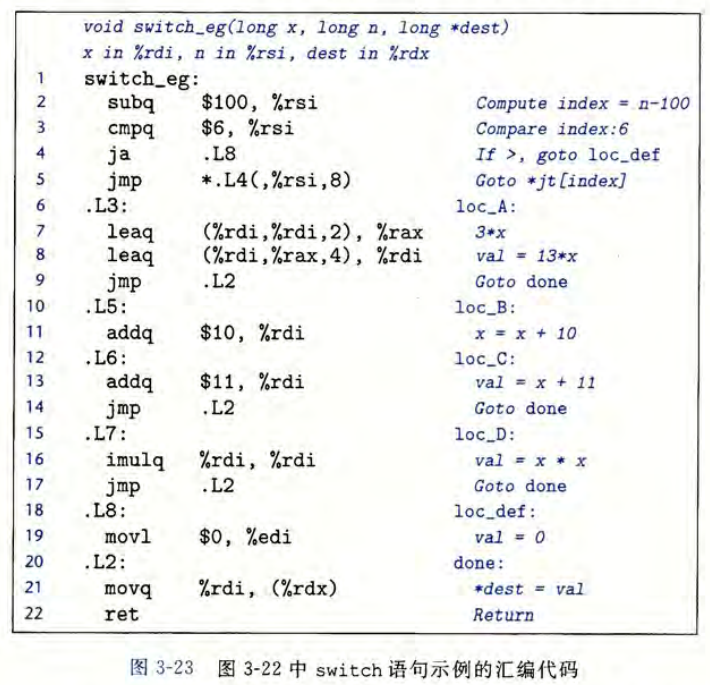
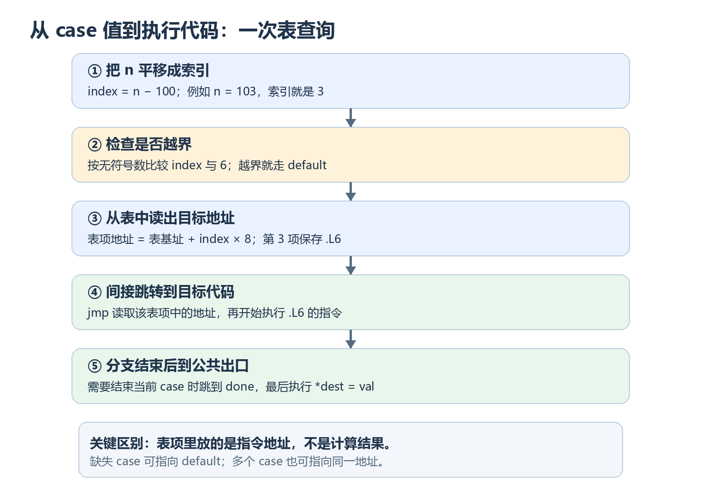
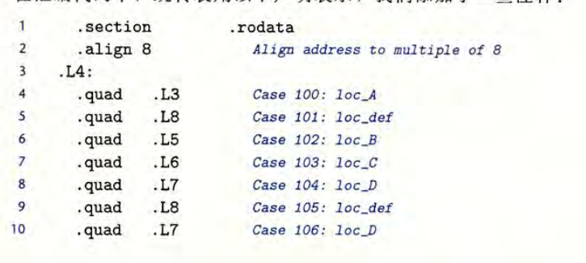

> 对应《深入理解计算机系统》第三版第 3.6.8 节，原书第 159～163 页。正文沿用前几篇的 x86-64 AT&T 汇编语法。原书展示的是一种具体编译结果；`switch` 并不总会编译成跳转表。

## 阅读路线：从选两条路，到选许多条路

前面已经见过两种跳转：`if` 根据条件选择一条路线，循环在条件成立时跳回前面的代码。现在考虑一个变量有很多可能取值，每个值对应不同处理方式。连续写很多个 `if-else` 可以实现，但编译器有时能采用另一种布局：**把各个分支的入口地址排成一张表，用变量值直接找到入口** 。

本篇沿着原书的一个例子走：先看 C 的 `switch` 究竟规定了哪些执行行为，再把 `case` 值映射到跳转表索引，最后读懂一条间接跳转怎样到达目标代码。原书例子还包含三种特殊情形：没有写出的 `case`、多个 `case` 共用处理代码、一个 `case` 顺序落入下一个 `case`。这些行为都能从同一张表和代码排列中解释。

---

## 1. switch 先解决什么问题

### 1.1 一次取值，多种去向

`switch (n)` 先求出表达式 `n` 的值，然后从与该值匹配的 `case` 标签开始执行。如果没有匹配的标签，就从 `default` 开始；若没有 `default`，则跳过整个 `switch`。这里讨论的是 C 的整数型选择值。

原书图 3-22 的例子有三个参数：`x` 是参与计算的值，`n` 决定走哪个分支，`dest` 指向存放最终结果的位置。



先只看图左边的普通 C 代码。各个分支的核心行为可以简写为：

```c
long val = x;
switch (n) {
    case 100:
        val *= 13;
        break;
    case 102:
        val += 10;         // 这里没有 break
    case 103:
        val += 11;
        break;
    case 104:
    case 106:
        val *= val;
        break;
    default:
        val = 0;
}
*dest = val;
```

`break` 在这里结束 **当前 switch** ，接着执行后面的 `*dest = val`。它不是退出整个函数；只有后续代码执行完，函数才返回。如果 `switch` 写在循环内，`break` 首先退出最近的 `switch`，上一节循环笔记中的区别在这里就有了具体场景。

### 1.2 缺失标签、共享代码、顺序落入是三回事

先不要急着看汇编。用上面的 C 代码回答三个问题：

| 输入 `n` | 从哪里开始 | 实际执行什么 | 最终 `val` |
| --- | --- | --- | --- |
| $101$ 或 $105$ | 没有匹配的 `case`，从 `default` 开始 | 赋零 | $0$ |
| $104$ 或 $106$ | 从同一段 `val *= val` 开始 | 平方一次 | $x^2$ |
| $102$ | 从 `case 102` 开始 | 加 $10$；因没有 `break`，继续执行 `case 103` 的加 $11$ | $x+21$ |
| $103$ | 直接从 `case 103` 开始 | 只加 $11$ | $x+11$ |

**两个标签共用代码** ：`case 104:` 和 `case 106:` 之间没有指令，两者都从同一段平方代码开始。**顺序落入** ：`case 102:` 有自己的加 $10$ 操作，完成后没有离开 `switch`，所以接着执行紧随其后的 `case 103:` 代码。这两种现象看起来都涉及相邻标签，执行过程却不同。

比如 $x=5$、$n=102$：`val` 起初为 $5$，先变成 $15$，再变成 $26$，最后写入 `*dest`。若 $n=103$，直接从第二次加法开始，结果是 $16$。这个例子也说明，匹配到某个 `case` 后，**是否继续执行下一个 case，由实际控制流决定，而不是重新匹配一次标签** 。

现在的问题是：如果输入值可能为 $100$ 到 $106$，机器如何迅速找到应该从哪段代码开始？

---

## 2. 跳转表：把 case 值变成数组索引
$switch$是怎么直接确定一个$case$的位置的？显然不是一个一个比较过去。有专门的跳转表存放地址。
### 2.1 表中放的是什么

跳转表可以先理解为一个数组：数组的每个元素都保存一段代码的 **入口地址** 。它保存的是地址，不是该分支算出的结果。处理器读出某个表项后，把下一条要执行的指令位置改为这个地址。

原书例子的标签分布在 $100$ 到 $106$ 之间。直接用 $100$ 当索引会让表前面空出许多格，因此先减去最小值 $100$：

$$
\boxed{\text{索引}=n-100}\qquad 100\le n\le106
$$

于是 $n=100$ 对应表项 $0$，$n=103$ 对应表项 $3$，$n=106$ 对应表项 $6$。这张表共有 $7$ 项，而不是只有源码中显式写出的 $5$ 个不同 `case` 值。



按图从左到右读一行即可：先由 `n` 算出索引，再读取该位置保存的目标地址。`101`、`105` 对应的表项虽然没有专门的 `case`，仍然要有去向，因此填入默认代码 `.L8` 的地址；`104`、`106` 共用平方代码，所以两个表项都填入 `.L7` 的地址。

还要注意索引 $2$ 对应 `.L5`，索引 $3$ 对应 `.L6`。它们不是同一个表项：$102$ 必须先执行自己的加 $10$，然后才顺序到达 `.L6` 的加 $11$。

### 2.2 但是 这种 jump table 实现方式要求索引连续

跳转表按 **最小值到最大值之间的整个区间** 建立索引，而不是只为源码里写出的标签编号。否则 `n-100` 就不能直接作为数组下标。

例如区间为 $100$ 到 $106$，中间即使缺了 $101$、$105$，总跨度仍为 $7$：

$$
\boxed{\text{表项数}=\text{最大值}-\text{最小值}+1=106-100+1=7}
$$

虽然源码中只写出了五个不同的 `case` 值，`101` 和 `105` 没有对应的 `case`，跳转表仍须为它们保留表项，并填入 `default` 分支的地址，因为表项按连续索引排列。
如果只写 `case 100` 和 `case 199`，其余值都走 `default`，直接建立覆盖整个区间的跳转表就要占用很多表项。编译器也可能改用其他分支实现。

---

## 3. 跳转流程1：先做范围检查，用一条无符号跳转挡住两侧越界。

原书图 3-23 开头的关键指令如下。在这个示例中，`n` 位于 `%rsi`：

```asm
subq $100, %rsi          # 把 n 平移成 index
cmpq $6, %rsi            # 检查 index 与 6
ja   .L8                 # 按无符号数比较：index > 6 则走 default
jmp  *.L4(,%rsi,8)       # 否则通过跳转表选择目标
```

为什么用 `ja`，而不是有符号的 `jg`？先看两个越界输入：

| 输入 `n` | 平移后的 $64$ 位位模式 | 按无符号数与 $6$ 比较 | 去向 |
| --- | --- | --- | --- |
| $107$ | $7$ | $7>6$ | `.L8` 默认分支 |
| $99$ | $99-100=-1$ 的 $64$ 位补码，即 $2^{64}-1$ | $2^{64}-1>6$ | `.L8` 默认分支 |

机器上的 `subq` 在 $64$ 位中保留低 $64$ 位。小于 $100$ 的输入平移后，会得到按无符号数解释为很大的位模式；`ja` 就能让这类输入和大于 $106$ 的输入都走默认分支。**先平移，再作无符号上界检查** ，**在这张连续范围表上同时处理了两端越界**。

>其实就是懒得再写一遍 $index<0$ 情况 。

完成范围检查后，合法的索引才进入下一条指令。它看起来只是一条 `jmp`，却同时完成了取表项与改变执行位置。

---

## 4. 接着一条间接跳转，走到对应的 case

### 4.1 先找到表项，再读出表项里的地址



图中关键行是：

```asm
jmp *.L4(,%rsi,8)
```

把它拆成两步理解：

1. `.L4(,%rsi,8)` 表示一个内存位置，其地址为跳转表基址 `.L4` 加上 `%rsi` 中的索引乘以 $8$。乘 $8$ 是因为跳转表里的每一项保存一个 $64$ 位地址。
>一个地址 = $64$ $bit$ = $8$ $byte$
假设 .L4 的地址是：$0x1000$
那么表项会这样排列：
index 0 : 0x1000
index 1 : 0x1008
index 2 : 0x1010
index 3 : 0x1018
index 4 : 0x1020
...
自然，表项地址 = 表首地址 + index * 8
2. 前面的 `*` 表示间接跳转：从那个内存位置读出一个目标地址，再跳到该地址开始执行。它与上一篇介绍的 `jmp *%rax` 同属间接跳转，只是目标地址这次保存在内存表项中。

可以把动作浓缩成一个易读的公式。设 $B$ 是跳转表首地址：

$$
\boxed{\text{表项地址}=B+8\times\text{索引};\quad\text{下一条指令地址}=\text{表项中保存的地址}}
$$

例如,假设 $.L4$ $=$ $0x1000$
|地址      |   内容
|--|--|
|0x1000   |   0x400100
|0x1008    |  0x400500
|0x1010    |  0x400200
|0x1018    |  0x400300   ← 当前找到这里

通过找到跳转表地址的位置的内容，读取这个内容（地址），从而找到最终跳转地址。

不要把它读成 `jmp .L4`。后者会直接跳到 `.L4` 所标记的位置，而这里的 `.L4` 是 **数据表的起点** ，真正要跳到哪里，还得先从表中取出某项保存的地址。



这张图把范围检查、寻址、读目标地址与执行分支连起来。前一篇中 `break` 可以跳到循环出口；在这里，`break` 通常对应跳到整个 `switch` 的公共出口。

### 4.2 原书中的跳转表实际长什么样



原书把表放在 `.rodata` 段，也就是用于只读数据的区域，结构可简写为：

```asm
.section .rodata
.align 8
.L4:
    .quad .L3           # index 0：n = 100
    .quad .L8           # index 1：n = 101，default
    .quad .L5           # index 2：n = 102
    .quad .L6           # index 3：n = 103
    .quad .L7           # index 4：n = 104
    .quad .L8           # index 5：n = 105，default
    .quad .L7           # index 6：n = 106
```

`.L4` 标记表的首地址，`.quad` 在这里表示连续放置 $8$ 字节的表项；`.L3`、`.L8` 等是分支代码的位置。多个表项可以保存同一个地址，正好对应前面见过的默认处理与代码共享。

图 3-22 右侧还用了 `&&loc_A` 和 `goto *jt[index]`。这是 GCC 的 **计算型 goto 扩展** ：`&&loc_A` 取得当前函数内一个标签的地址，`goto *...` 跳到读取出的地址。它是帮助人理解跳转表的 C 形式，不是 ISO C 的通用语法，也不是函数调用。

跳到代码入口以后，表的任务就结束了。接下来要看分支代码怎样完成操作、怎样到达公共出口。

---

## 5. 进入 case 后：共享、落入、break 各是什么形状

### 5.1 沿 $n=102$ 的路线逐步走

图 3-23 中，$102$ 的表项指向 `.L5`，相关汇编是：

```asm
.L5:                      # n = 102
    addq $10, %rdi       # x += 10
.L6:                      # n = 103 也可以从这里直接进入
    addq $11, %rdi       # 再加 11
    jmp  .L2            # 离开 switch 的各个分支
```

在这段汇编里，`%rdi` 起初保存 `x`，后来直接被当作 `val` 使用，不一定要为 C 中的 `val` 另开一个存储位置。若 $x=5$：

1. $n=102$ 让跳转表选中 `.L5`，`%rdi` 从 $5$ 变为 $15$。
2. `.L5` 末尾没有 `jmp`，处理器顺序执行紧随其后的 `.L6`，`%rdi` 从 $15$ 变为 $26$。
3. `.L6` 末尾的 `jmp .L2` 跳到公共出口，最终把 $26$ 写入 `*dest`。

如果 $n=103$，跳转表直接选 `.L6`，不会先执行 `.L5`，结果只有 $5+11=16$。由此可以看出：**fall-through 是代码块之间没有离开指令，处理器顺序执行到了下一块** ，并不是跳转表再次选择了一个新表项。

### 5.2 其他三种去向怎样到达公共出口

| 表项目标 | 代表的输入 | 分支代码做什么 | 如何结束 |
| --- | --- | --- | --- |
| `.L3` | $100$ | 把 `x` 乘 $13$ | `jmp .L2` |
| `.L7` | $104$、$106$ | 计算 `x * x` | `jmp .L2` |
| `.L8` | $101$、$105$，以及范围外输入 | 把结果设为 $0$ | 顺序到达 `.L2` |

原书的 `.L3` 使用 `lea` 组合出 $3x$ 和 $13x$，与前面学过的地址计算指令一致：`lea` 可以进行算术计算，并不一定真的访问内存。`.L7` 用乘法指令完成平方。这里的教学输入取小整数；若某些计算超出 C 有符号 `long` 的范围，源码中的整数运算仍受 C 的溢出规则约束。

`.L8` 是默认分支。它把 `%edi` 写成 $0$；在 x86-64 中，写 $32$ 位寄存器会清除对应 $64$ 位寄存器的高半部分，因此 `%rdi` 整体变成零。它下面紧挨着 `.L2`，无需再写一条跳转，也可以顺序到达公共出口。

公共出口只有一条关键写入：

```asm
.L2:
    movq %rdi, (%rdx)     # *dest = val
    ret
```

`%rdx` 保存 `dest` 指针，`(%rdx)` 是它指向的内存位置。于是各个分支只需把最终值准备在 `%rdi`，然后汇合到 `.L2`。这也解释了源码里为何只有一处 `*dest = val`，汇编里也可以只有一处写内存。

**表项选择入口，分支代码决定后续路线，公共出口完成共同工作** 。把这三个层次分清，就不会把跳转表里的重复地址、两个标签共用代码和顺序落入混在一起。

---

## 6. 为什么不是所有 switch 都有跳转表

跳转表的便利在于：通过一个索引和一次间接跳转，就能在许多代码入口中选一个。**原书指出，当 `case` 较多、取值范围相对集中时，编译器更可能选用它。** 表项数由整个取值跨度决定，即使中间有缺口也要占位置；范围很稀疏时，表可能浪费大量空间。

编译器还可以使用连续比较、分层比较、位测试或其他变换，具体取决于输入分布、代码大小与优化目标。即使选了跳转表，也不能说它在所有机器和输入上都必然更快：间接跳转仍需要读取目标，运行时的预测与缓存行为也会影响性能。

因此，看到 `switch` 时先确认 **源码语义** ，不要预设一定有跳转表；看到汇编时再根据实际的范围检查、表项和间接跳转还原它。

---

## 7. 全篇串联：按什么顺序读一段 switch 汇编

1. **先找选择值与索引变换** ：本例的 `n` 在 `%rsi`，`subq $100, %rsi` 把 $100$ 到 $106$ 平移为索引 $0$ 到 $6$。
2. **看范围检查** ：`cmpq $6, %rsi` 配合无符号 `ja`，把越界值送到 `.L8`。
3. **读跳转表** ：由表基址、索引和表项宽度算出位置，再看该表项保存哪个代码标签。
4. **沿标签之后的指令前进** ：遇到 `jmp .L2` 就汇合；没遇到跳转或返回，就可能顺序落入下一块。
5. **找到公共出口** ：确认最终结果存在哪里，以及 `break` 实际跳到哪个位置。

本篇最简洁的关系可以写成：

$$
\boxed{\text{case 值}\ \longrightarrow\ \text{合法索引}\ \longrightarrow\ \text{表中的代码地址}\ \longrightarrow\ \text{执行分支并汇合}}
$$

至此，第三章中顺序执行、条件分支、循环和多路分支的基本路线都已经串联起来。下一篇进入过程调用：程序从一个函数跳到另一个函数时，还要保存返回位置、传递参数，并管理调用期间使用的数据。
