> 对应《深入理解计算机系统》第三版第 3.7.1～3.7.6 节，原书第 164～175 页。本文按原书 x86-64 示例使用的整数与指针参数约定讲解；其他平台的调用约定可能不同，浮点参数也有另外的传递规则。

## 阅读路线：从跳转到函数调用，还缺什么

上一篇的 `switch` 可以把程序送到不同代码位置，但一条普通 `jmp` 并不会替我们记住从哪里来。函数调用多了一层要求：调用函数 `P` 进入被调用函数 `Q`，`Q` 做完以后，必须回到 `P` 中 **调用点后面的那条指令** ，还要让双方正确交换参数和结果。

因此，一次调用至少要解决三件事：

| 问题 | 需要做到什么 | 本篇对应机制 |
| --- | --- | --- |
| 控制转移 | 进入 `Q`，结束后返回 `P` 的正确位置 | `call` 保存返回地址，`ret` 取回地址 |
| 数据传递 | 把参数交给 `Q`，把结果交还 `P` | 参数寄存器、栈上传参、返回值寄存器 |
| 调用期间的存储 | 保存仍要用的值，为局部对象提供空间 | 栈帧、调用者与被调用者保存寄存器 |

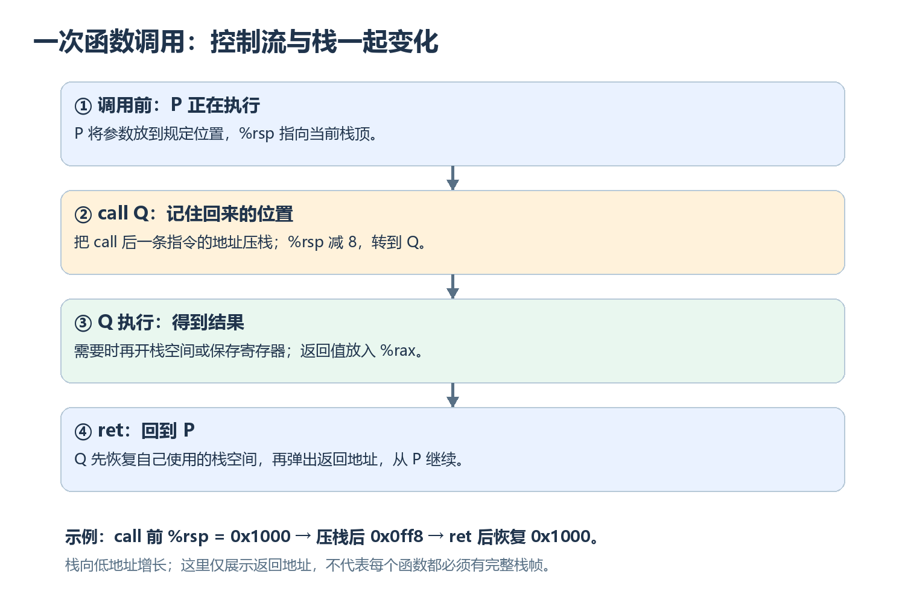

这张图给出整体顺序。本篇先弄明白为什么运行时栈能记住返回位置，再看参数与局部数据各放在哪里，最后用递归验证整套机制。读原书图例时，重点始终是数据和控制流从哪里来、到哪里去，而不是背某个函数恰好用了哪一块栈空间。

---

## 1. 为什么函数调用天然适合使用栈

### 1.1 返回顺序与栈的后进先出一致

假设 `main` 调用 `P`，`P` 又调用 `Q`。执行顺序是：

```text
main → P → Q → P → main
```

`Q` 必须先于 `P` 返回；最后进入的调用先结束。这正是栈的 **后进先出** 顺序。每次调用都可以把稍后要恢复的信息放到栈顶；返回时从栈顶取回。

在原书的 x86-64 例子中，栈向 **较低的内存地址** 增长，`%rsp` 保存当前栈顶地址。压入一个 $8$ 字节的值，`%rsp` 先减 $8$ 再写入；弹出时先读取栈顶，再让 `%rsp` 加 $8$。因此，栈变大时 `%rsp` 的数值反而变小。

### 1.2 栈帧是一次调用可用的空间，不是固定模板

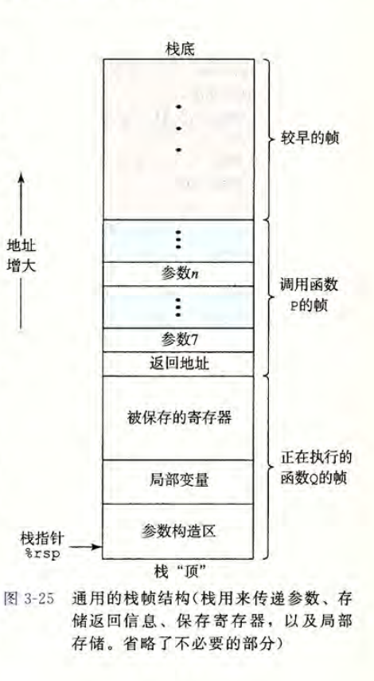

从图的上方向下看，地址逐渐减小。上方是较早的调用留下的空间；靠近 `%rsp` 的部分属于当前正在执行的函数。


---

## 2. call 与 ret：保存和取回返回位置

### 2.1 call 比普通跳转多做了什么

```asm
call Q
```

执行 `call Q` 时，处理器先把 **紧跟在这条 call 后面的指令地址** 压入栈，再跳到 `Q` 的入口。压入的地址称为返回地址。`Q` 结束时执行 `ret`，处理器从栈顶取出该地址，并从那里继续执行。

用最简单的概念模型表示：

$$
\begin{aligned}
\texttt{call Q}:&\quad\text{压入返回地址}\ \longrightarrow\ \text{进入 Q}\\
\texttt{ret}:&\quad\text{弹出返回地址}\ \longrightarrow\ \text{继续 P}
\end{aligned}
$$

`call` 要**保存返回位置**。普通 `jmp` 只改变下一条指令位置，不自动保存返回地址。
### 2.2 用原书地址例子跟踪一次调用

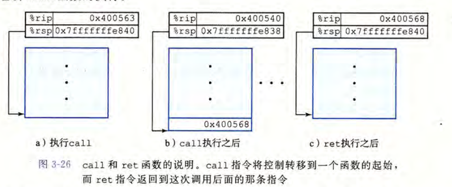

图中 `main` 在地址 `0x400563` 执行 `call`，下一条指令位于 `0x400568`，被调用函数从 `0x400540` 开始。若调用前 `%rsp` 为 `0x7fffffffe840`：

| 时刻 | `%rsp` | 栈顶保存的返回地址 | 接下来执行哪里 |
| --- | --- | --- | --- |
| `call` 前 | `0x7fffffffe840` | 此次返回地址尚未压入 | `main` 的 `call` |
| `call` 完成后 | `0x7fffffffe838` | `0x400568` | 被调用函数的入口 `0x400540` |
| `ret` 完成后 | 恢复为 `0x7fffffffe840` | 此次返回地址已弹出 | `main` 的 `0x400568` |

差出来的 $8$ 字节正是一个 $64$ 位返回地址所占的空间。这里先忽略被调用函数中间可能做的额外压栈；它执行 `ret` 前必须让栈顶再次指向这次调用的返回地址。

**返回地址不是函数返回值** 。前者是下一条机器指令的位置，放在栈上供 `ret` 使用；后者是 C 函数算出的数据，对本篇的整数或指针例子通常放在 `%rax`。

还要分清指令与约定各自负责什么：`call` 自动压入返回地址，`ret` 自动取回它；参数放置、局部空间分配、寄存器保存都需要编译器生成相应指令，处理器不会因为执行了 `call` 就自动备份所有寄存器。

---

## 3. 参数与返回值：数据按约定走到固定位置

### 3.1 前六个整数或指针参数放在寄存器中

在原书使用的这套 x86-64 调用约定里，整数和指针类参数按 **参数位置** 分配给前六个寄存器：

| 第几个参数 | 1 | 2 | 3 | 4 | 5 | 6 |
| --- | --- | --- | --- | --- | --- | --- |
| $64$ 位寄存器 | `%rdi` | `%rsi` | `%rdx` | `%rcx` | `%r8` | `%r9` |

类型较小时使用同一寄存器的相应部分：第一个 `int` 使用 `%edi`，第一个 `short` 使用 `%di`，第一个 `char` 使用 `%dil`。**第几个参数决定用哪个寄存器；参数宽度决定读寄存器的哪一部分** 。

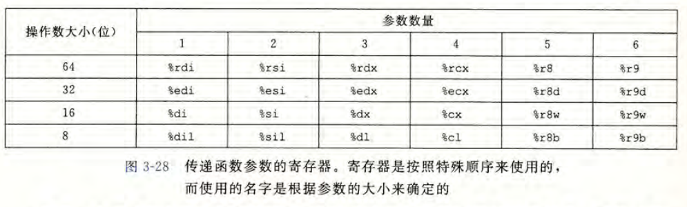

例如 `long sum(long a, long b)` 调用前把 `a` 放入 `%rdi`、`b` 放入 `%rsi`；函数完成后，把整数结果放入 `%rax`。返回 `int` 时通常使用 `%eax`。这些约定让分别编译的调用者与被调用者也能就参数位置达成一致。

这里说的前六个是 **整数和指针类参数** ，不表示所有函数无论参数类型如何都统一这样传参；浮点数和某些聚合类型还有不同规则。本篇只沿原书这一组示例理解。

### 3.2 第七个及以后的参数为什么在栈上

寄存器位置用完以后，调用者要在栈上准备其余参数。原书图 3-29 的 `proc` 有八个参数：前六个通过上述寄存器传递，第七个 `char a4` 和第八个 `char *a4p` 通过栈传递。

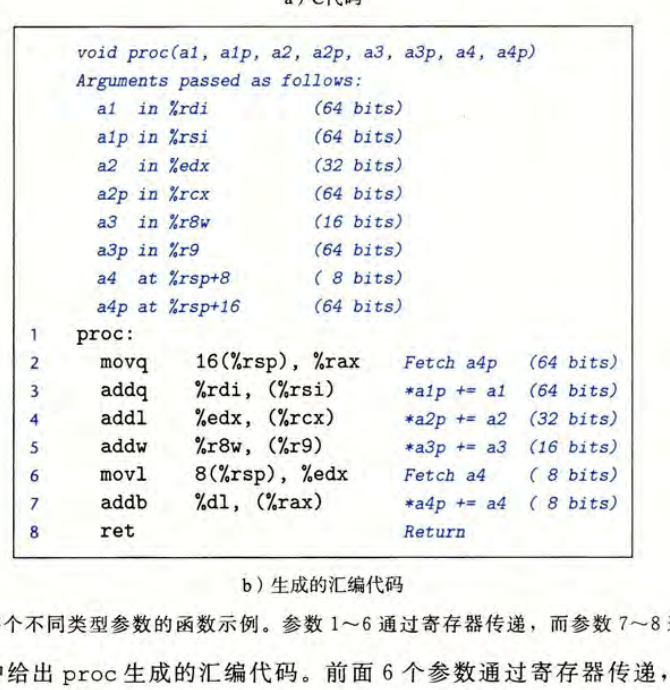

从被调用函数刚进入的视角看，`call` 已经把返回地址压在栈顶。因此，位置是：

| 相对进入 `proc` 时 `%rsp` 的位置 | 内容 |
| --- | --- |
| `0(%rsp)` | 返回地址 |
| `8(%rsp)` | 第七个参数 `a4` 所在的栈槽 |
| `16(%rsp)` | 第八个参数 `a4p` 所在的栈槽 |

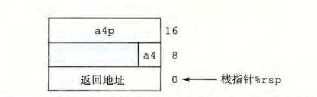

怎么理解图中的偏移？调用者准备参数时，这两个栈槽在它的栈顶附近；一执行 `call`，新的返回地址占了更低地址的一个 $8$ 字节位置，于是从被调用者入口的 `%rsp` 往高地址看，第七个参数在 $+8$，第八个在 $+16$。**每个栈上传递的参数槽按约定占用足够空间并满足对齐要求**；`char` 的实际有效数据虽只有 $1$ 字节，也不能把第八个参数直接挤到 $+9$。

还可以从图 3-29 的指令看到：`movq 16(%rsp), %rax` 取得第八个指针；`movl 8(%rsp), %edx` 读取第七个参数所在槽，后续只用 `%dl` 的低字节参与 `addb`。读入 $4$ 字节不代表 `char` 突然变成 $4$ 字节，真正参与加法的仍是那个字节。

到这里，参数传递与返回位置都有了。**但如果一个局部变量要传地址给另一个函数，单有寄存器还不够：这个变量必须有真实的存储位置。**+

---

## 4. 栈上的局部变量：取地址为什么会改变存储方式

### 4.1 什么时候必须为局部数据准备内存

编译器能把许多局部变量只保存在寄存器里，因为它们只需要取值和更新。但以下情形常使栈上存储变得必要：

- 局部值太多，当前可用寄存器放不下；
- 对局部变量取地址，例如 `&x`，要求存在一个可以指向的位置；
- 局部对象是数组、结构等，代码需要按其内存布局访问。


### 4.2 原书 swap_add：指针必须指向仍然存在的对象

原书图 3-31 中，`caller` 创建两个局部变量 `arg1 = 534`、`arg2 = 1057`，把 `&arg1`、`&arg2` 交给 `swap_add`。后者交换它们的值，同时返回交换前两值之和。

于是 `caller` 至少要在调用期间保留两个可通过指针访问的对象。一种汇编布局如下：

```asm
subq  $16, %rsp          # 为两个 long 局部变量留出 16 字节
movq  $534, (%rsp)       # arg1 放在 0(%rsp)
movq  $1057, 8(%rsp)     # arg2 放在 8(%rsp)
leaq  8(%rsp), %rsi      # 第二个参数：&arg2
movq  %rsp, %rdi         # 第一个参数：&arg1
call  swap_add
```

`lea` 在这里计算的是地址，不读取 `arg2` 的数值。`swap_add` 得到的两个指针仍指向 `caller` 的栈空间；调用它时，自己的返回地址和可能使用的栈空间位于栈的更低地址，不会让这两个对象消失。

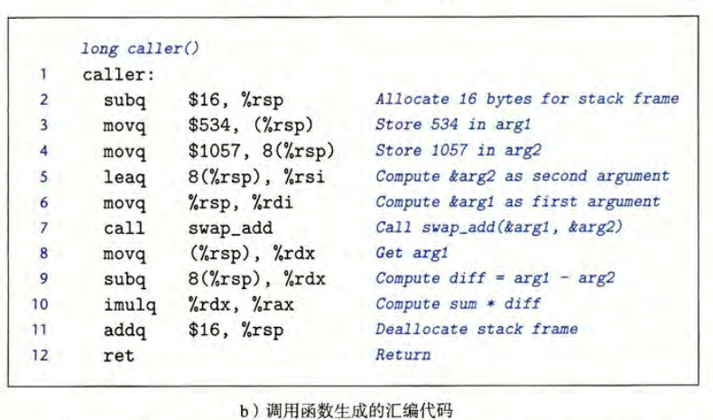

返回后，`caller` 会重新从 `(%rsp)` 与 `8(%rsp)` 读取两个变量，因为它们已经被 `swap_add` 交换。若原值为 $534$ 和 $1057$，返回时 `arg1 = 1057`、`arg2 = 534`。最后执行 `addq $16, %rsp`，释放刚才为本次调用使用的局部空间。

### 4.3 一个栈帧里还能同时准备下一次调用的参数

原书随后给出更长的 `call_proc`：它一边在自己的栈帧中放置四个可取地址的局部变量，一边准备传给 `proc` 的第七、第八个参数。图 3-33 把这两类数据画在同一片栈空间里。

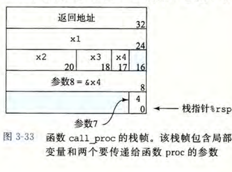

图中的数字是相对于 **调用者当前 `%rsp`** 的偏移。它在 `call` 前准备第七个参数所在的低地址栈槽和第八个参数所在的下一个栈槽；执行 `call` 后，返回地址又被压到更低地址。于是被调用者看到的第七、第八个参数偏移就成了上一节的 `8(%rsp)`、`16(%rsp)`。


---

## 5. 调用者保存与被调用者保存：跨调用的值由谁保护

### 5.1 共享寄存器为什么需要规则

假设 `P` 在某个寄存器里保存变量 `x`，随后调用 `Q`。如果 `Q` 也使用这个寄存器，`P` 回来时还能不能继续用原来的 `x`？不能靠运气，必须有一套双方都遵守的约定。

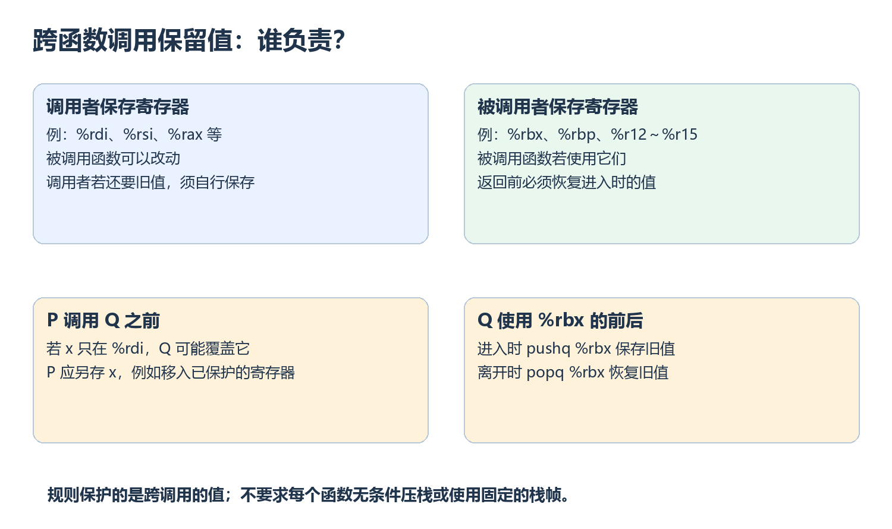

在本篇使用的约定中：

| 分类 | 典型寄存器 | 保留旧值的责任 |
| --- | --- | --- |
| 被调用者保存 | `%rbx`、`%rbp`、`%r12`～`%r15` | 被调用函数若使用它们，返回前必须恢复进入时的值 |
| 调用者保存 | `%rax`、`%rdi`、`%rsi`、`%rdx`、`%rcx`、`%r8`～`%r11` | 调用者若还需要调用前的值，须自行另存 |

`%rsp` 是栈指针，有单独的栈平衡要求，不能当作普通的调用者保存寄存器随意改动。`%rax` 常装返回值，所以调用 `Q` 后本来就会得到 `Q` 放入的新值；如果 `P` 还要调用前的 `%rax` 内容，就需要事先保存。

**被调用者保存不等于每次调用都必须压栈** 。只有一个函数实际要改写这类寄存器时，才需要在返回前恢复它继承的值；如果根本不使用，就无需多做事。

### 5.2 具体例子

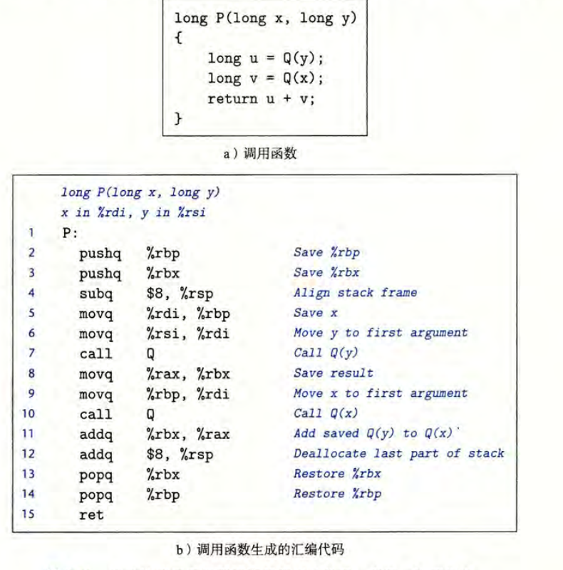

图中的 C 函数先求 `Q(y)`，再求 `Q(x)`，最后把两个结果相加。第一次调用前，`P` 要记住 `x` 以便第二次调用；第二次调用前，`P` 还要记住第一次的结果。

原书生成的关键步骤是：

```asm
pushq %rbp               # 保存 P 原先继承的 rbp
pushq %rbx               # 保存 P 原先继承的 rbx
subq  $8, %rsp           # 为调用点的栈布局留出空间
movq  %rdi, %rbp          # 保存 x
movq  %rsi, %rdi          # 将 y 放入第一个参数寄存器
call  Q                  # 计算 Q(y)，返回值在 rax
movq  %rax, %rbx          # 保存第一次调用的结果
movq  %rbp, %rdi          # 将 x 作为下一次调用的参数
call  Q                  # 计算 Q(x)
addq  %rbx, %rax          # rax = Q(x) + Q(y)
addq  $8, %rsp
popq  %rbx               # 恢复 P 进入时的旧值
popq  %rbp
ret
```

这里有两层保护，容易混为一谈：

1. `P` 把自己的 `x` 暂存于 `%rbp`、把 `Q(y)` 暂存于 `%rbx`，因为接下来调用 `Q` 时，按约定 `Q` 不得破坏这两个寄存器的值。
2. `P` 自己也使用了 `%rbp`、`%rbx`，因此在函数开头先压入继承来的旧值，返回给它的调用者前再反序弹出。

`pushq %rbp` 后又 `pushq %rbx`，恢复时先 `popq %rbx` 再 `popq %rbp`，正好符合栈的后进先出。中间的 `subq $8, %rsp` 用于满足这段代码发起下一次调用时的栈布局与对齐需要，不是新增了一个 C 变量。

理解这一套规则后，递归就不再神秘：同一个函数一层层调用自己，也仍然是调用者与被调用者之间的约定。关键是每次调用都要有自己的返回位置和需要保留的值。

---

## 6. 递归：同一段代码，为什么不会把上一层的值覆盖掉

### 6.1 原书的递归阶乘例子

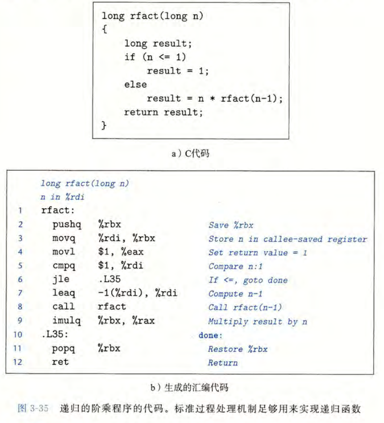

原书使用的 C 函数为：

```c
long rfact(long n) {
    if (n <= 1)
        return 1;
    return n * rfact(n - 1);
}
```

对 $n=3$，程序并不是同时算完三层。外层先暂停，等待更深一层给出结果：

| 调用层 | 本层需要记住什么 | 更深一层返回后做什么 |
| --- | --- | --- |
| `rfact(3)` | 自己的 $n=3$ 与返回位置 | 计算 $3\times\texttt{rfact(2)}$ |
| `rfact(2)` | 自己的 $n=2$ 与返回位置 | 计算 $2\times\texttt{rfact(1)}$ |
| `rfact(1)` | 到达基本情况 | 直接返回 $1$ |

随后返回路线逐层展开：`rfact(1)` 给 `rfact(2)` 一个 $1$，后者乘 $2$ 得 $2$；再把 $2$ 给 `rfact(3)`，外层乘 $3$ 得 $6$。

### 6.2 汇编怎样让每一层保存自己的 n

图 3-35 中的关键部分可以单独读成：

```asm
rfact:
    pushq %rbx             # 保存上一层交给本层的 rbx 旧值
    movq  %rdi, %rbx       # 本层把自己的 n 留在 rbx
    movl  $1, %eax         # 预设基本情况的返回值
    cmpq  $1, %rdi
    jle   .Ldone           # n <= 1 时不再递归
    leaq  -1(%rdi), %rdi   # 下一层参数 n - 1
    call  rfact            # rax 得到下一层的结果
    imulq %rbx, %rax       # 用本层保存的 n 去乘
.Ldone:
    popq  %rbx             # 恢复进入本层时的 rbx 旧值
    ret
```

以 `rfact(3)` 调用 `rfact(2)` 为例：外层先在自己的 `%rbx` 保存 $3$，`call` 再把它应当返回的位置压栈。内层进入后，先 `pushq %rbx` 保存它看到的旧值 $3$，才把自己的 $2$ 写进 `%rbx`。当内层完成，`popq %rbx` 会恢复 $3$，于是外层在 `call` 后继续执行时，仍可用自己的 $3$ 乘以返回值。

这体现两种不同的保护：**返回地址** 让每层返回自己的调用点；**保存寄存器旧值** 让每层恢复上一层尚未用完的数据。它们都利用栈的后进先出，但保存的内容和用途不同。

### 6.3 递归与普通调用是同一套机制

每进入一层，处理器仍执行一次 `call`；每离开一层，仍执行一次 `ret`。即使函数名相同，每一层的返回地址、保存的寄存器值以及按需分配的局部空间都可以不同。**递归并不要求复制一份函数机器代码** ，只需要为每次尚未结束的调用保存各自的状态。

这个函数对 $n\le1$ 都返回 $1$，因此对负数也会返回 $1$；它只是用于讲解控制流的阶乘示例，不是完整的数学阶乘定义。若 $n$ 很大，还可能遇到有符号乘法超范围或递归层数过深的问题。阅读这里的汇编，核心是看每一层怎样暂停和恢复，不必把输入边界问题误认为栈机制本身。

---

## 7. 全篇串联：沿一次调用追踪三类信息

再看一段陌生的调用汇编，可以按下面顺序读：

1. **找参数从哪里来** ：前六个整数或指针参数在哪些寄存器？额外参数在哪些栈槽？
2. **找 `call` 的下一条指令** ：那是本次调用的返回位置；进入被调用函数后，返回地址位于它的栈顶。
3. **看被调用函数是否分配空间** ：`subq ..., %rsp`、`pushq` 分别为哪些数据腾位置？有没有取局部变量地址？
4. **看哪些值必须跨调用保留** ：调用者是否保存了仍要用的值？被调用者是否在修改 `%rbx` 等寄存器前保存旧值？
5. **看返回路线** ：栈空间、被保存的寄存器是否恢复？返回值放在哪里？`ret` 最终回到哪里？

本篇可以压缩成一条主线：

$$
\boxed{\text{函数调用}=\text{记住返回位置}+\text{按约定传数据}+\text{保护仍需使用的状态}}
$$

这些机制解释了普通调用，也解释了递归。下一篇进入数组与指针时，我们会进一步追踪内存地址怎样由下标计算出来，以及函数里传递数组时究竟传的是什么。
