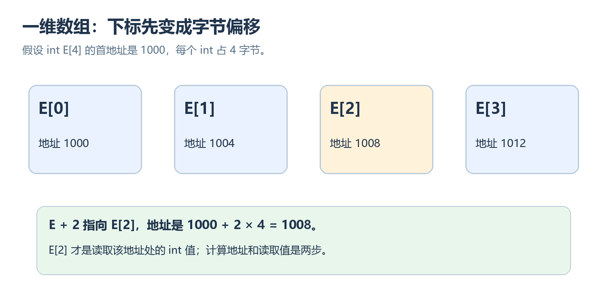
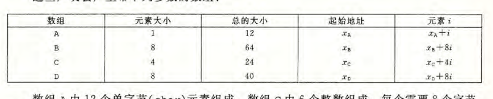
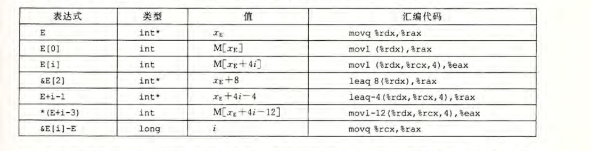
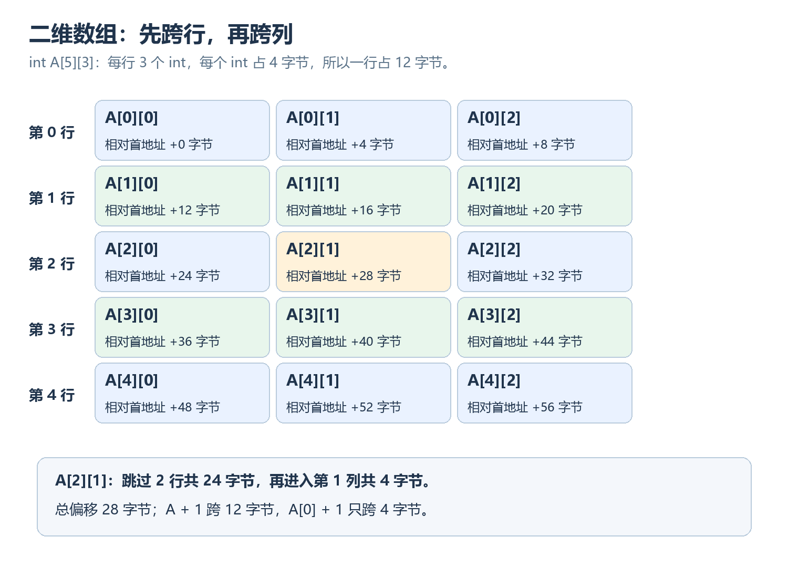
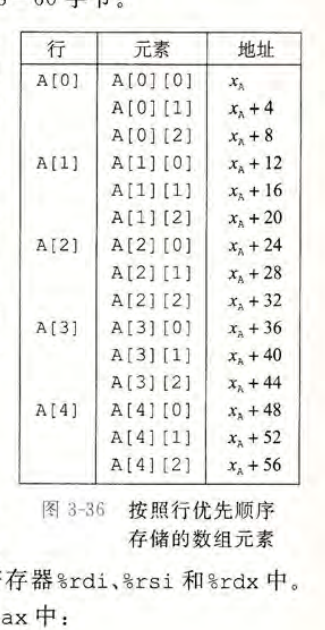
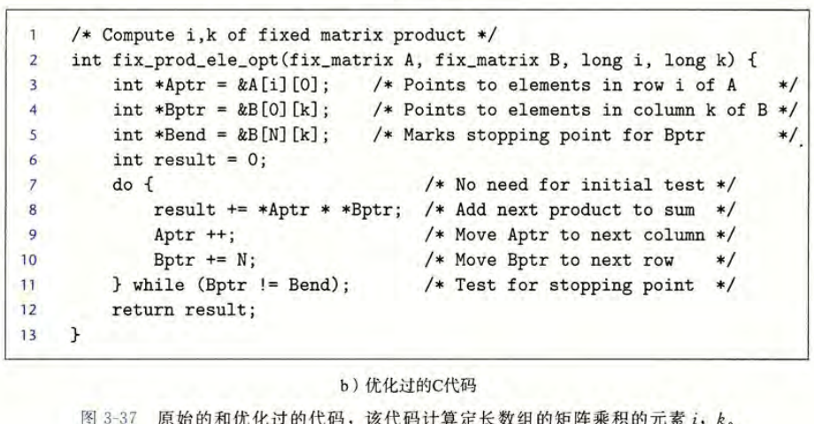
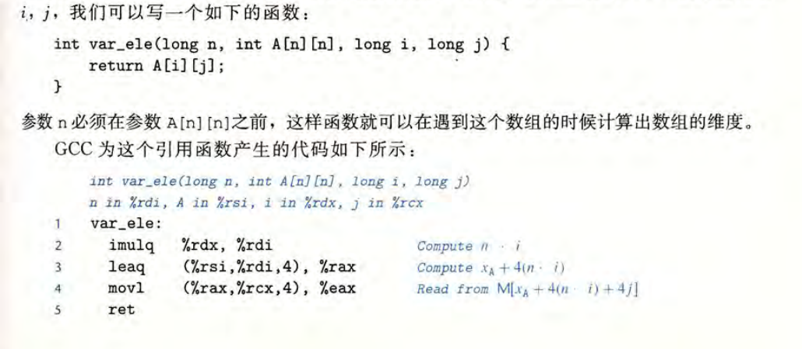
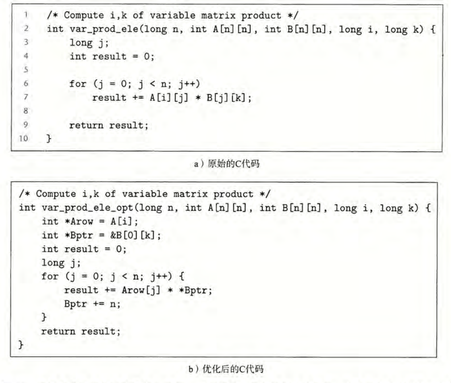

> 对应《深入理解计算机系统》第三版第 3.8.1～3.8.5 节，原书第 176～183 页。本文中的汇编和 `int` 大小沿用原书的 x86-64 示例：指针占 $8$ 字节，`int` 占 $4$ 字节。

## 阅读路线：函数收到数组地址以后，怎样找到元素

上一篇讲到函数传参：调用者可以把一个地址交给被调用者。对于数组，这引出一个很实际的问题：函数只拿到数组开头的地址，为什么仍能访问 `A[i]`，甚至 `A[i][j]`？

答案是 **元素地址 = 起始地址 + 按元素类型计算的偏移** 。一维数组需要知道每个元素多大；二维数组还要知道一行多宽；变长数组则要等运行时才知道行宽。本篇沿着这条线，逐步把 C 下标、指针表达式和汇编内存地址接起来。

| 要访问什么 | 需要知道什么 | 地址如何前进 |
| --- | --- | --- |
| `E[i]` | `E` 的起始地址、一个元素的大小 | 先跳过 $i$ 个元素 |
| `A[i][j]` | `A` 的起始地址、一行的长度、一个元素的大小 | 先跳过 $i$ 行，再走 $j$ 个元素 |
| `A[n][n]` 中的元素 | 前面的信息，以及运行时的 `n` | 行跨度在运行时计算 |

先从一维数组看起，因为后两种情况都在它的地址规则上增加一层。

---

## 1. 一维数组：下标为什么要乘元素大小

### 1.1 数组是一整段连续的存储空间

声明 `T E[N]` 表示创建一个有 $N$ 个 `T` 元素的数组对象。它们按下标顺序连续存放，因此总大小是：

$$
\text{数组总字节数}=N\times\operatorname{sizeof}(T)
$$

例如 `int E[4]` 占 $4\times4=16$ 字节。若 `E[0]` 的首地址是 $1000$，后面的元素依次从 $1004$、$1008$、$1012$ 开始。地址以 **字节** 为单位，所以从 `E[0]` 到 `E[1]` 要跳过整个 `int` 的 $4$ 字节。



怎么理解这张图？先把 $1000$ 当作整段数组的起点，再把下标 $2$ 理解为越过前面两个 `int`。每越过一个走 $4$ 字节，故 `E[2]` 的地址是 $1000+2\times4=1008$。最后才从这个地址读取 `int` 的值。

于是，一维数组的地址规则可以记为：

$$
\boxed{\operatorname{addr}(E[i])=\operatorname{base}(E)+i\times\operatorname{sizeof}(E[0])}
$$

这里的 `addr` 表示元素地址，`base` 表示首元素地址。公式算的是 **位置** ，还没有说这个位置存着什么数。

### 1.2 元素类型决定步长，也决定总大小



原书把几种声明放在同一张表里，值得特别看 `char A[12]` 与 `char *B[8]`：前者是 $12$ 个 `char`，共 $12$ 字节；后者是 **由 $8$ 个指针组成的数组** ，在书中的 x86-64 环境下共 $8\times8=64$ 字节。`B[i]` 里存放的是一个地址，不能把 `B` 当成 $8$ 个字符的数组。

声明里 `*` 的位置也影响含义。`char *B[8]` 是数组，元素类型为 `char *`；而 `char (*p)[8]` 是一个指针，它指向 **含 $8$ 个 `char` 的整行数组** 。后面讲二维数组传参时，会再次遇到这种指向整行的指针。

到这里，`E[i]` 的位置已经能算出来。接下来要分清 C 表达式里哪些是在求地址，哪些是在读取地址里的值。

---

## 2. 数组、指针与取值：同一个下标有两步

### 2.1 `E + i` 走的是元素，不是字节

在大多数表达式中，数组名 `E` 会转换为指向首元素的指针。对于 `int E[4]`，这个指针的类型是 `int *`。C 的指针加法会按所指元素的大小移动，所以 `E + 2` 指向 `E[2]`，实际地址增加 $2\times4=8$ 字节，而不是 $2$ 字节。

下标访问可以按下面的两步理解：

$$
\boxed{E[i]\equiv *(E+i)}
\qquad
\begin{cases}
E+i &: \text{算出第 }i\text{ 个元素的地址}\\
*(E+i) &: \text{读取或写入该地址处的元素}
\end{cases}
$$

`&E[i]` 只取元素地址，类型是 `int *`；`E[i]` 是该处的 `int` 值。假设 `E[2]` 存着 $37$，那么 `&E[2]` 是地址 $1008$，而 `E[2]` 是数值 $37$。不要把这两个结果混为一谈。



原书的表将 `E[i]`、`&E[2]`、`E+i-1` 等表达式和汇编并排展示。读表时先看结果类型：结果若为 `int *`，通常只需计算地址；结果若为 `int`，通常还要从内存读出 $4$ 字节。表中的 `&E[i]-E` 得到的是相隔 **多少个 `int` 元素** ，不是相隔多少字节；两个指针要指向同一数组中的元素或末尾后一位置，才可以这样相减。

### 2.2 汇编把算地址与读内存分得更清楚

若 `%rdx` 中是 `E` 的首地址，`%rcx` 中是下标 `i`，访问 `E[i]` 可以写成：

```asm
movl (%rdx,%rcx,4), %eax    # 从 E 的起点 + i×4 的地址读取 4 字节
```

括号里的地址计算对应 `base + index × scale`：`%rdx` 是起点，`%rcx` 是下标，`4` 是每个 `int` 的字节数；`movl` 才负责把那个地址处的值读入 `%eax`。若只需要 `&E[i]`，可以用 `leaq (%rdx,%rcx,4), %rax` 算出地址，而不读取元素。

这正是上一节公式在机器指令中的落点。不过，既然数组名在表达式中能变成指针，容易产生一个误解：数组本身是否就是一个指针？答案需要用 `sizeof` 来检验。

### 2.3 数组对象不是指针变量

`E` 是包含 $4$ 个 `int` 的 **数组对象** ，整个对象占 $16$ 字节；指向首元素的 `int *p = E` 则是保存地址的 **指针变量** ，在这里占 $8$ 字节。

```c
int E[4] = {10, 20, 30, 40};
int *p = E;

sizeof(E);     // 16：整个数组对象的字节数
sizeof(p);     // 8：指针变量本身的字节数，按本书 x86-64 环境
sizeof(E[0]);  // 4：一个 int 的字节数
```

数组名在 **大多数表达式** 中才转换为首元素指针；`sizeof(E)` 就是不会发生这种转换的典型情况。`&E` 也是例外：它取整个数组的地址，类型是 `int (*)[4]`。虽然 `E` 与 `&E` 在这个例子里数值上从同一地址开始，`E + 1` 前进 $4$ 字节，而 `&E + 1` 前进整个数组的 $16$ 字节。差别来自指针 **指向什么类型** 。

这也解释了为什么数组传给函数时，函数通常无法只靠收到的指针推知数组长度：转换以后，函数拿到的是地址，原数组的整体大小信息不会随地址自动附带。二维数组还会多一个问题：至少要保留一行有多宽的信息。先看内存是怎样排出行与列的。

---

## 3. 二维数组：先跳过整行，再进入某一列

### 3.1 `A[5][3]` 是由五个行数组组成的数组

`int A[5][3]` 的最外层有 $5$ 个元素，每个元素 `A[i]` 又是含 $3$ 个 `int` 的数组。所以每行占 $3\times4=12$ 字节，整个 `A` 占 $5\times12=60$ 字节。C 按 **行优先顺序** 存放：先放完 `A[0][0]`、`A[0][1]`、`A[0][2]`，再放 `A[1][0]`。



例如要找 `A[2][1]`：先越过第 $0$ 行和第 $1$ 行，共 $2\times12=24$ 字节；再从第 $2$ 行的开头越过 $1$ 个 `int`，加 $4$ 字节。因此它离 `A[0][0]` 共 $28$ 字节。原书图 3-36 列出了所有元素的地址，可以拿它核对图中的每一格。



把两段距离合在一起，就得到：

$$
\boxed{\operatorname{addr}(A[i][j])=
\operatorname{base}(A)+(i\times\text{每行元素数}+j)\times\text{元素字节数}}
$$

对 `int A[5][3]` 而言，每行元素数为 $3$，元素字节数为 $4$，所以地址偏移是 $4(3i+j)$ 字节。记住 **先行后列** ，就不必死记这个式子。

### 3.2 为什么 `A + 1` 和 `A[0] + 1` 走得不同

理解了行数组，指针步长就自然了。在普通表达式里，`A` 转换为指向首行的指针，类型为 `int (*)[3]`。于是 `A + 1` 指向下一行，跨过 $12$ 字节。`A[0]` 是首行数组；它转换为 `int *` 后，`A[0] + 1` 才是向右走一个 `int`，跨过 $4$ 字节。

| 表达式 | 指向什么 | 比起起点移动多少 |
| --- | --- | --- |
| `A + 1` | 第 $1$ 行 `A[1]` | $12$ 字节 |
| `A[0] + 1` | `A[0][1]` | $4$ 字节 |
| `&A[2][1]` | `A[2][1]` | $28$ 字节 |

所以 `A[i][j]` 也可以按 `*(*(A+i)+j)` 理解：先通过 `A+i` 定位第 $i$ 行，再在这一行内走到第 $j$ 个 `int`，最后取值。这里的两次加法之所以步长不同，是因为第一次操作的是 **行指针** ，第二次操作的是 **元素指针** 。

### 3.3 汇编怎样实现这个二维下标

假设 `%rdi` 是 `A` 的起始地址、`%rsi` 是 `i`、`%rdx` 是 `j`，下面的指令计算并读取 `A[i][j]`：

```asm
leaq (%rsi,%rsi,2), %rax    # rax = 3i
leaq (%rdi,%rax,4), %rax    # rax = A 的起点 + 4×3i
movl (%rax,%rdx,4), %eax    # 再加 4j，读取一个 int
```

第一条并未访问内存，只用 `leaq` 的地址计算能力得到 $3i$；第二条到达第 $i$ 行的开头；第三条才进入第 $j$ 列并读值。这与图中的 **跨整行 → 走列 → 取值** 完全一致。

现在回到开头的问题：如果把这种二维数组交给函数，函数至少要知道什么，才能算出每行跨度？

---

## 4. 数组传参：函数拿到的是地址，还需要行宽

### 4.1 一维数组参数实际是指针参数

```c
int first(int a[], long len) {
    return len > 0 ? a[0] : 0;
}
```

在 **函数形参** 这个位置，`int a[]` 会调整为 `int *a`。调用 `first(E, 4)` 时，不会复制 `E` 的四个元素；函数收到首元素地址，并可按需读原数组。`len` 要另外传，因为 `a` 是指针，`sizeof(a)` 得到的是指针大小，而不是原数组总大小。

这也把上一篇的参数传递与本篇连接起来：在书中的 x86-64 整数或指针参数约定下，传递首地址与传递一个普通指针参数遵循同一套规则。函数能修改原数组元素，因为它使用的地址仍指向调用者的数组存储空间。

### 4.2 二维数组参数必须能确定每一行多宽

```c
int get(int A[][3], long i, long j) {
    return A[i][j];
}
```

这里的形参 `A` 实际调整为 `int (*A)[3]`，也就是 **指向包含三个 `int` 的一整行的指针** 。函数计算 `A+i` 时才知道要跨 $12$ 字节。第一维写成 `[][3]`，因为函数已经把 `A` 当作行指针；第二维的 $3$ 则决定每行跨度，不能随意省去。

`int **` 的含义不同：它指向一个 `int *`，通常用来访问 **逐行保存的指针** 。普通的 `int A[5][3]` 在内存中直接连续存着 $15$ 个 `int`，行之间没有额外的指针对象。因此，把 `A` 当成 `int **` 传给函数，类型和内存解释都不对。

只要行宽确定，下标就能变成地址。接下来原书用矩阵乘法说明：在循环里连续访问元素时，编译器又如何避免每次都从头计算完整下标。

---

## 5. 定长二维数组：循环其实是在按固定跨度移动

### 5.1 一行与一列为什么走法不同

设 `N = 16`，有两个 `int A[16][16]` 和 `int B[16][16]`。矩阵乘积的一个元素可写成：

```c
int result = 0;
for (long j = 0; j < 16; j++) {
    result += A[i][j] * B[j][k];
}
```

随着 `j` 增加，`A[i][j]` 沿 **同一行** 向右走，每次多 $4$ 字节；`B[j][k]` 沿 **同一列** 向下走，每次跨过一整行，也就是 $16\times4=64$ 字节。

$$
\boxed{\Delta\operatorname{addr}(A[i][j])=4\text{ 字节},\qquad
\Delta\operatorname{addr}(B[j][k])=16\times4=64\text{ 字节}}
$$

假设 `B[0][k]` 位于地址 $2000$，那么下一次访问的 `B[1][k]` 位于 $2064$，再下一次是 $2128$。虽然列下标一直是 `k`，由于行号增加，地址仍然在前进。

### 5.2 用两个移动中的地址理解原书代码



原书图 3-37 用 `Aptr` 指向当前的 `A[i][j]`，用 `Bptr` 指向当前的 `B[j][k]`。每做完一次乘加，`Aptr++` 前进一个 `int`，对应 $4$ 字节；`Bptr += N` 按 `int` 为单位前进 $N=16$ 个位置，对应 $64$ 字节。汇编里因此可以用固定的加法更新地址，而不必每轮重新计算 `i×N+j` 和 `j×N+k`。

**注意 C 语言边界** ：图中的跨行指针加法和结束指针写法，适合帮助我们读懂机器地址如何移动；在严格的 C 指针规则下，不应直接把它当作通用、可移植的二维数组遍历模板。实际写 C 程序时，用上面的 `A[i][j]`、`B[j][k]` 下标写法即可，编译器仍能识别这些固定跨度。

定长情况下，$64$ 是编译时已经知道的常数。如果数组的行宽由函数调用时的参数 `n` 决定，地址规则并不改变，改变的是行跨度的计算时机。

---

## 6. 变长数组：行宽在运行时才确定

### 6.1 `n` 出现在参数列表里有什么作用

C 支持用运行时的 `n` 描述数组维度。原书给出这样的函数：

```c
int var_ele(long n, int A[n][n], long i, long j) {
    return A[i][j];
}
```

`n` 要写在 `A` 前面，因为编译器处理参数 `A[n][n]` 时需要知道这个维度从哪里来。这里的 `A` 仍是 **函数形参** ，会调整为指向一行的指针；传入函数时并不会新建一个 $n\times n$ 的数组。每行含 $n$ 个 `int`，故行跨度是 $4n$ 字节。

$$
\boxed{\operatorname{addr}(A[i][j])=
\operatorname{base}(A)+4(ni+j)}
$$

例如 `n = 5`、`i = 2`、`j = 1`，先越过 $2$ 行共 $2\times5\times4=40$ 字节，再走 $1$ 个 `int` 共 $4$ 字节，总偏移为 $44$ 字节。和前面的 `A[5][3]` 一样，仍然是 **先行后列** ，只是每行的元素数由参数 `n` 给出。

如果是在函数体内真正声明 `int local[n][n];`，那才是创建一个局部变长数组：存储空间的大小要到运行时才能确定。**变长数组形参与局部变长数组不是同一回事** ：前者接收已有数组的地址，后者创建数组对象。

### 6.2 汇编哪里体现了运行时行宽



按原书例子，`%rdi` 保存 `n`，`%rsi` 保存数组起始地址，`%rdx` 保存 `i`，`%rcx` 保存 `j`。核心指令是：

```asm
imulq %rdx, %rdi            # n×i：前面有多少个 int
leaq (%rsi,%rdi,4), %rax    # 跳到第 i 行的开头
movl (%rax,%rcx,4), %eax    # 再走 j 个 int 并读取
```

与定长的 `A[5][3]` 对比，关键差异是第一步：固定行宽 $3$ 可以直接用固定系数计算，变动的行宽 `n` 要参与运行时乘法。得到 `ni` 后，后两步仍是乘以每个 `int` 的 $4$ 字节，再加列偏移。

### 6.3 行宽未知，循环仍可逐步移动



原书图 3-38 又计算了一次矩阵乘积，只是矩阵宽度改为 `n`。在循环中，`A[i][j]` 每轮仍向右移动 $4$ 字节；`B[j][k]` 每轮向下移动 $4n$ 字节。程序可以先算出一次 $4n$，之后每轮给当前地址加上这个跨度。因此，**运行时才知道行宽** 并不等于 **每访问一个元素都要重新做完整的乘法** 。

把定长与变长两种情况并排看，差别就很明确：

| 数组形式 | 一行的字节数 | 何时知道 | 访问同一列的下一行 |
| --- | --- | --- | --- |
| `int A[16][16]` | $16\times4=64$ | 编译时 | 地址加 $64$ |
| `int A[n][n]` | $n\times4$ | 运行时 | 地址加 $4n$ |

两者遵循同一套行优先地址规则。下一节只需补上一个安全边界：公式能算出地址，并不保证那个地址属于数组。

---

## 7. 地址算得出来，不代表访问合法

如果 `int E[4]` 只有下标 $0$ 到 $3$，表达式 `E[4]` 仍能按地址公式算出 $1000+4\times4=1016$。但这个地址已在数组末尾之后，**读取或写入 `E[4]` 是越界访问** 。C 不会因为公式算得通就赋予它合法性；前面展示的简单汇编指令也没有自动替我们检查下标。

在同一个数组内，形成指向 **末尾后一位置** 的指针可用于比较或判断循环何时结束，但不能对它解引用。对二维数组还要注意每一维的下标范围：`A[5][3]` 的行下标只能是 $0$～$4$，列下标只能是 $0$～$2$。即使某个越界组合在数值上碰巧落到下一行的地址，也不能把它当作合法的 `A[i][j]` 访问。

读数组相关的 C 或汇编时，可以始终按这个顺序检查：

$$
\boxed{\text{确定元素类型与大小}
\longrightarrow\text{确定每行跨度}
\longrightarrow\text{计算地址}
\longrightarrow\text{确认下标有效}
\longrightarrow\text{读取或写入}}
$$

这条路线也为下一篇铺路。结构体不再是相同类型元素整齐重复排列，而是不同成员按各自的大小和对齐要求放在一段存储空间中；访问成员时，仍要回答同一个问题：**从对象起点走多少字节，才能找到目标数据** 。
